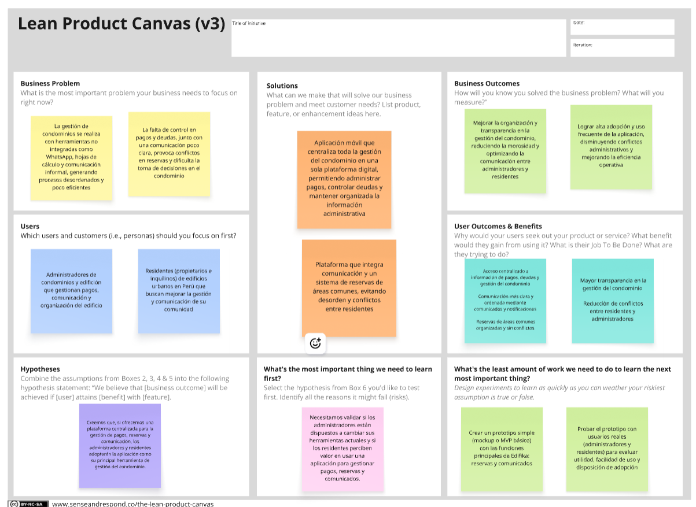
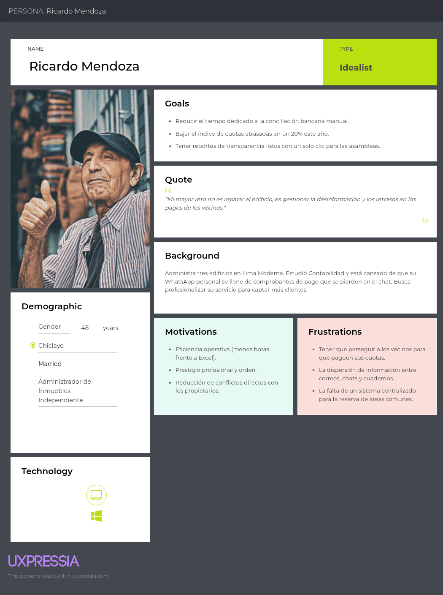
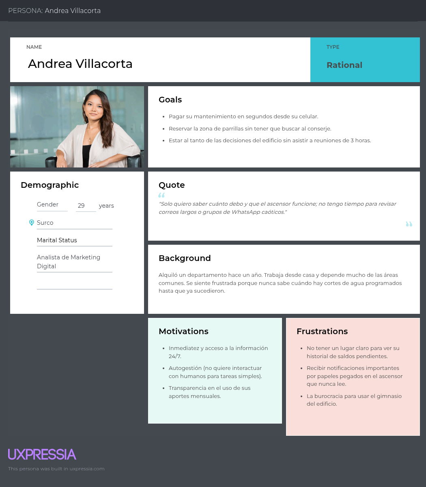
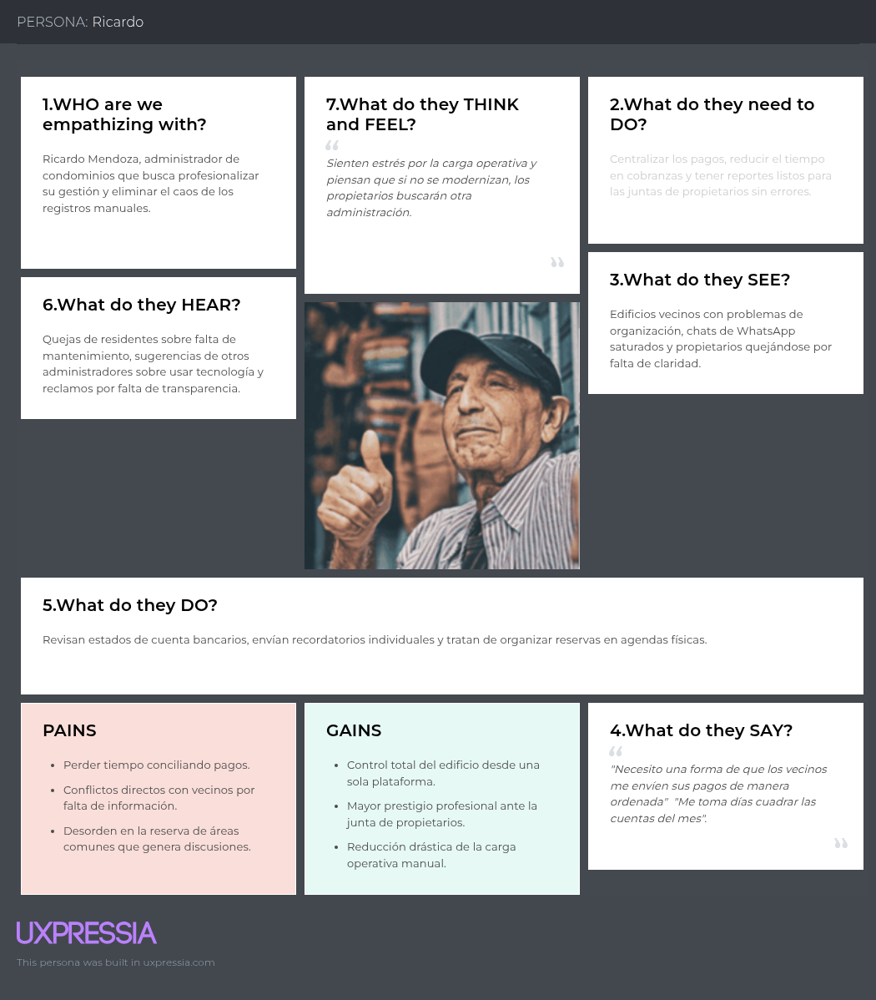
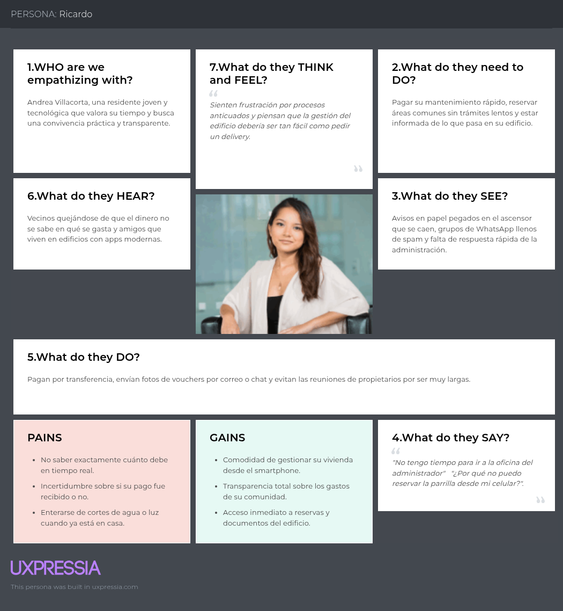
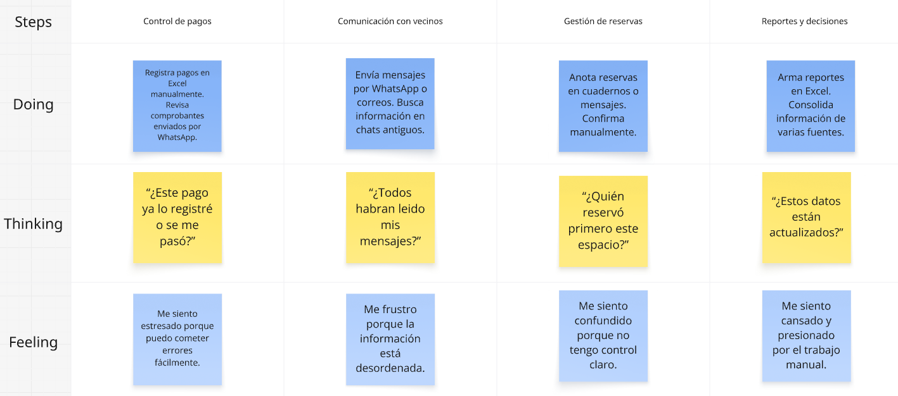
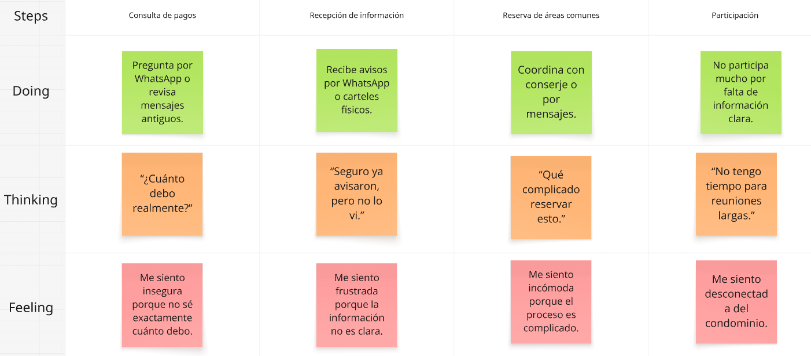
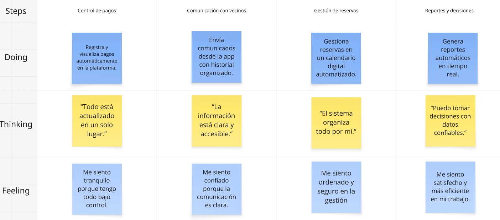
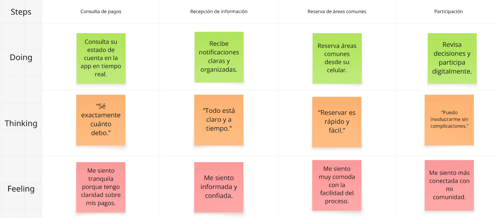

  

<h3 align="center">
Universidad Peruana de Ciencias Aplicadas
</h3>

<h3 align="center">
Ingeniería de Software  
  
Periodo: 202610
  
1ASI0657 - Fundamentos de Arquitectura de Software
  
NRC: 7944  
  
Docente: Abel Nehemias Rosales Caururu  
  
<strong>Informe de TB1</strong>  
  
Startup: Condomia  
  
Producto: Edifika  
  
  
<strong>Integrantes:</strong>  
  
Becerra Tejeda, Alessandra Nicole (u202318947)
  
Bejarano Martinez, Alvaro Leandro (u202311640)
  
Ortiz Cardenas, Johanna Antuanete (u202310358)
  
Sarmiento Medina, Loreley (u202310005) 
  
Zegarra López, Renato Sebastián Rubber (u202311558)
  
 

**Abril, 2026**
</h3>

## Registro de Versiones del Informe

<table>
  <thead>
    <tr>
      <th>Versión</th>
      <th>Fecha</th>
      <th>Autor</th>
      <th>Descripción de modificación</th>
    </tr>
  </thead>
  <tbody>
    <tr>
      <td>TB1</td>
      <td>17/04/2026</td>
      <td>
        - Becerra Tejeda, Alessandra Nicole  
        - Bejarano Martinez, Alvaro Leandro  
        - Ortiz Cardenas, Johanna Antuanete  
        - Sarmiento Medina, Loreley  
        - Zegarra López, Renato Sebastián Rubber
      </td>
      <td>
        Se realizaron los siguientes puntos del informe:   
        <b>Capítulo I: Introducción</b>  
        1.1 Startup Profile  
        1.1.1 Descripción de la Startup  
        1.1.2 Perfiles de integrantes del equipo  
        1.2 Solution Profile  
        1.2.1 Nombre del producto  
        1.2.2 Antecedentes y problemática  
        1.2.3 Lean UX Process  
        1.2.3.1 Lean UX Problem Statement  
        1.2.3.2 Lean UX Assumptions  
        1.2.3.3 Lean UX Hypothesis  
        1.2.3.4 Lean UX Canvas  
        1.3 Segmentos objetivo   
        <b>Capítulo II: Requirements & Analysis</b>  
        2.1 Competidores  
        2.2 Entrevistas  
        2.3 Needfinding  
        2.3.1 User Personas  
        2.3.2 User Task Matrix  
        2.3.3 Empathy Maps  
        2.3.4 As-is Scenario Mapping   
        <b>Capítulo III: Requirements Specification</b>  
        3.1 To-Be Scenario Mapping  
        3.2 User Stories  
        3.3 Impact Map  
        3.4 Product Backlog
      </td>
    </tr>
  </tbody>
</table>

## **Student Outcome**
ABET – EAC - Student Outcome 7: Aprendizaje Continuo y Autónomo  
Criterio: La capacidad de adquirir y aplicar nuevos conocimientos según sea necesario, utilizando estrategias de aprendizaje apropiadas.

<table border="1">
  <thead>
    <tr>
      <th>Criterio específico</th>
      <th>Acciones realizadas</th>
      <th>Conclusiones</th>
    </tr>
  </thead>
  <tbody>
    <tr>
      <td>7.c1. Actualiza conceptos y conocimientos necesarios para su desarrollo profesional y en especial para su proyecto en soluciones de ingeniería de software</td>
      <td>
        Becerra Tejeda, Alessandra Nicole   
        TB1:   Investigué y consolidé conceptos actualizados relacionados con la definición del problem statement, hypothesis y assumptions, aplicándolos de manera estructurada en el planteamiento inicial del proyecto.   
        Martinez, Alvaro Leandro   
        TB1:   
        Ortiz Cardenas, Johanna Antuanete   
        TB1:  
        Investigué y documenté el perfil de la startup Condomia, el nombre y concepto del producto Edifika, y los antecedentes del problema que busca resolver en la gestión de condominios.  
        Sarmiento Medina, Loreley   
        TB1:   
        Zegarra López, Renato Sebastián Rubber   
        TB1:   
      </td>
      <td>A lo largo del desarrollo del primer entregable, el equipo demostró capacidad para incorporar nuevos conceptos y herramientas propias de la ingeniería de software. El desarrollo del perfil de Condomia, la definición de Edifika y el trabajo con metodologías como Lean UX nos llevaron a investigar y aplicar conocimientos que inicialmente no manejábamos con profundidad. Este proceso de actualización continua se reflejó directamente en la calidad y coherencia de la documentación entregada.</td>
    </tr>
    <tr>
      <td>7.c2. Reconoce la necesidad del aprendizaje permanente para el desempeño profesional y el desarrollo de proyectos en soluciones de tecnologías de ingeniería de software.</td>
      <td>
        Becerra Tejeda, Alessandra Nicole   
        TB1:   
        Martinez, Alvaro Leandro   
        TB1:   
        Ortiz Cardenas, Johanna Antuanete   
        TB1: Reconocí la importancia de investigar el sector de gestión de condominios para desarrollar una solución relevante, lo que me motivó a profundizar en nuevos conceptos y herramientas necesarias para el proyecto Edifika.  
        Sarmiento Medina, Loreley   
        TB1:   
        Zegarra López, Renato Sebastián Rubber   
        TB1:   
      </td>
      <td>El desarrollo del proyecto Edifika nos permitió comprender que mantenerse en constante aprendizaje no es opcional, sino necesario. Cada sección trabajada en la TB1 nos presentó nuevos retos que exigieron investigar, cuestionar y adaptarnos. Como equipo, entendimos que la disposición para aprender de forma autónoma es una habilidad igual de importante que el conocimiento técnico en sí.</td>
    </tr>
  </tbody>
</table>

## **Contenido**
- [STUDENT OUTCOME](#student-outcome)
- [CAPÍTULO I: Introducción](#capítulo-i-introducción)
  - [1.1. Startup Profile](#11-startup-profile)
      - [1.1.1. Descripción de la Startup](#111-descripción-de-la-startup)
      - [1.1.2. Perfiles de integrantes del equipo](#112-perfiles-de-integrantes-del-equipo)
  - [1.2. Solution Profile](#12-solution-profile)
      - [1.2.1. Nombre del producto](#121-nombre-del-producto)
      - [1.2.2. Antecedentes y problemática](#122-antecedentes-y-problemática)
      - [1.2.3. Lean UX Process](#123-lean-ux-process)
        - [1.2.3.1. Lean UX Problem Statements](#1231-lean-ux-problem-statements)
        - [1.2.3.2. Lean UX Assumptions](#1232-lean-ux-assumptions)
        - [1.2.3.3. Lean UX Hypothesis](#1233-lean-ux-hypothesis)
        - [1.2.3.4. Lean UX Canvas](#1234-lean-ux-canvas)
  - [1.3. Segmentos objetivo](#13-segmentos-objetivo)
    
- [CAPÍTULO II: Requirements & Analysis](#capítulo-ii-requirements--analysis)
  - [2.1. Competidores](#21-competidores)
    -[2.1.1 Análisis de Competidores](#211-análisis-de-competidores)
    -[2.1.2. Estrategias frente a competidores](#212-estrategias-frente-a-competidores)
  - [2.2. Entrevistas](#22-entrevistas)
    - [2.2.1 Diseño de entrevistas](#221-diseño-de-entrevistas)
    - [2.2.2 Registro de entrevistas](#222-registro-de-entrevistas)
    - [2.2.3 Análisis de entrevistas](#223-análisis-de-entrevistas)
  - [2.3. Needfinding](#23-needfinding)
    - [2.3.1. User Personas](#231-user-personas)
    - [2.3.2. User Task Matrix](#232-user-task-matrix)
    - [2.3.3. Empathy Mapping](#233-empathy-mapping)
    - [2.3.4. As-is Scenario Mapping](#234-as-is-scenario-mapping)
- [CAPÍTULO III: Requirements Specification](#capítulo-iii-requirements-specification)
    - [3.1. To-Be Scenario Mapping](#31-to-be-scenario-mapping)
    - [3.2. User Stories](#32-user-stories)
    - [3.3. Impact Mapping](#33-impact-mapping)
    - [3.4. Product Backlog](#34-product-backlog)
  
 - [Conclusiones](#conclusiones)
 - [Conclusiones-y-Recomendaciones](#conclusiones-y-recomendaciones)
 - [Referencias Bibliografía](#referencias-bibliografía)
 - [Anexos](#anexos)
 - [Links](#links)

# CAPÍTULO I: Introducción

# 1.1. Startup Profile
## 1.1.1. Descripción de la Startup

Condomia es una startup tecnológica enfocada en transformar la gestión de condominios y edificios residenciales mediante soluciones digitales accesibles, intuitivas y diseñadas para el día a día. Creemos firmemente que administrar una comunidad residencial puede y debe ser una experiencia ordenada, clara y eficiente para todos los actores involucrados. Nuestro equipo combina experiencia en tecnología, diseño y gestión para desarrollar herramientas que respondan a las necesidades reales de quienes conviven y administran estos espacios. Nuestro producto principal, Edifika, es una plataforma que centraliza en un único entorno digital la gestión y seguimiento de deudas y pagos, agiliza el proceso de reserva de áreas comunes y mantiene a toda la comunidad informada a través de comunicados oficiales estructurados, eliminando los procesos manuales y la información dispersa que podrían generar conflictos y desorganización. Apostamos por una tecnología que no solo resuelve problemas operativos, sino que también fortalece la comunicación interna y facilita la toma de decisiones colectivas dentro de cada edificio. Nuestro objetivo es convertirnos en el aliado digital de cada comunidad residencial, brindándole las herramientas necesarias para funcionar con transparencia, autonomía y confianza.

## 1.1.2. Perfiles de integrantes del equipo

| Estudiante | Descripción |
|------------|-------------|
|  **Becerra Tejeda, Alessandra Nicole (u202318947)** |Mi nombre es Alessandra Becerra, tengo 19 años y actualmente curso el séptimo ciclo de la carrera de Ingeniería de Software. Me considero una persona comprometida, proactiva y con gran disposición para aprender nuevas tecnologías. Asimismo, me gusta trabajar en equipo y fomentar una buena relación con mis compañeros para alcanzar resultados de calidad. Por ello, en este proyecto me comprometo a cumplir con mis responsabilidades de manera eficiente, aportar ideas que contribuyan al desarrollo del equipo y finalizar las tareas asignadas dentro de los plazos establecidos. |
|  **Bejarano Martinez, Alvaro Leandro (u202311640)** | Mi nombre es Alvaro Leandro Bejarano Martínez, estudiante de la carrera Ingeniería de Software y me destaco por mi perseverancia, organización y capacidad para trabajar en equipo. Me esfuerzo por mantener un ambiente estructurado dentro del grupo, donde cada miembro se sienta valorado y sus ideas sean escuchadas y respetadas. Mi compromiso es fomentar la colaboración efectiva, asegurando que cada contribución se integre de manera ordenada y alineada con los objetivos comunes del equipo.|
|  **Ortiz Cardenas, Johanna Antuanete (u202310358)** | Mi nombre es Johanna Antuanete Ortiz Cardenas, tengo 20 años y actualmente curso el séptimo ciclo de la carrera de Ingeniería de Software en la Universidad Peruana de Ciencias Aplicadas. Me considero una persona proactiva, responsable y orientada a la calidad, con especial interés en el desarrollo frontend, área en la que disfruto crear interfaces intuitivas y visualmente atractivas. Me apasiona mantenerme actualizada sobre las últimas tendencias y avances tecnológicos, lo que me permite aportar soluciones modernas y fundamentadas a cada proyecto. En mi tiempo libre, disfruto escuchar música y leer cómics, actividades que nutren mi creatividad y perspectiva. En el marco de este proyecto grupal, me comprometo a colaborar de manera activa y responsable, aportando ideas de valor y cumpliendo con los entregables en los plazos establecidos, con el objetivo de alcanzar resultados de alta calidad. |
|  **Sarmiento Medina, Loreley (u202310005)** | Mi nombre es Loreley Sarmiento, tengo 20 años y actualmente curso la carrera de Ingeniería de Software. Me considero una persona responsable, organizada y con buena disposición para el trabajo en equipo, ya que valoro la comunicación y la colaboración como elementos clave para lograr buenos resultados. Me interesa seguir aprendiendo constantemente y asumir nuevos retos que me permitan fortalecer mis habilidades.En este proyecto, busco participar de manera activa, apoyar a mis compañeros, aportar ideas que contribuyan al desarrollo del equipo y cumplir con las tareas asignadas dentro de los plazos establecidos, con el objetivo de alcanzar un resultado de calidad.|
|  **Zegarra Lopez, Renato Sebastian Rubber (u202311558)** | Mi nombre es Renato Zegarra, tengo 20 años y actualmente estoy cursando la carrera de Ingeniería de Software en la Universidad Peruana de Ciencias Aplicadas. Fuera de mis estudios, disfruto explorar mis intereses en música, videojuegos y tecnología, siempre buscando nuevas formas de integrar estas pasiones en mi vida cotidiana. Me comprometo a colaborar de manera activa y responsable en la elaboración de este documento y en la concreción de la idea propuesta, aportando mis habilidades en análisis, creatividad y adaptabilidad. Estoy convencido de que con esfuerzo y trabajo en equipo, podemos alcanzar resultados innovadores y de alta calidad. |

# 1.2 Solution Profile
## 1.2.1. Nombre del producto

El nombre elegido para nuestro producto es Edifika. Este nombre surge de la fusión de dos conceptos clave: "edificio", que representa el entorno físico y la comunidad residencial a la que va dirigida la solución, y el sufijo "ka", que le otorga una identidad al producto en sí. Edifika es una aplicación digital que centraliza y simplifica la gestión integral de condominios y edificios residenciales en un solo lugar. Permite registrar y hacer un seguimiento de deudas y pagos de manera transparente, coordinar la reserva de áreas comunes sin complicaciones y mantener a toda la comunidad informada mediante comunicados fáciles de acceder. Su diseño está pensado para ser intuitivo y accesible, eliminando los procesos manuales y la información dispersa que suelen generar conflictos y desorganización dentro de las comunidades. Edifika no es solo una herramienta operativa, sino un canal que fortalece la comunicación y facilita la toma de decisiones dentro de cada edificio, con el objetivo de construir comunidades más ordenadas, transparentes y eficientes.

## 1.2.2. Antecedentes y problemática

 **What:**   
El crecimiento sostenido del mercado inmobiliario en Lima ha generado una mayor demanda de servicios de gestión y mantenimiento de propiedades. Durante el tercer trimestre del 2024, se registró la venta de 5,716 unidades en Lima Metropolitana y Callao, lo que evidencia una necesidad creciente de administración eficiente en edificios multifamiliares (Sociedad Peruana de Bienes Raíces, 2024). Sin embargo, las empresas y juntas encargadas de esta gestión enfrentan desafíos significativos relacionados con la transparencia, la eficiencia operativa y la comunicación con los residentes (Verastegui Leon et al., 2025).   
En este contexto, la digitalización emerge como una respuesta necesaria. Según la Sociedad Peruana de Bienes Raíces (2024), la gestión digital de edificios y condominios permite automatizar procesos como el registro de pagos y cobranzas, mejorar la comunicación entre administradores, propietarios e inquilinos, y garantizar mayor transparencia en la toma de decisiones. A pesar de ello, esta transformación digital aún representa una tendencia emergente en el Perú, lo que deja a gran parte de las comunidades residenciales sin herramientas adecuadas para una gestión ordenada y eficiente.   

**When:**   

El problema de la gestión ineficiente en condominios y edificios residenciales no es reciente, sin embargo se ha intensificado en los últimos años como consecuencia del crecimiento acelerado de edificaciones verticales en Latinoamérica. Aguilar (2026) señala que los conflictos en torno al pago de cuotas de mantenimiento, el uso de áreas comunes y la administración interna se presentan de forma recurrente y cotidiana dentro de las comunidades residenciales, agravándose en situaciones donde la normativa vigente data de décadas atrás y no responde a la necesidades actuales. En el caso de Perú, este escenario se hace más urgente considerando que solo en el tercer trimestre del 2024 se registró la venta de 5,716 unidades residenciales en Lima Metropolitana y Callao, lo que evidencia un crecimiento sostenido del mercado inmobiliario que amplía la demanda de soluciones de gestión eficientes (Verastegui Leon et al., 2025).   

**Where:**   

El problema de la gestión ineficiente en condominios y edificios residenciales se presenta principalmente en las zonas urbanas con mayor densidad de vivienda vertical. En el caso de Lima, distritos como Miraflores, Santiago de Surco y Jesús María concentran cerca del 70% de la búsqueda de viviendas nuevas, siendo las zonas clasificadas como Lima Moderna y Lima Top las de mayor demanda residencial (Verastegui Leon et al., 2025). Es precisamente en estas áreas donde la convivencia en espacios reducidos y la alta densidad poblacional intensifica los conflictos de gobernanza, administración y uso de bienes comunes. A nivel regional, Aguilar (2026) señala que esta problemática se vuelve a evidenciar en distintos países de Latinoamérica, manifestándose con mayor intensidad en las modalidades verticales, donde la convivencia de múltiples propietarios en un mismo espacio genera mayor volumen de requisitos que los sistemas de gestión tradicionales no logran atender de forma eficiente.   

**Why:**   

La problemática en la gestión de condominios y edificios residenciales responde a vacíos estructurales tanto normativos como operativos. Desde el ámbito legal, Aguilar (2026) señala que la Ley de Propiedad en Condominio no establece procedimientos claros para la supervisión estatal, ni asigna mecanismos de rendición de cuentas o auditoría sobre las juntas administradoras, lo que genera un vacío normativo que favorece la persistencia de conflictos recurrentes en los condominios verticales. Esta ausencia de regulación efectiva permite la proliferación de prácticas arbitrarias por parte de administradores o juntas directivas, dejando desprotegidos a los copropietarios frente a actos ilegítimos.
Desde el ámbito operativo, el mismo autor indica que el 80% de los encuestados considera prioritaria la fiscalización estatal obligatoria y la capacitación obligatoria para administradores y juntas directivas, mientras que el 60% demanda procedimientos más ágiles para el registro y gestión de condominios (Aguilar, 2026). Esto refleja que los propios actores del sistema reconocen la falta de herramientas y mecanismos claros para gestionar sus comunidades de manera eficiente y transparente.   
Con todo esto, la ausencia de canales formales de comunicación, la falta de transparencia en la administración financiera y la carencia de herramientas digitales accesibles forman un escenario donde los conflictos entre residentes y administradores se vuelven recurrentes y difíciles de resolver, evidenciando la necesidad urgente de soluciones tecnológicas que cubran estos vacíos.   

**Who:**   

Los principales afectados por la problemática de gestión ineficiente en condominios y edificios residenciales son dos grupos claramente diferenciados. Por un lado, los propietarios e inquilinos, quienes enfrentan una limitada transparencia en el manejo de los fondos, conflictos recurrentes por el uso de áreas comunes y dificultades para acceder a información clara sobre el estado financiero de su comunidad, lo que genera desconfianza y baja participación en las asambleas (Aguilar, 2026). Por otro lado, los administradores y juntas directivas, quienes deben gestionar comunidades cada vez más extensas y complejas sin contar con herramientas adecuadas, enfrentando dificultades en la aplicación de sanciones, mecanismos de resolución de conflictos poco efectivos y problemas recurrentes en la gestión financiera (Aguilar, 2026).   
Este escenario se agrava en el contexto peruano, donde el crecimiento sostenido del mercado inmobiliario, especialmente en zonas como Lima Moderna y Lima Top, ha incrementado significativamente el número de comunidades residenciales que requieren una gestión ordenada y eficiente (Verastegui Leon et al., 2025). Ambos grupos comparten la necesidad de contar con soluciones digitales que centralicen la gestión, mejoren la comunicación y garanticen la transparencia dentro de sus comunidades.   

**How:**   

La gestión ineficiente en condominios y edificios residenciales ocurre principalmente porque las comunidades dependen de herramientas informales y no especializadas para una correcta administración. El caso más extendido es el uso de grupos de WhatsApp como canal principal de gestión, donde se comparten comprobantes de pago, vouchers, boletas y comunicados oficiales mezclados con conversaciones cotidianas (ProTool, 2026). Si bien esta parece una opción práctica en un inicio, genera consecuencias graves: los comprobantes se pierden entre conversaciones, no existe un orden claro de documentos, los archivos quedan almacenados en teléfonos personales y la comunidad pierde su historial administrativo completo, especialmente cuando cambian los integrantes del comité o el administrador (ProTool, 2026).   
A esto se suma que los chats de vecinos, al carecer de moderación y reglas claras, se convierten en fuente de conflictos entre residentes, mensajes irrelevantes y malentendidos que dificultan la comunicación efectiva dentro de la comunidad (Condominos, 2024). La ausencia de trazabilidad administrativa impide que la comunidad pueda reconstruir con claridad su historial financiero, identificar qué pagos se realizaron, qué documentos los respaldan y quién autorizó cada gasto (ProTool, 2026). En conjunto, esta dependencia de herramientas no diseñadas para la gestión residencial perpetúa la desorganización, la falta de transparencia y los conflictos recurrentes que afectan la convivencia dentro de los edificios.   

**How much:**   

El impacto de una gestión ineficiente en condominios y edificios residenciales se refleja tanto en pérdidas económicas concretas como en consecuencias legales y financieras para los residentes. Según Birimisa, gerente de Operaciones de Cushman & Wakefield Perú, la falta de control y planificación en la gestión de edificios puede generar sobrecostos de hasta el 30% del presupuesto anual de operación, considerando que los servicios de seguridad, limpieza y administración representan más del 50% de los costos operativos (El Comercio, 2026). Asimismo, los altos niveles de morosidad y desbalances presupuestales afectan directamente el flujo de caja y la operación del edificio, generando riesgos acumulados que se vuelven difíciles de revertir sin intervención especializada.   
A nivel de los residentes, la morosidad en el pago de gastos comunes es una problemática recurrente que no solo afecta la salud financiera de la comunidad, sino que puede derivar en consecuencias legales para los deudores, incluyendo el registro en Infocorp y el deterioro de su historial crediticio (Gestión, 2023). La junta directiva, respaldada por el Decreto Legislativo N° 1568, tiene incluso la facultad de iniciar procesos judiciales que pueden llegar hasta el embargo de bienes, lo que evidencia la gravedad que puede alcanzar la falta de una gestión ordenada y transparente (Gestión, 2023). Estos datos confirman que la ausencia de herramientas digitales adecuadas no es solo un problema de organización, sino que tiene un impacto económico y legal directo sobre todos los actores involucrados en la comunidad residencial.   

## 1.2.3. Lean UX Process
### 1.2.3.1. Lean UX Problem Statements
En la actualidad, la gestión de condominios y edificios residenciales se realiza, en muchos casos, mediante procesos manuales o herramientas no integradas, como grupos de mensajería, hojas de cálculo o comunicaciones informales. Esta situación genera desorganización, falta de control sobre pagos y deudas, conflictos en la reserva de áreas comunes y una comunicación poco clara entre los miembros de la comunidad, lo que se traduce en ineficiencias operativas, errores en la gestión de la información y dificultades en la coordinación entre los distintos actores involucrados (Deloitte, 2022).

Este problema afecta principalmente a administradores y propietarios e inquilinos, quienes enfrentan dificultades para mantener una gestión eficiente, transparente y ordenada dentro de sus comunidades, lo que impacta negativamente en la convivencia y en la toma de decisiones colectivas.

Hemos identificado que esta problemática limita la capacidad de los condominios para operar de manera organizada y confiable. Esta situación se vuelve aún más crítica en contextos como el peruano, donde el crecimiento de viviendas en edificios multifamiliares ha ido en aumento en zonas urbanas, especialmente en Lima Metropolitana, incrementando la necesidad de mecanismos de gestión más eficientes (Instituto Nacional de Estadística e Informática [INEI], 2023).

A partir de ello surge la siguiente pregunta:  
**¿Cómo podríamos brindar a las comunidades residenciales una solución digital centralizada, accesible y confiable que mejore la gestión administrativa, reduzca conflictos y fortalezca la comunicación interna?**

Para abordar esta problemática, se ha definido el contexto del problema y los elementos clave del modelo de negocio, los cuales se detallan a continuación:
- **Domain:** Gestión de condominios y soluciones digitales para comunidades residenciales.  
- **Customer Segments:** Administradores de edificios y condominios, propietarios e inquilinos de edificios residenciales.  
- **Pain Points:** Falta de centralización de información, poca transparencia en pagos y deudas, conflictos por reservas de áreas comunes, comunicación desorganizada.  
- **Gap:** Ausencia de plataformas digitales integrales, accesibles e intuitivas enfocadas en la gestión completa de comunidades residenciales.  
- **Vision/Strategy:** Desarrollar una aplicación digital que centralice la gestión del condominio, mejore la comunicación interna y facilite procesos administrativos mediante una experiencia simple, transparente y eficiente.  
- **Initial Segment:** Edificios residenciales urbanos con gestión tradicional que buscan digitalizar sus procesos administrativos.
  
### 1.2.3.2. Lean UX Assumptions

### Business Assumptions

1. **Creemos que** nuestros usuarios tienen la necesidad de optimizar la gestión del condominio mediante herramientas digitales que centralicen pagos, reservas y comunicación.  

2. **Estas necesidades se pueden satisfacer con** una aplicación digital que integre en un solo entorno la gestión administrativa, la comunicación interna y la organización de actividades del condominio.  

3. **Nuestros clientes iniciales serán** administradores de edificios y condominios, y comunidades residenciales urbanas que buscan digitalizar sus procesos.  

4. **El valor más importante que un cliente quiere de nuestros servicios es** la transparencia, el control de la información y la eficiencia en la gestión del condominio.  

5. **El cliente también va a obtener beneficios adicionales como** la reducción de conflictos, mejor comunicación entre residentes, ahorro de tiempo en tareas administrativas y mayor organización en la comunidad.  

6. **Vamos a obtener la mayoría de los clientes mediante** recomendaciones, marketing digital y alianzas con administradores de condominios.  

7. **Vamos a obtener ingresos mediante** suscripciones mensuales por el uso de la plataforma por parte de cada condominio o administración.  

8. **Nuestra competencia en el mercado serán** herramientas tradicionales como Excel, grupos de mensajería como WhatsApp y algunas plataformas digitales no integradas o poco intuitivas.  

9. **Vamos a tener ventaja frente a nuestra competencia debido a** la centralización de funcionalidades en una sola plataforma, su facilidad de uso y su enfoque específico en comunidades residenciales.  

10. **El mayor riesgo del servicio es** la resistencia al cambio hacia herramientas digitales por parte de administradores o residentes, así como una baja adopción inicial.  

11. **Lo resolveremos realizando** un diseño intuitivo, procesos de onboarding simples y mostrando beneficios claros desde el primer uso de la plataforma.  

12. **Otro riesgo que debemos considerar y que, si resulta falso, haría fracasar el proyecto es** que los usuarios realmente perciban valor en digitalizar la gestión del condominio y estén dispuestos a cambiar sus métodos actuales.  

### User Assumptions

**¿Quién es el usuario?**  
Nuestro usuario principal son administradores de edificios y condominios y los residentes que buscan mejorar la organización y convivencia dentro de su comunidad.

**¿Dónde encaja nuestro producto en su vida?**  
Encaja en la gestión diaria del condominio, facilitando tareas administrativas, comunicación y organización de espacios comunes.

**¿Qué problemas resuelve nuestro producto?**  
Resuelve la desorganización en la gestión, la falta de control en pagos y deudas, los conflictos en reservas de áreas comunes y la comunicación dispersa.

**¿Cuándo y cómo se usa nuestro producto?**  
Se utiliza de manera frecuente cuando los usuarios necesitan revisar pagos, reservar áreas comunes, recibir comunicados o gestionar información del condominio, principalmente a través de dispositivos móviles.

**¿Qué características son importantes?**
- Gestión de pagos y deudas  
- Reserva de áreas comunes  
- Comunicación centralizada  
- Notificaciones automáticas  
- Interfaz simple e intuitiva  

**¿Cómo debería lucir y comportarse el producto?**  
El producto debe lucir moderno, accesible y amigable, con un diseño centrado en el usuario. Debe comportarse de forma intuitiva, rápida y confiable, priorizando la facilidad de uso y la claridad de la información.

### Feature Assumptions

- **Creemos que** los usuarios necesitan visualizar de forma clara y en tiempo real sus pagos y deudas.  
- **Creemos que** un sistema digital de reservas reducirá conflictos por el uso de áreas comunes.  
- **Creemos que** una comunicación centralizada mejorará la organización dentro del condominio.  
- **Creemos que** las notificaciones automáticas aumentarán el compromiso de los usuarios con la plataforma.  
- **Creemos que** una interfaz intuitiva facilitará la adopción del sistema sin necesidad de capacitación.  

### 1.2.3.3. Lean UX Hypothesis

#### Hypothesis Statement 01
Creemos que los administradores y residentes utilizarán Edifika como su principal herramienta para gestionar pagos, reservas y comunicación dentro del condominio.  

**Sabremos que hemos tenido éxito** cuando al menos un 70% de los usuarios registrados utilicen la plataforma semanalmente durante el primer mes.

#### Hypothesis Statement 02
Creemos que la centralización de la información reducirá los conflictos relacionados con pagos y reservas dentro de la comunidad.  

**Sabremos que hemos tenido éxito** cuando se reduzcan en al menos un 40% los reclamos o incidencias relacionadas con la gestión administrativa en un periodo de tres meses.

#### Hypothesis Statement 03
Creemos que una interfaz intuitiva y accesible permitirá que los usuarios adopten la plataforma sin dificultad.  

**Sabremos que hemos tenido éxito** cuando al menos un 80% de los nuevos usuarios completen su registro y primeras acciones sin asistencia.

#### Hypothesis Statement 04
Creemos que una comunicación estructurada dentro de la plataforma aumentará la participación de los residentes en actividades y decisiones del condominio.  

**Sabremos que hemos tenido éxito** cuando al menos un 60% de los usuarios interactúen con comunicados o notificaciones dentro de la aplicación.

### 1.2.3.4. Lean UX Canvas

# 1.3. Segmentos objetivo

**Administradores de edificios y condominios:**

Una gran parte de las administraciones aún utiliza herramientas informales como Excel, WhatsApp o registros manuales, lo que genera desorden en la gestión y dificulta la toma de decisiones.

- Edad estimada: 25 a 60 años
- Ubicación: Zonas urbanas con alta concentración de edificios residenciales como Lima Metropolitana, Arequipa o Callao
- Características demográficas y de comportamiento:
   - Son responsables de la gestión operativa, administrativa y financiera del condominio.
   - Utilizan herramientas básicas y poco integradas para el control de pagos y comunicación.
   - Enfrentan problemas frecuentes de morosidad y desorganización.
   - Buscan optimizar procesos y reducir conflictos entre residentes.
- Necesidades principales:
   - Gestionar de manera clara y automatizada las deudas y pagos.
   - Enviar comunicados organizados y verificables.
   - Contar con reportes que faciliten la toma de decisiones.
   - Reducir la carga operativa manual y mejorar la eficiencia.

**Propietarios e inquilinos de condominios:**

El crecimiento de la vivienda vertical en ciudades ha incrementado la cantidad de personas que viven en condominios, generando la necesidad de herramientas digitales que faciliten la convivencia, el acceso a información y la participación en la gestión del edificio.

- Edad estimada: 18 a 55 años
- Ubicación: Zonas urbanas residenciales en ciudades como Lima y Callao
- Características demográficas y de comportamiento:
   - Incluye tanto propietarios como inquilinos que residen en el condominio.
   - Utilizan smartphones y aplicaciones móviles de manera frecuente.
   - Buscan soluciones rápidas, claras y accesibles.
   - Valoran la transparencia en la gestión y la buena comunicación.
- Necesidades principales:
   - Consultar sus deudas y estado de pagos en cualquier momento.
   - Recibir notificaciones y comunicados importantes.
   - Reservar áreas comunes de forma sencilla.
   - Mantenerse informados y participar en la vida del condominio.

 # CAPÍTULO II: Requirements & Analysis

 # 2.1. Competidores
 ## 2.1.1 Análisis de Competidores
 
 <table border="2" style="text-align: center; border-collapse: collapse; width: 100%;">
  <tbody>
    <tr>
      <td colspan="6" style="padding: 8px; font-weight: bold;">Competitive Analysis Landscape</td>
    </tr>
    <tr>
      <td colspan="2" style="padding: 8px; font-weight: bold;">¿Por qué llevar a cabo este análisis?</td>
      <td colspan="4" style="padding: 8px;">
        Este análisis permite comprender cómo distintas plataformas gestionan la administración de condominios, qué funcionalidades ofrecen y qué valor brindan a los usuarios. De esta manera, se identifican oportunidades de mejora, diferenciación y posicionamiento para Edifika dentro del mercado, especialmente frente a soluciones tradicionales y plataformas digitales existentes.
      </td>
    </tr>
    <tr>
      <td colspan="2" style="padding: 8px;"></td>
      <td style="padding: 8px; font-weight: bold;">Edifika</td>
      <td style="padding: 8px; font-weight: bold;">Condo Control</td>
      <td style="padding: 8px; font-weight: bold;">Buildium</td>
      <td style="padding: 8px; font-weight: bold;">AppFolio</td>
    </tr>
    <tr>
      <td rowspan="2" style="padding: 8px; font-weight: bold; vertical-align: middle;">Perfil</td>
      <td style="padding: 8px; font-weight: bold;">Overview</td>
      <td style="padding: 8px; vertical-align: top;">Aplicación enfocada en la gestión de condominios en el contexto peruano, que centraliza pagos, reservas y comunicación en una sola plataforma accesible e intuitiva.</td>
      <td style="padding: 8px; vertical-align: top;">Software de gestión de condominios que permite la comunicación entre residentes, gestión de documentos y administración de reservas.</td>
      <td style="padding: 8px; vertical-align: top;">Plataforma de gestión inmobiliaria en la nube orientada a administradores profesionales, con herramientas financieras, operativas y de comunicación.</td>
      <td style="padding: 8px; vertical-align: top;">Software integral de gestión de propiedades que permite administrar pagos, mantenimiento y comunicación desde una sola plataforma.</td>
    </tr>
    <tr>
      <td style="padding: 8px; font-weight: bold;">Ventaja competitiva ¿Qué valor ofrece?</td>
      <td style="padding: 8px; vertical-align: top;">Centraliza funciones clave en una interfaz simple, enfocada en la adopción real de usuarios que actualmente usan WhatsApp y Excel.</td>
      <td style="padding: 8px; vertical-align: top;">Ofrece una plataforma estructurada para la comunicación y organización dentro del condominio.</td>
      <td style="padding: 8px; vertical-align: top;">Proporciona herramientas avanzadas de gestión financiera y automatización para empresas administradoras.</td>
      <td style="padding: 8px; vertical-align: top;">Integra múltiples funcionalidades con automatización y escalabilidad para grandes volúmenes de propiedades.</td>
    </tr>
    <tr>
      <td rowspan="2" style="padding: 8px; font-weight: bold; vertical-align: middle;">Perfil de Marketing</td>
      <td style="padding: 8px; font-weight: bold;">Mercado objetivo</td>
      <td style="padding: 8px; vertical-align: top;">Condominios urbanos en Perú, administradores y residentes que buscan digitalizar su gestión.</td>
      <td style="padding: 8px; vertical-align: top;">Condominios y asociaciones de propietarios, principalmente en mercados internacionales.</td>
      <td style="padding: 8px; vertical-align: top;">Empresas administradoras de propiedades y profesionales inmobiliarios.</td>
      <td style="padding: 8px; vertical-align: top;">Empresas de gestión inmobiliaria y administradores de múltiples propiedades.</td>
    </tr>
    <tr>
      <td style="padding: 8px; font-weight: bold;">Estrategias de marketing</td>
      <td style="padding: 8px; vertical-align: top;">Enfoque en simplicidad, adopción digital y solución de problemas reales en comunidades locales.</td>
      <td style="padding: 8px; vertical-align: top;">Marketing digital enfocado en comunidades y administradores de condominios.</td>
      <td style="padding: 8px; vertical-align: top;">Marketing B2B dirigido a empresas inmobiliarias con enfoque en eficiencia y automatización.</td>
      <td style="padding: 8px; vertical-align: top;">Estrategias digitales enfocadas en empresas grandes y escalabilidad del servicio.</td>
    </tr>
    <tr>
      <td rowspan="3" style="padding: 8px; font-weight: bold; vertical-align: middle;">Perfil de Producto</td>
      <td style="padding: 8px; font-weight: bold;">Productos & Servicios</td>
      <td style="padding: 8px; vertical-align: top; text-align: left;">
        <ul>
          <li>Gestión de pagos y deudas</li>
          <li>Reserva de áreas comunes</li>
          <li>Comunicados centralizados</li>
        </ul>
      </td>
      <td style="padding: 8px; vertical-align: top; text-align: left;">
        <ul>
          <li>Gestión de documentos</li>
          <li>Comunicación con residentes</li>
          <li>Reservas de espacios</li>
        </ul>
      </td>
      <td style="padding: 8px; vertical-align: top; text-align: left;">
        <ul>
          <li>Gestión financiera</li>
          <li>Pagos en línea</li>
          <li>Reportes y contabilidad</li>
        </ul>
      </td>
      <td style="padding: 8px; vertical-align: top; text-align: left;">
        <ul>
          <li>Gestión de pagos</li>
          <li>Mantenimiento</li>
          <li>Automatización de procesos</li>
        </ul>
      </td>
    </tr>
    <tr>
      <td style="padding: 8px; font-weight: bold;">Precios & Costos</td>
      <td style="padding: 8px; vertical-align: top; text-align: left;">
        <ul>
          <li>Modelo de suscripción mensual por condominio</li>
          <li>Posible versión freemium</li>
        </ul>
      </td>
      <td style="padding: 8px; vertical-align: top; text-align: left;">
        <ul>
          <li>Suscripción mensual según tamaño del condominio</li>
        </ul>
      </td>
      <td style="padding: 8px; vertical-align: top; text-align: left;">
        <ul>
          <li>Suscripción mensual para empresas administradoras</li>
        </ul>
      </td>
      <td style="padding: 8px; vertical-align: top; text-align: left;">
        <ul>
          <li>Modelo SaaS con precios escalables</li>
        </ul>
      </td>
    </tr>
    <tr>
      <td style="padding: 8px; font-weight: bold;">Canales de distribución</td>
      <td style="padding: 8px; vertical-align: top; text-align: left;">
        <ul>
          <li>Aplicación móvil (iOS y Android)</li>
          <li>Posible versión web</li>
        </ul>
      </td>
      <td style="padding: 8px; vertical-align: top; text-align: left;">
        <ul>
          <li>Web y aplicación móvil</li>
        </ul>
      </td>
      <td style="padding: 8px; vertical-align: top; text-align: left;">
        <ul>
          <li>Web (plataforma en la nube)</li>
        </ul>
      </td>
      <td style="padding: 8px; vertical-align: top; text-align: left;">
        <ul>
          <li>Web y aplicación móvil</li>
        </ul>
      </td>
    </tr>
    <tr>
      <td rowspan="4" style="padding: 8px; font-weight: bold; vertical-align: middle;">Análisis SWOT</td>
      <td style="padding: 8px; font-weight: bold;">Fortalezas</td>
      <td style="padding: 8px; vertical-align: top;">Enfoque local, simplicidad y alta adaptabilidad al contexto peruano.</td>
      <td style="padding: 8px; vertical-align: top;">Experiencia en gestión de condominios y comunicación estructurada.</td>
      <td style="padding: 8px; vertical-align: top;">Plataforma robusta con herramientas financieras avanzadas.</td>
      <td style="padding: 8px; vertical-align: top;">Alta escalabilidad y automatización.</td>
    </tr>
    <tr>
      <td style="padding: 8px; font-weight: bold;">Debilidades</td>
      <td style="padding: 8px; vertical-align: top;">Aplicación nueva con baja adopción inicial.</td>
      <td style="padding: 8px; vertical-align: top;">Puede ser compleja para usuarios no tecnológicos.</td>
      <td style="padding: 8px; vertical-align: top;">No está enfocada en usuarios pequeños o individuales.</td>
      <td style="padding: 8px; vertical-align: top;">Curva de aprendizaje más alta.</td>
    </tr>
    <tr>
      <td style="padding: 8px; font-weight: bold;">Oportunidades</td>
      <td style="padding: 8px; vertical-align: top;">Alta demanda de digitalización en condominios en Perú.</td>
      <td style="padding: 8px; vertical-align: top;">Expansión en mercados internacionales.</td>
      <td style="padding: 8px; vertical-align: top;">Expansión en mercados emergentes.</td>
      <td style="padding: 8px; vertical-align: top;">Innovación en automatización y servicios.</td>
    </tr>
    <tr>
      <td style="padding: 8px; font-weight: bold;">Amenazas</td>
      <td style="padding: 8px; vertical-align: top;">Resistencia al cambio y uso de herramientas informales.</td>
      <td style="padding: 8px; vertical-align: top;">Competencia de nuevas apps más simples.</td>
      <td style="padding: 8px; vertical-align: top;">Competencia de software especializado más accesible.</td>
      <td style="padding: 8px; vertical-align: top;">Competencia creciente en el sector proptech.</td>
    </tr>
  </tbody>
</table>

 ## 2.1.2. Estrategias frente a competidores

**Enfoque en la digitalización total del condominio**

Estrategia: Diferenciarse de soluciones tradicionales (WhatsApp, Excel, papel) ofreciendo una plataforma centralizada y estructurada

Táctica: Integrar en una sola app funcionalidades como pagos, comunicados, reservas y gestión de usuarios, evitando el uso de múltiples herramientas dispersas

**Transparencia en la gestión administrativa**

Estrategia: Generar confianza entre residentes y administradores mediante acceso claro a la información

Táctica: Mostrar historiales de pagos, deudas (morosidad), reportes financieros y registros de decisiones accesibles en tiempo real para todos los usuarios autorizados

**Comunicación centralizada y efectiva**

Estrategia: Reemplazar la comunicación desordenada de múltiples canales por un sistema único y eficiente

Táctica: Crear un sistema de notificaciones dentro de la app con confirmación de lectura, segmentación por tipo de usuario (residente/administrador) y categorización de anuncios

**Experiencia de usuario simple y accesible**

Estrategia: Facilitar la adopción tecnológica incluso para usuarios no familiarizados con apps complejas

Táctica: Diseñar una interfaz intuitiva, con accesos rápidos (ej: “Pagar”, “Reservar”, “Ver avisos”) y procesos simplificados en pocos pasos

**Adaptación al contexto local (Perú / LATAM)**

Estrategia: Diferenciarse de competidores internacionales adaptándose a la realidad local

Táctica: Incluir métodos de pago locales (Yape, Plin), lenguaje adaptado, y funcionalidades específicas como control de morosos o juntas vecinales

**Gestión inteligente de áreas comunes**

Estrategia: Optimizar el uso de recursos compartidos dentro del condominio

Táctica: Implementar un calendario interactivo con disponibilidad en tiempo real, reglas automáticas de uso y confirmaciones instantáneas de reservas

 # 2.2. Entrevistas
 
 ## 2.2.1 Diseño de entrevistas

1. Segmento: Administradores de edificios y condominios

- ¿Cuántos edificios administran actualmente y cómo llevan hoy la gestión del día a día?

- ¿Qué herramientas o sistemas utilizan para gestionar los pagos y deudas de todos sus edificios?

- ¿Cómo coordinan las reservas de áreas comunes en los distintos edificios que administran?

- ¿De qué manera envían avisos oficiales a los residentes y cómo verifican que la información llegó a todos?

- ¿Cuál es el proceso más tedioso que quisieran eliminar de su operación diaria?

- ¿Qué tan seguido reciben quejas de residentes por falta de información o transparencia?

- ¿Han evaluado antes algún software de administración? Si es así, ¿qué fue lo que no les convenció?

- ¿Qué tan probable sería para su empresa migrar toda la gestión a una sola plataforma digital?

- ¿Qué tendría que tener una plataforma para que su empresa la adopte sin dudarlo?
  
- ¿Cuánto estarían dispuestos a pagar mensualmente por una herramienta que centralice toda su gestión?

2. Segmento: Propietarios e Inquilinos

- ¿Cómo se entera hoy de sus saldos pendientes de mantenimiento y de las noticias de su edificio?

- ¿Qué tan fácil o difícil le resulta realizar el pago y enviar el comprobante de mantenimiento?

- ¿Dónde puede consultar su historial de pagos si necesita verificar un cobro antiguo?

- ¿Ha tenido problemas para reservar áreas comunes por falta de claridad en los horarios?

- ¿Siente que la administración es transparente con el uso del dinero y los gastos del edificio?

- ¿Qué tan rápido recibe respuesta cuando tiene una duda o necesita un comunicado importante?

- ¿Cuál es el canal de comunicación que más le molesta o le satura (ej. grupos de WhatsApp)?

- ¿Qué trámite del edificio le parece el más anticuado o el que más le quita tiempo?

- ¿Estaría dispuesto a gestionar sus pagos y cuotas en una sola aplicación móvil?

- Si pudiera cambiar una sola cosa de la gestión de su condominio, ¿qué sería?

## 2.2.2 Registro de entrevistas

**Segmento obejtivo: Administradores de edificios y condominios:**

Entrevista #1:   

Enlace de entrevista: `https://upcedupe-my.sharepoint.com/:v:/g/personal/u202310358_upc_edu_pe/IQDEXx-uGk1tS71xXaDeSeDeAf3fEODmStVZKztx7vcr0i8?nav=eyJyZWZlcnJhbEluZm8iOnsicmVmZXJyYWxBcHAiOiJPbmVEcml2ZUZvckJ1c2luZXNzIiwicmVmZXJyYWxBcHBQbGF0Zm9ybSI6IldlYiIsInJlZmVycmFsTW9kZSI6InZpZXciLCJyZWZlcnJhbFZpZXciOiJNeUZpbGVzTGlua0NvcHkifX0&e=5V6W7o`

Nombre y apellido: Cesar Villalobos  
Edad: 51  
Distrito: Cercado de Lima  
Resumen:  
César es administrador de edificios en GWM EIRL y actualmente gestiona 15 edificios usando Excel con macros como herramienta principal, apoyándose en WhatsApp para coordinar reservas y comunicaciones, y en las páginas de los bancos para pagos. El proceso más tedioso es la emisión de recibos, que aún se hace de forma física en varios edificios y que desea digitalizar al 100%. Ha evaluado entre 3 y 4 sistemas sin éxito, ya que todos presentaban exceso de información que generaba confusión en los propietarios y una percepción de desorden o falta de transparencia. Como empresa tiene el objetivo claro de migrar a una plataforma digital, y considera que una app o sistema web mejoraría significativamente la comunicación y la gestión, siempre que sea ágil, ordenada, fácil de entender y con información siempre actualizada. En cuanto al precio, conoce el mercado y sabe que el rango habitual oscila entre 2 y 5 dólares por unidad al mes.   

Entrevista #2:   

Enlace de entrevista:   `https://onedrive.live.com/?photosData=%2Fshare%2F9437654E47DA79DA%21s5bef16853bb54438ab9b19568c78ff92%3Fithint%3Dvideo%26e%3Ducc9iX%26migratedtospo%3Dtrue&redeem=aHR0cHM6Ly8xZHJ2Lm1zL3YvYy85NDM3NjU0ZTQ3ZGE3OWRhL0lRQ0ZGdTlidFRzNFJLdWJHVmFNZVAtU0FUQ1d5VHdxVHFSMGkxSEE5VnVhQ2MwP2U9dWNjOWlY&view=8`
 

Nombre y apellido: Daniel Farro 
Edad: 52  
Distrito: San Miguel  
Resumen:  El entrevistado, Daniel Farro, administrador de un condominio de cinco unidades, señala que actualmente gestiona los pagos y la información de los condominios utilizando únicamente Excel y WhatsApp. Sin embargo, considera que estas herramientas son limitadas y le gustaría implementar un software especializado que le permita centralizar y organizar mejor la información, facilitando así una gestión más eficiente y ordenada.
 

Entrevista #3:   

Enlace de entrevista: `https://upcedupe-my.sharepoint.com/:v:/g/personal/u202310358_upc_edu_pe/IQAwy_k6sU2YRKI18EALtlfaAW-oOO5gsiUFc0BnRIHZsMw?nav=eyJyZWZlcnJhbEluZm8iOnsicmVmZXJyYWxBcHAiOiJPbmVEcml2ZUZvckJ1c2luZXNzIiwicmVmZXJyYWxBcHBQbGF0Zm9ybSI6IldlYiIsInJlZmVycmFsTW9kZSI6InZpZXciLCJyZWZlcnJhbFZpZXciOiJNeUZpbGVzTGlua0NvcHkifX0&e=KlfhO1`   

Nombre y apellido:  Andrés Ventoncilla
Edad:  25
Distrito:  San Miguel
Resumen:  Andrés Ventocilla se encarga de la supervisión de 4 inmuebles residenciales, basando toda su estructura de trabajo en documentos de Excel y la mensajería de WhatsApp para el contacto con los residentes. El mayor cuello de botella que enfrenta es la verificación de depósitos, una tarea manual donde debe contrastar cada movimiento bancario con las capturas de pantalla que envían los vecinos, lo que le resta eficiencia a su labor administrativa. Tras haber probado otras alternativas tecnológicas, las descartó por ser demasiado robustas y difíciles de navegar, lo que terminaba por confundir a los usuarios finales. Su meta es integrar la operación en un ecosistema digital como Edifika, siempre que la herramienta priorice la simplicidad visual y permita que los propietarios visualicen el uso de los fondos de forma clara. Bajo su perspectiva, una tarifa mensual de entre S/ 150 y S/ 300 por edificio sería un monto justo, siempre que el sistema logre liberar su tiempo de tareas repetitivas. 

**Segmento obejtivo: Propietarios e Inquilinos:**

Entrevista #1:   

Enlace de entrevista:   `https://onedrive.live.com/?photosData=%2Fshare%2FAD69326B0DEF8050%21s3d07563af59e4884bc99e8c85efc208e%3Fithint%3Dvideo%26e%3DcyTopU%26migratedtospo%3Dtrue&redeem=aHR0cHM6Ly8xZHJ2Lm1zL3YvYy9hZDY5MzI2YjBkZWY4MDUwL0lRQTZWZ2M5bnZXRVNMeVo2TWhlX0NDT0FUNDh4X3d5OWFpZXdkY1pEODJTd2pzP2U9Y3lUb3BV&view=8`  

Nombre y apellido: Mery Ojeda  
Edad: 38  
Distrito: San Miguel 
Resumen:  
Mery es propietaria de un departamento en un condominio, ella indicó que recibe información sobre sus pagos mediante recibos mensuales y que el proceso de pago es sencillo a través de depósitos o aplicativos; sin embargo, señaló que no existe un acceso directo al historial de pagos, lo que obliga a recurrir a la administración. Asimismo, mencionó dificultades en la reserva de áreas comunes por falta de claridad y alta demanda, además de demoras en la comunicación, ya que WhatsApp no siempre ofrece respuestas oportunas y la atención presencial no es constante. Aunque percibe cierto nivel de transparencia en los gastos, considera tedioso el proceso de reclamos y manifestó interés en una aplicación móvil que centralice pagos, reservas y comunicaciones de manera rápida y eficiente.
 

Entrevista #2:  

Enlace de entrevista: `https://upcedupe-my.sharepoint.com/:v:/g/personal/u202310358_upc_edu_pe/IQCrGL7_ZORtSbK1HjVPRnKSAV6DqNEu28FqeS0W-wKJ7Rk?nav=eyJyZWZlcnJhbEluZm8iOnsicmVmZXJyYWxBcHAiOiJPbmVEcml2ZUZvckJ1c2luZXNzIiwicmVmZXJyYWxBcHBQbGF0Zm9ybSI6IldlYiIsInJlZmVycmFsTW9kZSI6InZpZXciLCJyZWZlcnJhbFZpZXciOiJNeUZpbGVzTGlua0NvcHkifX0&e=PPJ5TV`  

Nombre y apellido: Melina Lopez 
Edad: 51  
Distrito: San Miguel 
Resumen: Se entrevistó a Melina López, propietaria de un departamento, ella indica que no suele estar al tanto de las reuniones del edificio debido a la falta de tiempo. En cuanto a los pagos, envía los comprobantes por correo al administrador y mantiene un archivo físico como respaldo, ya que de lo contrario no tendría un historial accesible, asumiendo que la administración podría brindárselo si lo solicita. Señala que el proceso de reserva de espacios es el más tedioso, pues implica consultar disponibilidad, dejar garantía, realizar pagos y luego hacer seguimiento para su devolución, lo que la obliga a estar constantemente detrás de la administración. Además, le incomoda la gran cantidad de mensajes en el grupo de WhatsApp, donde se pierde información relevante. Finalmente, se muestra abierta al uso de una aplicación que centralice la información, considerando que actualmente los eventos y reuniones ya se comunican mediante un tablero.  

Entrevista #3:   

Enlace de entrevista: `https://upcedupe-my.sharepoint.com/:v:/g/personal/u202310358_upc_edu_pe/IQAwy_k6sU2YRKI18EALtlfaAW-oOO5gsiUFc0BnRIHZsMw?nav=eyJyZWZlcnJhbEluZm8iOnsicmVmZXJyYWxBcHAiOiJPbmVEcml2ZUZvckJ1c2luZXNzIiwicmVmZXJyYWxBcHBQbGF0Zm9ybSI6IldlYiIsInJlZmVycmFsTW9kZSI6InZpZXciLCJyZWZlcnJhbFZpZXciOiJNeUZpbGVzTGlua0NvcHkifX0&e=KlfhO1`   

Nombre y apellido:  Angel Lazo Panduro
Edad:  24
Distrito:  San Miguel
Resumen:  Angel Lazo Panduro reside en un condominio de tamaño medio y manifiesta una clara frustración por la dependencia de métodos tradicionales, como el uso de papeles informativos en áreas comunes y el envío de capturas de pantalla por chats grupales para reportar sus cuotas. Para él, la comunicación actual es desordenada, lo que provoca que muchas veces ignore avisos importantes sobre reparaciones o servicios del edificio. Su prioridad principal es la autogestión; busca una herramienta que le permita confirmar la disponibilidad del área de parrillas y realizar su reserva de forma instantánea sin tener que esperar la aprobación manual de un portero o administrador. Angel ve en Edifika la oportunidad de profesionalizar la convivencia, eliminando la fricción de los trámites presenciales y obteniendo una visibilidad clara de su historial financiero. Considera que la plataforma será un éxito en su edificio si logra simplificar el proceso de reporte de pagos y centraliza los reglamentos internos en un formato digital de fácil acceso. 

## 2.2.3 Análisis de entrevistas
## **Segmento objetivo de administradores de edificios y condominios**

El segmento de administradores de edificios y condominios, representado por nuestros tres entrevistados, opera actualmente con herramientas no especializadas como Excel y WhatsApp, que si bien cubren las necesidades básicas, resultan insuficientes para gestionar de forma ordenada y eficiente múltiples edificios o unidades. Esta situación es reconocida por los propios administradores, lo que indica que la necesidad de digitalización es consciente y no requiere ser justificada.
El dolor más concreto se concentra en la gestión de pagos y emisión de recibos, un proceso que sigue siendo manual, disperso y en algunos casos físico, generando una carga operativa significativa. La comunicación con residentes también representa un punto crítico, al depender de canales informales sin trazabilidad ni orden centralizado.
Un hallazgo relevante es que ya existen soluciones en el mercado que han sido evaluadas y descartadas, no por falta de funcionalidades sino por exceso de información mal organizada, lo que genera confusión en los propietarios y una percepción de desorden. Esto señala que la oportunidad para Edifika no está en ofrecer más funciones, sino en ofrecer una experiencia más clara, simple y bien presentada.
La disposición a migrar hacia una plataforma digital es alta en este segmento, lo que reduce la fricción comercial. Adicionalmente, existe conciencia sobre el modelo de precios del mercado, con un rango conocido de entre 2 y 5 dólares por unidad al mes, lo que facilita el posicionamiento de Edifika dentro de una referencia de precio ya aceptada.

## **Segmento objetivo de propietarios e inquilinos**

El segmento de propietarios e inquilinos, representado por tres entrevistados, refleja una experiencia de vida en condominio marcada por la dependencia constante hacia la administración para acceder a información básica. En general, ninguno cuenta con un canal directo para consultar su historial de pagos, lo que los obliga a mantener respaldos personales o a solicitar la información cada vez que la necesitan.
El dolor más concreto se concentra en la reserva de áreas comunes, proceso que los entrevistados describen como tedioso y poco claro, con múltiples pasos manuales, falta de disponibilidad visible y seguimiento de garantías que recae completamente en el residente. Esta fricción acumulada genera una percepción negativa de la administración, aunque el problema de fondo es la ausencia de un proceso estructurado.
La comunicación representa otro punto crítico. WhatsApp, canal principal en la mayoría de casos, es percibido como ineficiente por el volumen de mensajes y la falta de respuestas oportunas. La información relevante se pierde con facilidad, generando desconexión entre los residentes y la gestión del edificio.
Un hallazgo importante es que los entrevistados ya reconocen la necesidad de una solución digital y se muestran abiertos a adoptarla sin necesidad de ser convencidos. La oportunidad para Edifika está en ofrecerles visibilidad, orden y autonomía, permitiéndoles acceder a su información sin depender de terceros.

 # 2.3. Needfinding

## 2.3.1. User Personas

### Administrador de Condominio – Ricardo Mendoza

### Residente (Propietario/Inquilino) – Andrea Villacorta

## 2.3.2. User Task Matrix

### Administrador de Condominio – Ricardo Mendoza

| Tarea | Frecuencia | Prioridad | Frustración |
| :--- | :--- | :--- | :--- |
| Conciliar pagos y validar transferencias | Diario | Muy Alta | Alta |
| Actualizar el estado de saldos pendientes | Diario | Alta | Alta |
| Enviar comunicados oficiales masivos | Semanal | Alta | Media |
| Gestionar y aprobar reservas de áreas comunes | Diario | Media | Media |
| Generar reportes financieros mensuales | Mensual | Muy Alta | Alta |
| Registrar gastos y facturas del edificio | Semanal | Alta | Media |
| Identificar deudores críticos para cobranza | Semanal | Alta | Media |

### Residente (Propietario/Inquilino) – Andrea Villacorta

| Tarea | Frecuencia | Prioridad | Frustración |
| :--- | :--- | :--- | :--- |
| Consultar monto exacto de cuota del mes | Mensual | Muy Alta | Media |
| Subir el comprobante de pago realizado | Mensual | Alta | Alta |
| Verificar disponibilidad de áreas comunes | Ocasional | Media | Alta |
| Realizar una reserva (parrilla, SUM, etc.) | Ocasional | Media | Media |
| Leer notificaciones de mantenimiento | Semanal | Alta | Media |
| Revisar el estado de cuenta histórico | Semanal | Media | Alta |
| Reportar una avería o incidencia | Ocasional | Alta | Alta |

## 2.3.3. Empathy Mapping

### Administrador de Condominio – Ricardo Mendoza

### Residente (Propietario/Inquilino) – Andrea Villacorta

## 2.3.4. As-is Scenario Mapping
**Segmento 1-Administradores de edificios y condominios:**
El escenario actual del administrador de condominios refleja una gestión altamente manual y fragmentada. Ricardo depende de herramientas como Excel y WhatsApp para llevar el control de pagos, comunicarse con los vecinos y organizar la información. Esta dispersión genera errores, retrabajo y una alta carga operativa, dificultando la transparencia y la toma de decisiones dentro del condominio.

  

**Segmento 2-Propietarios/Inquilinos:**
Actualmente, los residentes como Andrea enfrentan una experiencia poco eficiente y desorganizada en la gestión del condominio. La información relevante se encuentra dispersa en múltiples canales, lo que dificulta el acceso a datos importantes como pagos, comunicados o reservas. Esto genera frustración, pérdida de tiempo y una baja participación en la comunidad.

  

# CAPÍTULO III: Requirements Specification
# 3.1. To-Be Scenario Mapping

**Segmento 1-Administradores de edificios y condominios:**
El escenario futuro plantea una transformación hacia una gestión digital centralizada mediante Edifika. Ricardo podrá automatizar procesos clave como el control de pagos, la generación de reportes y la comunicación con los residentes. Esto le permitirá reducir su carga operativa, mejorar la transparencia y brindar un servicio más profesional y eficiente.

  

**Segmento 2-Propietarios/Inquilinos:**
El escenario ideal propone una experiencia digital simple, rápida y centralizada a través de Edifika. Andrea podrá acceder a toda la información desde su celular, gestionar pagos, recibir notificaciones y reservar espacios de forma intuitiva. Esto mejora la transparencia, la comodidad y fomenta una mayor participación en la vida del condominio.

  

# 3.2. User Stories

**Epics:**

| Epic ID | Título                                          | Descripción                                                                                                                                                                                                                                                                                                                                                                                               |
| ------- | ----------------------------------------------- | --------------------------------------------------------------------------------------------------------------------------------------------------------------------------------------------------------------------------------------------------------------------------------------------------------------------------------------------------------------------------------------------------------- |
| EP01    | Autenticación y gestión de usuarios             | Esta épica se enfoca en la creación, registro y administración de usuarios dentro de la plataforma, incluyendo residentes y administradores. Permite vincular cuentas a unidades específicas dentro del edificio, así como gestionar perfiles, validar información y controlar accesos. Su objetivo es garantizar seguridad, organización y correcta identificación de todos los usuarios del sistema.    |
| EP02    | Comunicación centralizada                       | Esta épica aborda la gestión de notificaciones y comunicados dentro del condominio, permitiendo mantener informados a los residentes sobre incidencias, pagos, reservas y anuncios importantes. Incluye la personalización de notificaciones y el seguimiento de visualización de comunicados, con el fin de mejorar la comunicación interna y la toma de decisiones oportunas.                           |
| EP03    | Gestión de áreas comunes                        | Esta épica se centra en la administración y uso eficiente de las áreas comunes del condominio. Permite a los residentes consultar disponibilidad, realizar reservas y cancelarlas, mientras que los administradores pueden aprobar solicitudes y evitar conflictos como duplicidad de reservas. Su objetivo es optimizar el uso de espacios compartidos.                                                  |
| EP04    | Gestión financiera y reportes                   | Esta épica se enfoca en la administración económica del condominio, permitiendo a los residentes consultar su deuda, registrar pagos y revisar su historial financiero. Asimismo, los administradores pueden gestionar pagos, identificar residentes morosos, generar reportes financieros y exportarlos para su análisis y comunicación. Su objetivo es garantizar transparencia, control y confianza en la gestión económica del condominio. |

**User Stories:**

<table>
  <thead>
    <tr>
      <th>Epic / User Story ID</th>
      <th>Título</th>
      <th>Descripción</th>
      <th>Criterios de Aceptación</th>
      <th>Relacionado con (Epic ID)</th>
    </tr>
  </thead>
  <tbody>
    <tr>
      <td>US01</td>
      <td>Crear cuenta vinculada a unidad</td>
      <td>Como residente, deseo crear una cuenta vinculada a mi unidad para acceder a la gestión de mi edificio.</td>
      <td>
        <strong>Escenario: Registro exitoso vinculado a unidad</strong> 
        Dado que el residente ingresa sus datos correctamente 
        Cuando selecciona su unidad 
        Entonces su cuenta queda vinculada a dicha unidad.  

 <strong>Escenario: Error al no seleccionar unidad</strong> 
        Dado que el residente completa el formulario 
        Cuando no selecciona una unidad 
        Entonces el sistema muestra un mensaje de error.
      </td>
      <td>EP01</td>
    </tr>
  </tbody>

 <tr>
      <td>US02</td>
      <td>Registro con correo</td>
      <td>Como usuario, quiero registrarme con mi correo para acceder a la plataforma.</td>
      <td>
        <strong>Escenario: Registro exitoso</strong> 
        Dado que el usuario ingresa un correo válido 
        Cuando completa el registro 
        Entonces su cuenta es creada correctamente.  

 <strong>Escenario: Correo inválido</strong> 
        Dado que el usuario ingresa un correo incorrecto 
        Cuando intenta registrarse 
        Entonces el sistema muestra un error de validación.
      </td>
      <td>EP01</td>
    </tr>

<tr>
      <td>US03</td>
      <td>Inicio de sesión</td>
      <td>Como usuario, quiero iniciar sesión para acceder a mi información del condominio.</td>
      <td>
        <strong>Escenario: Login exitoso</strong> 
        Dado que el usuario ingresa credenciales correctas 
        Cuando inicia sesión 
        Entonces accede a su panel.  

<strong>Escenario: Credenciales incorrectas</strong> 
        Dado que el usuario ingresa datos incorrectos 
        Cuando intenta iniciar sesión 
        Entonces el sistema muestra un error.
      </td>
      <td>EP01</td>
    </tr>

 <tr>
      <td>US04</td>
      <td>Verificar información de usuarios</td>
      <td>Como administrador, quiero verificar la información de los usuarios para asegurar que sea correcta.</td>
      <td>
        <strong>Escenario: Verificación exitosa</strong> 
        Dado que el administrador revisa los datos 
        Cuando valida la información 
        Entonces el usuario queda verificado.  

<strong>Escenario: Información incorrecta</strong> 
        Dado que el administrador detecta errores 
        Cuando revisa el perfil 
        Entonces marca al usuario como pendiente de corrección.
      </td>
      <td>EP01</td>
    </tr>
	
 <tr>
      <td>US05</td>
      <td>Actualizar información de usuarios</td>
      <td>Como administrador, quiero actualizar información de usuarios para mantener datos correctos.</td>
      <td>
        <strong>Escenario: Actualización exitosa</strong> 
        Dado que el administrador edita datos 
        Cuando guarda los cambios 
        Entonces la información se actualiza correctamente.  

<strong>Escenario: Error en datos</strong> 
        Dado que el administrador ingresa datos inválidos 
        Cuando intenta guardar 
        Entonces el sistema muestra un error.
      </td>
      <td>EP01</td>
    </tr>

 <tr>
      <td>US06</td>
      <td>Editar perfil</td>
      <td>Como residente, quiero editar mi perfil para mantener mi información actualizada.</td>
      <td>
        <strong>Escenario: Edición exitosa</strong> 
        Dado que el residente modifica su información 
        Cuando guarda los cambios 
        Entonces su perfil se actualiza correctamente.  

 <strong>Escenario: Cancelación de cambios</strong> 
        Dado que el residente edita su perfil 
        Cuando cancela la operación 
        Entonces no se guardan los cambios.
      </td>
      <td>EP01</td>
    </tr>
  <tr>
      <td>US07</td>
      <td>Registrar edificio y unidades</td>
      <td>Como administrador, quiero registrar el edificio con sus unidades residenciales para poder gestionar la comunidad desde la app.</td>
      <td>
        <strong>Escenario: Registro exitoso</strong> 
        Dado que el administrador ingresa datos del edificio 
        Cuando registra las unidades 
        Entonces el edificio queda configurado correctamente.  

 <strong>Escenario: Datos incompletos</strong> 
        Dado que faltan datos del edificio 
        Cuando intenta registrar 
        Entonces el sistema muestra un error.
      </td>
      <td>EP01</td>
    </tr>

  </tbody>
</table>

<table>
  <thead>
    <tr>
      <th>Epic / User Story ID</th>
      <th>Título</th>
      <th>Descripción</th>
      <th>Criterios de Aceptación</th>
      <th>Relacionado con (Epic ID)</th>
    </tr>
  </thead>
  <tbody>

 <tr>
      <td>US08</td>
      <td>Notificaciones de incidencias o emergencias</td>
      <td>Como residente, quiero recibir notificaciones inmediatas sobre incidencias o emergencias en el edificio para poder tomar precauciones a tiempo.</td>
      <td>
        <strong>Escenario: Notificación de emergencia enviada</strong> 
        Dado que ocurre una incidencia en el edificio 
        Cuando el administrador la registra 
        Entonces los residentes reciben una notificación inmediata.  

 <strong>Escenario: Fallo en envío de notificación</strong> 
        Dado que ocurre una incidencia 
        Cuando el sistema no puede enviar la notificación 
        Entonces se registra un error en el sistema.
      </td>
      <td>EP02</td>
    </tr>
<tr>
      <td>US09</td>
      <td>Recordatorios de pagos pendientes</td>
      <td>Como residente, quiero recibir recordatorios de mis pagos pendientes para evitar retrasos y mantenerme al día.</td>
      <td>
        <strong>Escenario: Recordatorio enviado correctamente</strong> 
        Dado que el residente tiene un pago pendiente 
        Cuando se acerca la fecha de vencimiento 
        Entonces recibe un recordatorio.  

 <strong>Escenario: Sin pagos pendientes</strong> 
        Dado que el residente no tiene deudas 
        Cuando se ejecuta el sistema de recordatorios 
        Entonces no recibe ninguna notificación.
      </td>
      <td>EP02</td>
    </tr>
  <tr>
      <td>US10</td>
      <td>Recepción de comunicados importantes</td>
      <td>Como residente, quiero recibir comunicados importantes del condominio para mantenerme informado sobre decisiones o actividades.</td>
      <td>
        <strong>Escenario: Comunicado recibido</strong> 
        Dado que el administrador publica un comunicado 
        Cuando el residente tiene activadas las notificaciones 
        Entonces recibe el comunicado.  

 <strong>Escenario: Notificaciones desactivadas</strong> 
        Dado que el residente desactivó notificaciones 
        Cuando se publica un comunicado 
        Entonces no recibe alerta inmediata.
      </td>
      <td>EP02</td>
    </tr>
 <tr>
      <td>US11</td>
      <td>Notificaciones de reservas</td>
      <td>Como residente, quiero recibir notificaciones sobre mis reservas de áreas comunes para recordar horarios y evitar conflictos.</td>
      <td>
        <strong>Escenario: Recordatorio de reserva</strong> 
        Dado que el residente tiene una reserva 
        Cuando se acerca la hora 
        Entonces recibe una notificación.  

 <strong>Escenario: Reserva cancelada</strong> 
        Dado que una reserva es cancelada 
        Cuando el sistema actualiza el estado 
        Entonces el residente recibe una notificación de cancelación.
      </td>
      <td>EP02</td>
    </tr>
 <tr>
      <td>US12</td>
      <td>Configuración de notificaciones</td>
      <td>Como residente, quiero elegir qué tipo de notificaciones recibir para recibir solo información relevante para mí.</td>
      <td>
        <strong>Escenario: Configuración guardada</strong> 
        Dado que el residente selecciona sus preferencias 
        Cuando guarda los cambios 
        Entonces el sistema actualiza sus notificaciones.  

   <strong>Escenario: Error al guardar configuración</strong> 
        Dado que ocurre un error en el sistema 
        Cuando el residente intenta guardar 
        Entonces se muestra un mensaje de error.
      </td>
      <td>EP02</td>
    </tr>
<tr>
      <td>US13</td>
      <td>Publicar comunicados oficiales</td>
      <td>Como administrador, quiero publicar comunicados oficiales para informar a los residentes.</td>
      <td>
        <strong>Escenario: Comunicado publicado</strong> 
        Dado que el administrador redacta un comunicado 
        Cuando lo publica 
        Entonces los residentes pueden visualizarlo.  

  <strong>Escenario: Error al publicar</strong> 
        Dado que faltan datos en el comunicado 
        Cuando intenta publicarlo 
        Entonces el sistema muestra un error.
      </td>
      <td>EP02</td>
    </tr>
<tr>
      <td>US14</td>
      <td>Visualizar comunicados anteriores</td>
      <td>Como residente, quiero visualizar comunicados anteriores para mantenerme informado.</td>
      <td>
        <strong>Escenario: Consulta de historial</strong> 
        Dado que existen comunicados previos 
        Cuando el residente accede al historial 
        Entonces puede visualizarlos.  

  <strong>Escenario: Sin comunicados</strong> 
        Dado que no existen comunicados 
        Cuando el residente accede 
        Entonces se muestra un mensaje informativo.
      </td>
      <td>EP02</td>
    </tr>
 <tr>
      <td>US15</td>
      <td>Seguimiento de visualización de comunicados</td>
      <td>Como administrador, quiero saber quién ha visto los comunicados para asegurar su alcance.</td>
      <td>
        <strong>Escenario: Registro de visualización</strong> 
        Dado que un residente abre un comunicado 
        Cuando lo visualiza 
        Entonces el sistema registra la vista.  

 <strong>Escenario: Consulta de visualizaciones</strong> 
        Dado que el administrador revisa un comunicado 
        Cuando consulta las métricas 
        Entonces puede ver quién lo ha leído.
      </td>
      <td>EP02</td>
    </tr>

  </tbody>
</table>

<table>
  <thead>
    <tr>
      <th>Epic / User Story ID</th>
      <th>Título</th>
      <th>Descripción</th>
      <th>Criterios de Aceptación</th>
      <th>Relacionado con (Epic ID)</th>
    </tr>
  </thead>
  <tbody>

 <tr>
      <td>US16</td>
      <td>Ver disponibilidad de áreas comunes</td>
      <td>Como residente, quiero ver la disponibilidad de áreas comunes para planificar su uso.</td>
      <td>
        <strong>Escenario: Consulta de disponibilidad</strong> 
        Dado que el residente accede al calendario 
        Cuando selecciona un área común 
        Entonces puede ver los horarios disponibles.  

 <strong>Escenario: Área sin disponibilidad</strong> 
        Dado que el área está completamente reservada 
        Cuando el residente consulta 
        Entonces el sistema muestra que no hay horarios disponibles.
      </td>
      <td>EP03</td>
    </tr>

<tr>
      <td>US17</td>
      <td>Reservar área común</td>
      <td>Como residente, quiero reservar un área común para asegurar su uso en una fecha específica.</td>
      <td>
        <strong>Escenario: Reserva exitosa</strong> 
        Dado que el área está disponible 
        Cuando el residente realiza la reserva 
        Entonces el sistema registra la reserva correctamente.  

 <strong>Escenario: Reserva en horario no disponible</strong> 
        Dado que el horario ya está ocupado 
        Cuando intenta reservar 
        Entonces el sistema muestra un mensaje de error.
      </td>
      <td>EP03</td>
    </tr>
<tr>
      <td>US18</td>
      <td>Aprobar o rechazar reservas</td>
      <td>Como administrador, quiero aprobar o rechazar reservas para mantener el control.</td>
      <td>
        <strong>Escenario: Reserva aprobada</strong> 
        Dado que el administrador revisa una solicitud 
        Cuando la aprueba 
        Entonces la reserva queda confirmada.  

 <strong>Escenario: Reserva rechazada</strong> 
        Dado que el administrador revisa una solicitud 
        Cuando la rechaza 
        Entonces el residente recibe una notificación de rechazo.
      </td>
      <td>EP03</td>
    </tr>
<tr>
      <td>US19</td>
      <td>Evitar reservas duplicadas</td>
      <td>Como administrador, quiero evitar reservas duplicadas para prevenir conflictos.</td>
      <td>
        <strong>Escenario: Bloqueo de reserva duplicada</strong> 
        Dado que ya existe una reserva en ese horario 
        Cuando otro usuario intenta reservar 
        Entonces el sistema bloquea la operación.  

 <strong>Escenario: Validación de disponibilidad</strong> 
        Dado que se realiza una nueva reserva 
        Cuando el sistema valida el horario 
        Entonces permite solo si no hay conflictos.
      </td>
      <td>EP03</td>
    </tr>

<tr>
      <td>US20</td>
      <td>Cancelar reserva</td>
      <td>Como residente, quiero cancelar una reserva para liberar el espacio.</td>
      <td>
        <strong>Escenario: Cancelación exitosa</strong> 
        Dado que el residente tiene una reserva activa 
        Cuando decide cancelarla 
        Entonces el sistema libera el horario.  

 <strong>Escenario: Cancelación fuera de tiempo permitido</strong> 
        Dado que la reserva está próxima a iniciar 
        Cuando intenta cancelarla fuera del plazo permitido 
        Entonces el sistema muestra un mensaje de restricción.
      </td>
      <td>EP03</td>
    </tr>

  </tbody>
</table>

<table>
  <thead>
    <tr>
      <th>Epic / User Story ID</th>
      <th>Título</th>
      <th>Descripción</th>
      <th>Criterios de Aceptación</th>
      <th>Relacionado con (Epic ID)</th>
    </tr>
  </thead>
  <tbody>
<tr>
      <td>US21</td>
      <td>Ver deuda actual</td>
      <td>Como residente, quiero ver mi deuda actual para saber cuánto debo pagar.</td>
      <td>
        <strong>Escenario: Consulta de deuda actual</strong> 
        Dado que el residente ingresa a su panel financiero 
        Cuando consulta su estado de cuenta 
        Entonces el sistema muestra el monto total pendiente.  

 <strong>Escenario: Sin deuda registrada</strong> 
        Dado que el residente no tiene pagos pendientes 
        Cuando revisa su deuda actual 
        Entonces el sistema muestra un saldo de cero.
      </td>
      <td>EP04</td>
    </tr>

<tr>
      <td>US22</td>
      <td>Registrar pago con comprobante</td>
      <td>Como residente, quiero registrar mi pago y subir un comprobante para validarlo.</td>
      <td>
        <strong>Escenario: Registro exitoso de pago</strong> 
        Dado que el residente completa los datos del pago 
        Cuando adjunta el comprobante y envía la información 
        Entonces el sistema registra el pago como pendiente de validación.  

 <strong>Escenario: Comprobante no adjuntado</strong> 
        Dado que el residente registra un pago 
        Cuando no adjunta el comprobante 
        Entonces el sistema muestra un mensaje de error.
      </td>
      <td>EP04</td>
    </tr>

<tr>
      <td>US23</td>
      <td>Registrar pagos en el sistema</td>
      <td>Como administrador, quiero registrar pagos para mantener actualizado el sistema.</td>
      <td>
        <strong>Escenario: Registro manual exitoso</strong> 
        Dado que el administrador ingresa los datos del pago 
        Cuando guarda la información 
        Entonces el sistema actualiza el estado de cuenta del residente.  

<strong>Escenario: Datos de pago incompletos</strong> 
        Dado que el administrador intenta registrar un pago 
        Cuando faltan datos obligatorios 
        Entonces el sistema muestra un error.
      </td>
      <td>EP04</td>
    </tr>
<tr>
      <td>US24</td>
      <td>Visualizar residentes morosos</td>
      <td>Como administrador, quiero visualizar residentes morosos para tomar acciones.</td>
      <td>
        <strong>Escenario: Consulta de morosos</strong> 
        Dado que existen residentes con deudas pendientes 
        Cuando el administrador accede al módulo de morosidad 
        Entonces el sistema muestra la lista de morosos.  

<strong>Escenario: Sin residentes morosos</strong> 
        Dado que todos los residentes están al día 
        Cuando el administrador revisa la morosidad 
        Entonces el sistema muestra que no hay deudas pendientes.
      </td>
      <td>EP04</td>
    </tr>

 <tr>
      <td>US25</td>
      <td>Generar reportes financieros</td>
      <td>Como administrador, quiero generar reportes financieros para evaluar el estado del condominio.</td>
      <td>
        <strong>Escenario: Generación exitosa de reporte</strong> 
        Dado que el administrador selecciona un período de tiempo 
        Cuando solicita el reporte financiero 
        Entonces el sistema genera el resumen de ingresos y egresos.  

<strong>Escenario: Período no válido</strong> 
        Dado que el administrador selecciona fechas incorrectas 
        Cuando intenta generar el reporte 
        Entonces el sistema muestra un mensaje de error.
      </td>
      <td>EP04</td>
    </tr>

<tr>
      <td>US26</td>
      <td>Exportar reportes financieros</td>
      <td>Como administrador, quiero exportar reportes para compartirlos con la comunidad.</td>
      <td>
        <strong>Escenario: Exportación exitosa</strong> 
        Dado que el administrador genera un reporte 
        Cuando selecciona la opción de exportar 
        Entonces el sistema descarga el archivo correctamente.  

 <strong>Escenario: Error en exportación</strong> 
        Dado que el administrador intenta exportar un reporte 
        Cuando ocurre un fallo del sistema 
        Entonces se muestra un mensaje de error.
      </td>
      <td>EP04</td>
    </tr>

<tr>
      <td>US27</td>
      <td>Ver resumen de gastos</td>
      <td>Como residente, quiero ver un resumen de gastos para confiar en la gestión.</td>
      <td>
        <strong>Escenario: Visualización de resumen</strong> 
        Dado que existen gastos registrados del condominio 
        Cuando el residente accede al resumen financiero 
        Entonces el sistema muestra el detalle de gastos.  

<strong>Escenario: Sin gastos registrados</strong> 
        Dado que no existen gastos cargados en el período 
        Cuando el residente consulta el resumen 
        Entonces el sistema muestra un mensaje informativo.
      </td>
      <td>EP04</td>
    </tr>

 <tr>
      <td>US28</td>
      <td>Consultar pagos pasados</td>
      <td>Como residente, deseo consultar mis pagos pasados para tener un respaldo de mis transacciones.</td>
      <td>
        <strong>Escenario: Consulta de historial de pagos</strong> 
        Dado que el residente tiene pagos registrados 
        Cuando accede al historial 
        Entonces el sistema muestra sus transacciones anteriores.  

 <strong>Escenario: Sin historial de pagos</strong> 
        Dado que el residente no tiene pagos registrados 
        Cuando consulta sus pagos pasados 
        Entonces el sistema muestra un mensaje informativo.
      </td>
      <td>EP04</td>
    </tr>

  </tbody>
</table>

<table>
  <thead>
    <tr>
      <th>Epic / User Story ID</th>
      <th>Título</th>
      <th>Descripción</th>
      <th>Criterios de Aceptación</th>
      <th>Relacionado con (Epic ID)</th>
    </tr>
  </thead>
  <tbody>

<tr>
      <td>TS01</td>
      <td>Implementar autenticación con JWT</td>
      <td>Como desarrollador, quiero implementar autenticación mediante tokens JWT para garantizar acceso seguro a todos los endpoints de la API.</td>
      <td>
        <strong>Escenario: Generación de token JWT</strong> 
        Dado que el usuario se autentica correctamente 
        Cuando el sistema valida sus credenciales 
        Entonces se genera un token JWT válido.  

 <strong>Escenario: Acceso con token inválido</strong> 
        Dado que un usuario intenta acceder a un endpoint protegido 
        Cuando el token es inválido o expirado 
        Entonces el sistema rechaza la solicitud con error de autenticación.
      </td>
      <td>EP01</td>
 </tr>

<tr>
      <td>TS02</td>
      <td>Implementar endpoints de registro e inicio de sesión</td>
      <td>Como desarrollador, quiero implementar los endpoints de registro e inicio de sesión para que los usuarios puedan crear cuentas y autenticarse.</td>
      <td>
        <strong>Escenario: Registro de usuario exitoso</strong> 
        Dado que el usuario envía datos válidos 
        Cuando el sistema procesa el registro 
        Entonces se crea una nueva cuenta en la base de datos.  

 <strong>Escenario: Inicio de sesión exitoso</strong> 
        Dado que el usuario ingresa credenciales correctas 
        Cuando realiza la solicitud de login 
        Entonces el sistema autentica al usuario y devuelve un token.
      </td>
      <td>EP01</td>
    </tr>

  </tbody>
</table>

# 3.3. Impact Mapping
# 3.4. Product Backlog

| Orden | User Story Id | Título | Descripción | Story Points |
| :--- | :--- | :--- | :--- | :--- |
| 1 | US01 | Crear cuenta vinculada a unidad | Como residente, deseo crear una cuenta vinculada a mi unidad para acceder a la gestión de mi edificio. | 5 |
| 2 | US02 | Registro con correo | Como usuario, quiero registrarme con mi correo para acceder a la plataforma. | 3 |
| 3 | US03 | Inicio de sesión | Como usuario, quiero iniciar sesión para acceder a mi información del condominio. | 2 |
| 4 | US04 | Verificar información de usuarios | Como administrador, quiero verificar la información de los usuarios para asegurar que sea correcta. | 3 |
| 5 | US05 | Actualizar información de usuarios | Como administrador, quiero actualizar información de usuarios para mantener datos correctos. | 2 |
| 6 | US06 | Editar perfil | Como residente, quiero editar mi perfil para mantener mi información actualizada. | 2 |
| 7 | US07 | Registrar edificio y unidades | Como administrador, quiero registrar el edificio con sus unidades residenciales para gestionar la comunidad. | 8 |
| 8 | US08 | Notificaciones de incidencias | Como residente, quiero recibir notificaciones inmediatas sobre incidencias o emergencias. | 5 |
| 9 | US09 | Recordatorios de pagos | Como residente, quiero recibir recordatorios de mis pagos pendientes para evitar retrasos. | 5 |
| 10 | US10 | Recepción de comunicados | Como residente, quiero recibir comunicados importantes del condominio para mantenerme informado. | 3 |
| 11 | US11 | Notificaciones de reservas | Como residente, quiero recibir notificaciones sobre mis reservas de áreas comunes. | 3 |
| 12 | US12 | Configuración de notificaciones | Como residente, quiero elegir qué tipo de notificaciones recibir para filtrar información. | 3 |
| 13 | US13 | Publicar comunicados oficiales | Como administrador, quiero publicar comunicados oficiales para informar a los residentes. | 3 |
| 14 | US14 | Visualizar comunicados anteriores | Como residente, quiero visualizar comunicados anteriores para mantenerme informado. | 2 |
| 15 | US15 | Seguimiento de visualización | Como administrador, quiero saber quién ha visto los comunicados para asegurar su alcance. | 5 |
| 16 | US16 | Ver disponibilidad de áreas | Como residente, quiero ver la disponibilidad de áreas comunes para planificar su uso. | 3 |
| 17 | US17 | Reservar área común | Como residente, quiero reservar un área común para asegurar su uso en una fecha específica. | 5 |
| 18 | US18 | Aprobar o rechazar reservas | Como administrador, quiero aprobar o rechazar reservas para mantener el control. | 3 |
| 19 | US19 | Evitar reservas duplicadas | Como administrador, quiero evitar reservas duplicadas para prevenir conflictos. | 5 |
| 20 | US20 | Cancelar reserva | Como residente, quiero cancelar una reserva para liberar el espacio. | 2 |
| 21 | US21 | Ver deuda actual | Como residente, quiero ver mi deuda actual para saber cuánto debo pagar. | 3 |
| 22 | US22 | Registrar pago con comprobante | Como residente, quiero registrar mi pago y subir un comprobante para validarlo. | 5 |
| 23 | US23 | Registrar pagos en el sistema | Como administrador, quiero registrar pagos para mantener actualizado el sistema. | 3 |
| 24 | US24 | Visualizar residentes morosos | Como administrador, quiero visualizar residentes morosos para tomar acciones. | 5 |
| 25 | US25 | Generar reportes financieros | Como administrador, quiero generar reportes financieros para evaluar el estado del condominio. | 8 |
| 26 | US26 | Exportar reportes financieros | Como administrador, quiero exportar reportes para compartirlos con la comunidad. | 3 |
| 27 | US27 | Ver resumen de gastos | Como residente, quiero ver un resumen de gastos para confiar en la gestión. | 3 |
| 28 | US28 | Consultar pagos pasados | Como residente, deseo consultar mis pagos pasados para tener un respaldo. | 3 |
| 29 | TS01 | Implementar autenticación JWT | Como desarrollador, quiero implementar autenticación mediante tokens JWT para acceso seguro. | 5 |
| 30 | TS02 | Endpoints de registro y login | Como desarrollador, quiero implementar los endpoints de registro e inicio de sesión. | 5 |

# Conclusiones
# Conclusiones-y-Recomendaciones

- La investigación realizada confirmó que la gestión de condominios en el Perú presenta problemas estructurales de desorganización, falta de transparencia y comunicación deficiente, validando la necesidad real que Edifika busca resolver mediante la digitalización.
- Ambos segmentos objetivo mostraron disposición para adoptar una solución digital, lo que reduce la fricción de entrada al mercado y respalda la viabilidad del producto, siempre que ofrezca una experiencia simple y accesible.
- El análisis competitivo reveló que las soluciones existentes no están adaptadas al contexto local, lo que representa una oportunidad de diferenciación para Edifika al enfocarse en la simplicidad y las necesidades reales del usuario peruano.
- Se recomienda priorizar las funcionalidades de mayor impacto como pagos, reservas y comunicados, validarlas con usuarios reales antes del lanzamiento e incorporar métodos de pago locales para facilitar la adopción.
- Para escalar el producto de forma sostenible, se recomienda explorar alianzas con empresas administradoras de condominios como canal principal de distribución, permitiendo llegar a múltiples comunidades a través de un solo punto de entrada.
- El desarrollo del product backlog, los user stories y los escenarios To-Be demostró que el equipo logró comprender en profundidad los problemas de ambos segmentos y traducirlos en soluciones concretas, lo que garantiza que el producto esté orientado a generar valor real desde sus primeras versiones.

# Referencias Bibliografía
  - Aguilar, K. L. B. (2026). Vacíos regulatorios en la Ley de Propiedad en Condominio, análisis de conflictos recurrentes en su modalidad vertical ubicados en el Distrito Central (Tesis doctoral). Centro Universitario Tecnológico CEUTEC. `https://repositorio.unitec.edu/server/api/core/bitstreams/cd97bbd4-204c-49c8-9901-3d0a5a85d7f3/content`
  - Condominos. (2024, 4 de noviembre). Manejo de chats de WhatsApp de vecinos en condominios. `https://www.condominos.app/sitio/detalle/OA/manejo-de-chats-de-whatsapp-de-vecinos-en-condominios`
  - El Comercio. (2026, 3 de abril). Fallas en la gestión de edificios corporativos pueden generar sobrecostos de hasta 30%. `https://elcomercio.pe/economia/fallas-en-la-gestion-de-edificios-corporativos-pueden-generar-sobrecostos-de-hasta-30-noticia/`
  - Gestión. (2023, 12 de septiembre). Advierten que deudas por gastos en condominios llevan a inquilinos a Infocorp. `https://gestion.pe/tu-dinero/inmobiliarias/advierten-que-deudas-por-gastos-en-condominios-llevan-a-inquilinos-a-infocorp-condominios-deudas-por-pagos-de-mantenimiento-noticia/`
  - ProTool. (2026, 11 de marzo). Administrar un condominio por WhatsApp no es gestión, es un riesgo para la comunidad. `https://www.protool.cl/noticia_detalle.php?slug=administrar-condominios-por-whatsapp-no-es-gestion-es-riesgo`
  - Sociedad Peruana de Bienes Raíces. (2024). Digitalización de edificios y condominios en Perú. `https://bienesraicess.com/blogs/digitalizacion-de-edificios-y-condominios-en-peru`
  - Verastegui Leon, P. A., Mendoza Castañeda, J. L. D. C., Zapata Becerra, M. L., Capristan Leon, K. E., & Ravines Garcia, M. A. (2025). Propuesta de un plan estratégico para mejora de la Gestión en Edificios Multifamiliares en Lima Moderna: Caso De Estudio: MONARCH MANAGERS EIRL. Universidad Peruana de Ciencias Aplicadas. `https://repositorioacademico.upc.edu.pe/handle/10757/686137`

# Anexos
- Lean Ux Canvas: `https://miro.com/welcomeonboard/SXAwU0llbzVXekRWcG4zWHhBSjBBMjJkUEdXTXlncGEzOHlPWDM1dkRvMVlPU3I5QzE1UWhrMEg2USsyTFYvU002eVpyS2JvdVlYRzFsODZLV0xpcEYwblhkNkx1RHZZM3VjeDlHbmV5MXU0dmpsMFZ4K050NVVxMlRUTVNzRFZhWWluRVAxeXRuUUgwWDl3Mk1qRGVRPT0hdjE=?share_link_id=35010524832`
# Links
- Enlace del repositorio: `https://github.com/Condomia/Edifika-report.git`
