

  

<h3 align="center">
Universidad Peruana de Ciencias Aplicadas
</h3>

<h3 align="center">
Ingeniería de Software  
  
Periodo: 202610
  
1ASI0657 - Fundamentos de Arquitectura de Software
  
NRC: 7944  
  
Docente: Abel Nehemias Rosales Caururu  
  
<strong>Informe de TP1</strong>  
  
Startup: Condomia  
  
Producto: Edifika  
  
  
<strong>Integrantes:</strong>  
  
Becerra Tejeda, Alessandra Nicole (u202318947)
  
Bejarano Martinez, Alvaro Leandro (u202311640)
  
Ortiz Cardenas, Johanna Antuanete (u202310358)
  
Sarmiento Medina, Loreley (u202310005) 
  
Zegarra López, Renato Sebastián Rubber (u202311558)
  
 

**Abril, 2026**
</h3>

## Registro de Versiones del Informe

<table>
  <thead>
    <tr>
      <th>Versión</th>
      <th>Fecha</th>
      <th>Autor</th>
      <th>Descripción de modificación</th>
    </tr>
  </thead>
  <tbody>
    <tr>
      <td>TB1</td>
      <td>17/04/2026</td>
      <td>
        - Becerra Tejeda, Alessandra Nicole  
        - Bejarano Martinez, Alvaro Leandro  
        - Ortiz Cardenas, Johanna Antuanete  
        - Sarmiento Medina, Loreley  
        - Zegarra López, Renato Sebastián Rubber
      </td>
      <td>
        Se realizaron los siguientes puntos del informe:   
        <b>Capítulo I: Introducción</b>  
        1.1 Startup Profile  
        1.1.1 Descripción de la Startup  
        1.1.2 Perfiles de integrantes del equipo  
        1.2 Solution Profile  
        1.2.1 Nombre del producto  
        1.2.2 Antecedentes y problemática  
        1.2.3 Lean UX Process  
        1.2.3.1 Lean UX Problem Statement  
        1.2.3.2 Lean UX Assumptions  
        1.2.3.3 Lean UX Hypothesis  
        1.2.3.4 Lean UX Canvas  
        1.3 Segmentos objetivo   
        <b>Capítulo II: Requirements & Analysis</b>  
        2.1 Competidores  
        2.2 Entrevistas  
        2.3 Needfinding  
        2.3.1 User Personas  
        2.3.2 User Task Matrix  
        2.3.3 Empathy Maps  
        2.3.4 As-is Scenario Mapping   
        <b>Capítulo III: Requirements Specification</b>  
        3.1 To-Be Scenario Mapping  
        3.2 User Stories  
        3.3 Impact Map  
        3.4 Product Backlog
      </td>
    </tr>
    <tr>
      <td>TB2</td>
      <td>02/05/2026</td>
      <td>
        - Becerra Tejeda, Alessandra Nicole  
        - Bejarano Martinez, Alvaro Leandro  
        - Ortiz Cardenas, Johanna Antuanete  
        - Sarmiento Medina, Loreley  
        - Zegarra López, Renato Sebastián Rubber
      </td>
      <td>
        Se realizaron los siguientes puntos del informe:   
        <b>Capítulo IV: Product Architecture Design</b>  
        4.1 Design Concepts, ViewPoints & ER Diagrams  
        4.1.1 Principles Statements  
        4.1.2 Approaches Statements Architectural Styles & Patterns  
        4.1.3 Context Diagram  
        4.1.4 Approach driven ViewPoints Diagrams  
        4.1.5 Relational/Non Relational Database Diagram  
        4.1.6 Design Patterns  
        4.1.7 Tactics   
        4.2 Architectural Drivers  
        4.2.1 Design Purpose  
        4.2.2 Primary Functionality (Primary User Stories)  
        4.2.3 Quality Attribute Scenarios  
        4.2.4 Constraints  
        4.2.5 Architectural Concerns   
        4.3 ADD Iterations  
        4.3.1 Iteration 1  
        4.3.1.1 Architectural Design Backlog  
        4.3.1.2 Establish Iteration Goal by Selecting Drivers  
        4.3.1.3 Choose One or More Elements of the System to Refine  
        4.3.1.4 Choose One or More Design Concepts That Satisfy the Selected Drivers  
        4.3.1.5 Instantiate Architectural Elements, Allocate Responsibilities, and Define Interfaces  
        4.3.1.6 Sketch Views (C4 & UML) and Record Design Decisions  
        4.3.1.7 Analysis of Current Design and Review Iteration Goal (Kanban Board)
      </td>
    </tr>
  </tbody>
</table>

## **Student Outcome**
ABET – EAC - Student Outcome 7: Aprendizaje Continuo y Autónomo  
Criterio: La capacidad de adquirir y aplicar nuevos conocimientos según sea necesario, utilizando estrategias de aprendizaje apropiadas.

<table border="1">
  <thead>
    <tr>
      <th>Criterio específico</th>
      <th>Acciones realizadas</th>
      <th>Conclusiones</th>
    </tr>
  </thead>
  <tbody>
    <tr>
      <td>7.c1. Actualiza conceptos y conocimientos necesarios para su desarrollo profesional y en especial para su proyecto en soluciones de ingeniería de software</td>
      <td>
        Becerra Tejeda, Alessandra Nicole   
        TB1:   Investigué y consolidé conceptos actualizados relacionados con la definición del problem statement, hypothesis y assumptions, aplicándolos de manera estructurada en el planteamiento inicial del proyecto.   
        TB2:  Actualicé y apliqué conceptos de arquitectura de software necesarios para el desarrollo del proyecto, incluyendo drivers arquitectónicos como Design Purpose, User Stories y Quality Attribute Scenarios, logrando estructurar de manera adecuada los requerimientos y decisiones del sistema.  
        Bejarano Martinez, Alvaro Leandro   
        TB1:  Investigué y apliqué metodologías de diseño centrado en el usuario para la creación de User Personas y la User Task Matrix. Asimismo, profundicé en técnicas de Empathy Mapping y priorización de requisitos mediante la elaboración del Product Backlog, asegurando que la solución Edifika responda a necesidades técnicas y funcionales reales.  
        TB2:  Desarrollé las ADD Iterations del proyecto Edifika, aplicando el método Attribute-Driven Design para definir y refinar la arquitectura del sistema. Identifiqué drivers como disponibilidad, rendimiento, seguridad e integridad de datos, y propuse soluciones como microservicios, API Gateway y patrones como Saga y Availability Service, fortaleciendo el diseño arquitectónico del sistema.  
        Ortiz Cardenas, Johanna Antuanete   
        TB1:  
        Investigué y documenté el perfil de la startup Condomia, el nombre y concepto del producto Edifika, y los antecedentes del problema que busca resolver en la gestión de condominios.  
        TB2:   Investigué y apliqué conceptos de arquitectura de software para definir los principios, enfoques y patrones del sistema Edifika, y desarrollé los diagramas de secuencia junto con las tácticas arquitectónicas del proyecto.  
        Sarmiento Medina, Loreley   
        TB1:  Desarrollé los cuadros As-Is y To-Be, el Impact Map y la entrevista a un usuario, para poder analizar el comportamiento del usuario y alinear sus necesidades con la solución propuesta.  
        TB2:  Durante el desarrollo del capítulo 4, actualicé y apliqué conocimientos relacionados con el diseño de arquitectura de software, incluyendo la identificación de drivers arquitectónicos, constraints y concerns, así como la definición de componentes y relaciones dentro del sistema. Este proceso me permitió fortalecer mi comprensión sobre cómo estructurar una solución técnica alineada a los requerimientos del proyecto.  
        Zegarra López, Renato Sebastián Rubber   
        TB1:  Realicé investigación sobre el sector de gestión de condominios, incluyendo análisis de competidores y entrevistas a usuarios, lo que me permitió actualizar conocimientos relevantes para el desarrollo de una solución de software  
        TB2:  Actualicé y apliqué conocimientos sobre arquitectura de software mediante los diagramas C4 y el diagrama ERD. Esto me permitió comprender mejor la estructura del sistema, sus componentes, servicios, bases de datos y relaciones principales. 
      </td>
      <td>
        TB1: A lo largo del desarrollo del primer entregable, el equipo demostró capacidad para incorporar nuevos conceptos y herramientas propias de la ingeniería de software. El desarrollo del perfil de Condomia, la definición de Edifika y el trabajo con metodologías como Lean UX nos llevaron a investigar y aplicar conocimientos que inicialmente no manejábamos con profundidad. Este proceso de actualización continua se reflejó directamente en la calidad y coherencia de la documentación entregada.  
        TB2: Durante el segundo entregable, el equipo profundizó en conceptos de arquitectura de software aplicados directamente al diseño de Edifika. El desarrollo de las ADD Iterations permitió tomar decisiones arquitectónicas basadas en atributos de calidad, así como aplicar patrones y metodologías que fortalecen la estructura del sistema, evidenciando la capacidad del equipo para diseñar soluciones técnicas coherentes y escalables.
      </td>
    </tr>
    <tr>
      <td>7.c2. Reconoce la necesidad del aprendizaje permanente para el desempeño profesional y el desarrollo de proyectos en soluciones de tecnologías de ingeniería de software.</td>
      <td>
        Becerra Tejeda, Alessandra Nicole   
        TB1:  Investigué y contrasté información de diversas fuentes para comprender y aplicar adecuadamente los conceptos de problem statement, hypothesis y assumptions en el desarrollo del proyecto.  
        TB2:  Desarrollé en conjunto los drivers arquitectónicos, incluyendo Design Purpose, Primary Functionality (User Stories) y Quality Attribute Scenarios. Para ello, investigué y apliqué conceptos de arquitectura de software, permitiendo estructurar correctamente los requerimientos y decisiones del sistema.  
        Bejarano Martinez, Alvaro Leandro   
        TB1:  Reconocí la importancia de dominar técnicas de investigación cualitativa mediante el diseño y ejecución de entrevistas a los dos segmentos objetivo. Esta experiencia me permitió comprender que el aprendizaje de nuevas estrategias de recolección de datos es vital para validar hipótesis y reducir la incertidumbre en el desarrollo de software.  
        TB2:  Al desarrollar las ADD Iterations, reconocí que el aprendizaje permanente es clave para tomar decisiones arquitectónicas fundamentadas. Fue necesario investigar conceptos como atributos de calidad, patrones arquitectónicos y diseño de microservicios, comprendiendo que el conocimiento debe actualizarse constantemente para diseñar soluciones robustas.  
        Ortiz Cardenas, Johanna Antuanete   
        TB1:  Reconocí la importancia de investigar el sector de gestión de condominios para desarrollar una solución relevante, lo que me motivó a profundizar en nuevos conceptos y herramientas necesarias para el proyecto Edifika.  
        TB2:   Reconocí que diseñar la arquitectura de Edifika exige aprendizaje continuo, ya que trabajar con patrones como microservicios, DDD y atributos de calidad me motivó a investigar y profundizar en conceptos que no manejaba previamente.  
        Sarmiento Medina, Loreley   
        TB1:  Reconocí la importancia del aprendizaje continuo al desarrollar los cuadros As-Is, To-Be, el Impact Map y la entrevista, lo que me permitió mejorar mi análisis del usuario y comprender mejor cómo estructurar soluciones alineadas a sus necesidades reales.  
        TB2:  A partir del desarrollo del capítulo 4, reconocí la importancia del aprendizaje continuo para comprender conceptos clave de arquitectura de software y su aplicación en un caso real.  
        Zegarra López, Renato Sebastián Rubber   
        TB1:  A partir del desarrollo del Lean UX Canvas, el análisis de competidores y las entrevistas realizadas, reconocí que el aprendizaje permanente es esencial para el desempeño profesional en ingeniería de software. 
        TB2:  Reconocí la importancia del aprendizaje permanente porque, para elaborar estos diagramas, fue necesario reforzar conceptos como arquitectura, comunicación entre servicios y modelado de datos.
      </td>
      <td>
        TB1: El desarrollo del proyecto Edifika nos permitió comprender que mantenerse en constante aprendizaje no es opcional, sino necesario. Cada sección trabajada en la TB1 nos presentó nuevos retos que exigieron investigar, cuestionar y adaptarnos.  
        TB2: El desarrollo de la arquitectura de Edifika reafirmó que el aprendizaje permanente es indispensable en la ingeniería de software. La aplicación de ADD Iterations, patrones arquitectónicos y diseño basado en atributos de calidad evidenció que el conocimiento debe actualizarse continuamente para enfrentar retos reales del desarrollo de software.
      </td>
    </tr>
  </tbody>
</table>

## **Contenido**
- [STUDENT OUTCOME](#student-outcome)
- [CAPÍTULO I: Introducción](#capítulo-i-introducción)
  - [1.1. Startup Profile](#11-startup-profile)
      - [1.1.1. Descripción de la Startup](#111-descripción-de-la-startup)
      - [1.1.2. Perfiles de integrantes del equipo](#112-perfiles-de-integrantes-del-equipo)
  - [1.2. Solution Profile](#12-solution-profile)
      - [1.2.1. Nombre del producto](#121-nombre-del-producto)
      - [1.2.2. Antecedentes y problemática](#122-antecedentes-y-problemática)
      - [1.2.3. Lean UX Process](#123-lean-ux-process)
        - [1.2.3.1. Lean UX Problem Statements](#1231-lean-ux-problem-statements)
        - [1.2.3.2. Lean UX Assumptions](#1232-lean-ux-assumptions)
        - [1.2.3.3. Lean UX Hypothesis](#1233-lean-ux-hypothesis)
        - [1.2.3.4. Lean UX Canvas](#1234-lean-ux-canvas)
  - [1.3. Segmentos objetivo](#13-segmentos-objetivo)
    
- [CAPÍTULO II: Requirements & Analysis](#capítulo-ii-requirements--analysis)
  - [2.1. Competidores](#21-competidores)
    - [2.1.1 Análisis de Competidores](#211-análisis-de-competidores)
    - [2.1.2. Estrategias frente a competidores](#212-estrategias-frente-a-competidores)
  - [2.2. Entrevistas](#22-entrevistas)
    - [2.2.1 Diseño de entrevistas](#221-diseño-de-entrevistas)
    - [2.2.2 Registro de entrevistas](#222-registro-de-entrevistas)
    - [2.2.3 Análisis de entrevistas](#223-análisis-de-entrevistas)
  - [2.3. Needfinding](#23-needfinding)
    - [2.3.1. User Personas](#231-user-personas)
    - [2.3.2. User Task Matrix](#232-user-task-matrix)
    - [2.3.3. Empathy Mapping](#233-empathy-mapping)
    - [2.3.4. As-is Scenario Mapping](#234-as-is-scenario-mapping)

- [CAPÍTULO III: Requirements Specification](#capítulo-iii-requirements-specification)
    - [3.1. To-Be Scenario Mapping](#31-to-be-scenario-mapping)
    - [3.2. User Stories](#32-user-stories)
    - [3.3. Impact Mapping](#33-impact-mapping)
    - [3.4. Product Backlog](#34-product-backlog)

- [CAPÍTULO IV: Product Architecture Design](#capítulo-iv-product-architecture-design)
  - [4.1. Design Concepts, ViewPoints & ER Diagrams](#41-design-concepts-viewpoints--er-diagrams)
      - [4.1.1. Principles Statements](#411-principles-statements)
      - [4.1.2. Approaches Statements Architectural Styles & Patterns](#412-approaches-statements-architectural-styles--patterns)
      - [4.1.3. Context Diagram](#413-context-diagram)
      - [4.1.4. Approach driven ViewPoints Diagrams](#414-approach-driven-viewpoints-diagrams)
      - [4.1.5. Relational/Non Relational Database Diagram](#415-relationalnon-relational-database-diagram)
      - [4.1.6. Design Patterns](#416-design-patterns)
      - [4.1.7. Tactics](#417-tactics)

  - [4.2. Architectural Drivers](#42-architectural-drivers)
      - [4.2.1. Design Purpose](#421-design-purpose)
      - [4.2.2. Primary Functionality (Primary User Stories)](#422-primary-functionality-primary-user-stories)
      - [4.2.3. Quality Attribute Scenarios](#423-quality-attribute-scenarios)
      - [4.2.4. Constraints](#424-constraints)
      - [4.2.5. Architectural Concerns](#425-architectural-concerns)

  - [4.3. ADD Iterations](#43-add-iterations)

      - [4.3.1. Iteration 1: Definición de la arquitectura base del sistema](#431-iteration-1-definición-de-la-arquitectura-base-del-sistema)
        - [4.3.1.1. Architectural Design Backlog](#4311-architectural-design-backlog)
        - [4.3.1.2. Establish Iteration Goal by Selecting Drivers](#4312-establish-iteration-goal-by-selecting-drivers)
        - [4.3.1.3. Choose One or More Elements of the System to Refine](#4313-choose-one-or-more-elements-of-the-system-to-refine)
        - [4.3.1.4. Choose One or More Design Concepts That Satisfy the Selected Drivers](#4314-choose-one-or-more-design-concepts-that-satisfy-the-selected-drivers)
        - [4.3.1.5. Instantiate Architectural Elements, Allocate Responsibilities, and Define Interfaces](#4315-instantiate-architectural-elements-allocate-responsibilities-and-define-interfaces)
        - [4.3.1.6. Sketch Views (C4 & UML) and Record Design Decisions](#4316-sketch-views-c4--uml-and-record-design-decisions)
        - [4.3.1.7. Analysis of Current Design and Review Iteration Goal (Kanban Board)](#4317-analysis-of-current-design-and-review-iteration-goal-kanban-board)

      - [4.3.2. Iteration 2: Refinamiento de módulos críticos (Pagos y Reservas)](#432-iteration-2-refinamiento-de-módulos-críticos-pagos-y-reservas)
        - [4.3.2.1. Architectural Design Backlog](#4321-architectural-design-backlog)
        - [4.3.2.2. Establish Iteration Goal by Selecting Drivers](#4322-establish-iteration-goal-by-selecting-drivers)
        - [4.3.2.3. Choose One or More Elements of the System to Refine](#4323-choose-one-or-more-elements-of-the-system-to-refine)
        - [4.3.2.4. Choose One or More Design Concepts That Satisfy the Selected Drivers](#4324-choose-one-or-more-design-concepts-that-satisfy-the-selected-drivers)
        - [4.3.2.5. Instantiate Architectural Elements, Allocate Responsibilities, and Define Interfaces](#4325-instantiate-architectural-elements-allocate-responsibilities-and-define-interfaces)
        - [4.3.2.6. Sketch Views (C4 & UML) and Record Design Decisions](#4326-sketch-views-c4--uml-and-record-design-decisions)
        - [4.3.2.7. Analysis of Current Design and Review Iteration Goal (Kanban Board)](#4327-analysis-of-current-design-and-review-iteration-goal-kanban-board)

      - [4.3.3. Iteration 3: Optimización de reportes, comunicados y notificaciones](#433-iteration-3-optimización-de-reportes-comunicados-y-notificaciones)
        - [4.3.3.1. Architectural Design Backlog](#4331-architectural-design-backlog)
        - [4.3.3.2. Establish Iteration Goal by Selecting Drivers](#4332-establish-iteration-goal-by-selecting-drivers)
        - [4.3.3.3. Choose One or More Elements of the System to Refine](#4333-choose-one-or-more-elements-of-the-system-to-refine)
        - [4.3.3.4. Choose One or More Design Concepts That Satisfy the Selected Drivers](#4334-choose-one-or-more-design-concepts-that-satisfy-the-selected-drivers)
        - [4.3.3.5. Instantiate Architectural Elements, Allocate Responsibilities, and Define Interfaces](#4335-instantiate-architectural-elements-allocate-responsibilities-and-define-interfaces)
        - [4.3.3.6. Sketch Views (C4 & UML) and Record Design Decisions](#4336-sketch-views-c4--uml-and-record-design-decisions)
        - [4.3.3.7. Analysis of Current Design and Review Iteration Goal (Kanban Board)](#4337-analysis-of-current-design-and-review-iteration-goal-kanban-board)
          
- [CAPÍTULO V: Product Implementation, Validation & Deployment](#capítulo-v-product-implementation-validation--deployment)
 - [5.1. Testing Suites & General Patterns](#51-testing-suites--general-patterns)
      - [5.1.1. Backend Application Core Testing Suite](#511-backend-application-core-testing-suite)
      - [5.1.2. Pattern Based Backend Application(s)](#512-pattern-based-backend-applications)
      - [5.1.3. Pattern Based Custom Software Library](#513-pattern-based-custom-software-library)
      - [5.1.4. Framework Pattern Driven Refactoring Report](#514-framework-pattern-driven-refactoring-report)
  - [5.2. Software Configuration Management](#52-software-configuration-management)
      - [5.2.1. Software Development Environment Configuration](#521-software-development-environment-configuration)
      - [5.2.2. Source Code Management](#522-source-code-management)
      - [5.2.3. Source Code Style Guide & Conventions](#523-source-code-style-guide--conventions)
      - [5.2.4. Software Deployment Configuration](#524-software-deployment-configuration)
  - [5.3. Microservices Implementation](#53-microservices-implementation)
      - [5.3.1. Sprint 1](#531-sprint-1)
        - [5.3.1.1. Sprint Backlog 1](#5311-sprint-backlog-1)
        - [5.3.1.2. Development Evidence for Sprint Review](#5312-development-evidence-for-sprint-review)
        - [5.3.1.3. Testing Suite Evidence for Sprint Review](#5313-testing-suite-evidence-for-sprint-review)
        - [5.3.1.4. Execution Evidence for Sprint Review](#5314-execution-evidence-for-sprint-review)
        - [5.3.1.5. Microservices Documentation Evidence for Sprint Review](#5315-microservices-documentation-evidence-for-sprint-review)
        - [5.3.1.6. Software Deployment Evidence for Sprint Review](#5316-software-deployment-evidence-for-sprint-review)
        - [5.3.1.7. Team Collaboration Insights during Sprint](#5317-team-collaboration-insights-during-sprint)
        - [5.3.1.8. Kanban Board](#5318-kanban-board)
          
- [Conclusiones](#conclusiones)
- [Conclusiones y Recomendaciones](#conclusiones-y-recomendaciones)
- [Referencias Bibliografía](#referencias-bibliografía)
- [Anexos](#anexos)
- [Links](#links)

# CAPÍTULO I: Introducción

# 1.1. Startup Profile
## 1.1.1. Descripción de la Startup

Condomia es una startup tecnológica enfocada en transformar la gestión de condominios y edificios residenciales mediante soluciones digitales accesibles, intuitivas y diseñadas para el día a día. Creemos firmemente que administrar una comunidad residencial puede y debe ser una experiencia ordenada, clara y eficiente para todos los actores involucrados. Nuestro equipo combina experiencia en tecnología, diseño y gestión para desarrollar herramientas que respondan a las necesidades reales de quienes conviven y administran estos espacios. Nuestro producto principal, Edifika, es una plataforma que centraliza en un único entorno digital la gestión y seguimiento de deudas y pagos, agiliza el proceso de reserva de áreas comunes y mantiene a toda la comunidad informada a través de comunicados oficiales estructurados, eliminando los procesos manuales y la información dispersa que podrían generar conflictos y desorganización. Apostamos por una tecnología que no solo resuelve problemas operativos, sino que también fortalece la comunicación interna y facilita la toma de decisiones colectivas dentro de cada edificio. Nuestro objetivo es convertirnos en el aliado digital de cada comunidad residencial, brindándole las herramientas necesarias para funcionar con transparencia, autonomía y confianza.

**Misión:**
Transformar la gestión de comunidades residenciales mediante soluciones digitales accesibles e intuitivas que centralicen los procesos administrativos, mejoren la comunicación y promuevan la transparencia entre administradores y residentes.

**Visión:**
Convertirnos en la plataforma de referencia para la gestión de condominios, siendo el aliado digital de cada comunidad residencial que busca operar con orden y confianza.

## 1.1.2. Perfiles de integrantes del equipo

| Estudiante | Descripción |
|------------|-------------|
|  **Becerra Tejeda, Alessandra Nicole (u202318947)** |Mi nombre es Alessandra Becerra, tengo 19 años y actualmente curso el séptimo ciclo de la carrera de Ingeniería de Software. Me considero una persona comprometida, proactiva y con gran disposición para aprender nuevas tecnologías. Asimismo, me gusta trabajar en equipo y fomentar una buena relación con mis compañeros para alcanzar resultados de calidad. Por ello, en este proyecto me comprometo a cumplir con mis responsabilidades de manera eficiente, aportar ideas que contribuyan al desarrollo del equipo y finalizar las tareas asignadas dentro de los plazos establecidos. |
|  **Bejarano Martinez, Alvaro Leandro (u202311640)** | Mi nombre es Alvaro Leandro Bejarano Martínez, estudiante de la carrera Ingeniería de Software y me destaco por mi perseverancia, organización y capacidad para trabajar en equipo. Me esfuerzo por mantener un ambiente estructurado dentro del grupo, donde cada miembro se sienta valorado y sus ideas sean escuchadas y respetadas. Mi compromiso es fomentar la colaboración efectiva, asegurando que cada contribución se integre de manera ordenada y alineada con los objetivos comunes del equipo.|
|  **Ortiz Cardenas, Johanna Antuanete (u202310358)** | Mi nombre es Johanna Antuanete Ortiz Cardenas, tengo 20 años y actualmente curso el séptimo ciclo de la carrera de Ingeniería de Software en la Universidad Peruana de Ciencias Aplicadas. Me considero una persona proactiva, responsable y orientada a la calidad, con especial interés en el desarrollo frontend, área en la que disfruto crear interfaces intuitivas y visualmente atractivas. Me apasiona mantenerme actualizada sobre las últimas tendencias y avances tecnológicos, lo que me permite aportar soluciones modernas y fundamentadas a cada proyecto. En mi tiempo libre, disfruto escuchar música y leer cómics, actividades que nutren mi creatividad y perspectiva. En el marco de este proyecto grupal, me comprometo a colaborar de manera activa y responsable, aportando ideas de valor y cumpliendo con los entregables en los plazos establecidos, con el objetivo de alcanzar resultados de alta calidad. |
|  **Sarmiento Medina, Loreley (u202310005)** | Mi nombre es Loreley Sarmiento, tengo 20 años y actualmente curso la carrera de Ingeniería de Software. Me considero una persona responsable, organizada y con buena disposición para el trabajo en equipo, ya que valoro la comunicación y la colaboración como elementos clave para lograr buenos resultados. Me interesa seguir aprendiendo constantemente y asumir nuevos retos que me permitan fortalecer mis habilidades.En este proyecto, busco participar de manera activa, apoyar a mis compañeros, aportar ideas que contribuyan al desarrollo del equipo y cumplir con las tareas asignadas dentro de los plazos establecidos, con el objetivo de alcanzar un resultado de calidad.|
|  **Zegarra Lopez, Renato Sebastian Rubber (u202311558)** | Mi nombre es Renato Zegarra, tengo 20 años y actualmente estoy cursando la carrera de Ingeniería de Software en la Universidad Peruana de Ciencias Aplicadas. Fuera de mis estudios, disfruto explorar mis intereses en música, videojuegos y tecnología, siempre buscando nuevas formas de integrar estas pasiones en mi vida cotidiana. Me comprometo a colaborar de manera activa y responsable en la elaboración de este documento y en la concreción de la idea propuesta, aportando mis habilidades en análisis, creatividad y adaptabilidad. Estoy convencido de que con esfuerzo y trabajo en equipo, podemos alcanzar resultados innovadores y de alta calidad. |

# 1.2 Solution Profile
## 1.2.1. Nombre del producto

El nombre elegido para nuestro producto es Edifika. Este nombre surge de la fusión de dos conceptos clave: "edificio", que representa el entorno físico y la comunidad residencial a la que va dirigida la solución, y el sufijo "ka", que le otorga una identidad al producto en sí. Edifika es una aplicación digital que centraliza y simplifica la gestión integral de condominios y edificios residenciales en un solo lugar. Permite registrar y hacer un seguimiento de deudas y pagos de manera transparente, coordinar la reserva de áreas comunes sin complicaciones y mantener a toda la comunidad informada mediante comunicados fáciles de acceder. Su diseño está pensado para ser intuitivo y accesible, eliminando los procesos manuales y la información dispersa que suelen generar conflictos y desorganización dentro de las comunidades. Edifika no es solo una herramienta operativa, sino un canal que fortalece la comunicación y facilita la toma de decisiones dentro de cada edificio, con el objetivo de construir comunidades más ordenadas, transparentes y eficientes.

## 1.2.2. Antecedentes y problemática

 **What:**   
El crecimiento sostenido del mercado inmobiliario en Lima ha generado una mayor demanda de servicios de gestión y mantenimiento de propiedades. Durante el tercer trimestre del 2024, se registró la venta de 5,716 unidades en Lima Metropolitana y Callao, lo que evidencia una necesidad creciente de administración eficiente en edificios multifamiliares (Sociedad Peruana de Bienes Raíces, 2024). Sin embargo, las empresas y juntas encargadas de esta gestión enfrentan desafíos significativos relacionados con la transparencia, la eficiencia operativa y la comunicación con los residentes (Verastegui Leon et al., 2025).   
En este contexto, la digitalización emerge como una respuesta necesaria. Según la Sociedad Peruana de Bienes Raíces (2024), la gestión digital de edificios y condominios permite automatizar procesos como el registro de pagos y cobranzas, mejorar la comunicación entre administradores, propietarios e inquilinos, y garantizar mayor transparencia en la toma de decisiones. A pesar de ello, esta transformación digital aún representa una tendencia emergente en el Perú, lo que deja a gran parte de las comunidades residenciales sin herramientas adecuadas para una gestión ordenada y eficiente.   

**When:**   

El problema de la gestión ineficiente en condominios y edificios residenciales no es reciente, sin embargo se ha intensificado en los últimos años como consecuencia del crecimiento acelerado de edificaciones verticales en Latinoamérica. Aguilar (2026) señala que los conflictos en torno al pago de cuotas de mantenimiento, el uso de áreas comunes y la administración interna se presentan de forma recurrente y cotidiana dentro de las comunidades residenciales, agravándose en situaciones donde la normativa vigente data de décadas atrás y no responde a la necesidades actuales. En el caso de Perú, este escenario se hace más urgente considerando que solo en el tercer trimestre del 2024 se registró la venta de 5,716 unidades residenciales en Lima Metropolitana y Callao, lo que evidencia un crecimiento sostenido del mercado inmobiliario que amplía la demanda de soluciones de gestión eficientes (Verastegui Leon et al., 2025).   

**Where:**   

El problema de la gestión ineficiente en condominios y edificios residenciales se presenta principalmente en las zonas urbanas con mayor densidad de vivienda vertical. En el caso de Lima, distritos como Miraflores, Santiago de Surco y Jesús María concentran cerca del 70% de la búsqueda de viviendas nuevas, siendo las zonas clasificadas como Lima Moderna y Lima Top las de mayor demanda residencial (Verastegui Leon et al., 2025). Es precisamente en estas áreas donde la convivencia en espacios reducidos y la alta densidad poblacional intensifica los conflictos de gobernanza, administración y uso de bienes comunes. A nivel regional, Aguilar (2026) señala que esta problemática se vuelve a evidenciar en distintos países de Latinoamérica, manifestándose con mayor intensidad en las modalidades verticales, donde la convivencia de múltiples propietarios en un mismo espacio genera mayor volumen de requisitos que los sistemas de gestión tradicionales no logran atender de forma eficiente.   

**Why:**   

La problemática en la gestión de condominios y edificios residenciales responde a vacíos estructurales tanto normativos como operativos. Desde el ámbito legal, Aguilar (2026) señala que la Ley de Propiedad en Condominio no establece procedimientos claros para la supervisión estatal, ni asigna mecanismos de rendición de cuentas o auditoría sobre las juntas administradoras, lo que genera un vacío normativo que favorece la persistencia de conflictos recurrentes en los condominios verticales. Esta ausencia de regulación efectiva permite la proliferación de prácticas arbitrarias por parte de administradores o juntas directivas, dejando desprotegidos a los copropietarios frente a actos ilegítimos.
Desde el ámbito operativo, el mismo autor indica que el 80% de los encuestados considera prioritaria la fiscalización estatal obligatoria y la capacitación obligatoria para administradores y juntas directivas, mientras que el 60% demanda procedimientos más ágiles para el registro y gestión de condominios (Aguilar, 2026). Esto refleja que los propios actores del sistema reconocen la falta de herramientas y mecanismos claros para gestionar sus comunidades de manera eficiente y transparente.   
Con todo esto, la ausencia de canales formales de comunicación, la falta de transparencia en la administración financiera y la carencia de herramientas digitales accesibles forman un escenario donde los conflictos entre residentes y administradores se vuelven recurrentes y difíciles de resolver, evidenciando la necesidad urgente de soluciones tecnológicas que cubran estos vacíos.   

**Who:**   

Los principales afectados por la problemática de gestión ineficiente en condominios y edificios residenciales son dos grupos claramente diferenciados. Por un lado, los propietarios e inquilinos, quienes enfrentan una limitada transparencia en el manejo de los fondos, conflictos recurrentes por el uso de áreas comunes y dificultades para acceder a información clara sobre el estado financiero de su comunidad, lo que genera desconfianza y baja participación en las asambleas (Aguilar, 2026). Por otro lado, los administradores y juntas directivas, quienes deben gestionar comunidades cada vez más extensas y complejas sin contar con herramientas adecuadas, enfrentando dificultades en la aplicación de sanciones, mecanismos de resolución de conflictos poco efectivos y problemas recurrentes en la gestión financiera (Aguilar, 2026).   
Este escenario se agrava en el contexto peruano, donde el crecimiento sostenido del mercado inmobiliario, especialmente en zonas como Lima Moderna y Lima Top, ha incrementado significativamente el número de comunidades residenciales que requieren una gestión ordenada y eficiente (Verastegui Leon et al., 2025). Ambos grupos comparten la necesidad de contar con soluciones digitales que centralicen la gestión, mejoren la comunicación y garanticen la transparencia dentro de sus comunidades.   

**How:**   

La gestión ineficiente en condominios y edificios residenciales ocurre principalmente porque las comunidades dependen de herramientas informales y no especializadas para una correcta administración. El caso más extendido es el uso de grupos de WhatsApp como canal principal de gestión, donde se comparten comprobantes de pago, vouchers, boletas y comunicados oficiales mezclados con conversaciones cotidianas (ProTool, 2026). Si bien esta parece una opción práctica en un inicio, genera consecuencias graves: los comprobantes se pierden entre conversaciones, no existe un orden claro de documentos, los archivos quedan almacenados en teléfonos personales y la comunidad pierde su historial administrativo completo, especialmente cuando cambian los integrantes del comité o el administrador (ProTool, 2026).   
A esto se suma que los chats de vecinos, al carecer de moderación y reglas claras, se convierten en fuente de conflictos entre residentes, mensajes irrelevantes y malentendidos que dificultan la comunicación efectiva dentro de la comunidad (Condominos, 2024). La ausencia de trazabilidad administrativa impide que la comunidad pueda reconstruir con claridad su historial financiero, identificar qué pagos se realizaron, qué documentos los respaldan y quién autorizó cada gasto (ProTool, 2026). En conjunto, esta dependencia de herramientas no diseñadas para la gestión residencial perpetúa la desorganización, la falta de transparencia y los conflictos recurrentes que afectan la convivencia dentro de los edificios.   

**How much:**   

El impacto de una gestión ineficiente en condominios y edificios residenciales se refleja tanto en pérdidas económicas concretas como en consecuencias legales y financieras para los residentes. Según Birimisa, gerente de Operaciones de Cushman & Wakefield Perú, la falta de control y planificación en la gestión de edificios puede generar sobrecostos de hasta el 30% del presupuesto anual de operación, considerando que los servicios de seguridad, limpieza y administración representan más del 50% de los costos operativos (El Comercio, 2026). Asimismo, los altos niveles de morosidad y desbalances presupuestales afectan directamente el flujo de caja y la operación del edificio, generando riesgos acumulados que se vuelven difíciles de revertir sin intervención especializada.   
A nivel de los residentes, la morosidad en el pago de gastos comunes es una problemática recurrente que no solo afecta la salud financiera de la comunidad, sino que puede derivar en consecuencias legales para los deudores, incluyendo el registro en Infocorp y el deterioro de su historial crediticio (Gestión, 2023). La junta directiva, respaldada por el Decreto Legislativo N° 1568, tiene incluso la facultad de iniciar procesos judiciales que pueden llegar hasta el embargo de bienes, lo que evidencia la gravedad que puede alcanzar la falta de una gestión ordenada y transparente (Gestión, 2023). Estos datos confirman que la ausencia de herramientas digitales adecuadas no es solo un problema de organización, sino que tiene un impacto económico y legal directo sobre todos los actores involucrados en la comunidad residencial.   

## 1.2.3. Lean UX Process
### 1.2.3.1. Lean UX Problem Statements
En la actualidad, la gestión de condominios y edificios residenciales se realiza, en muchos casos, mediante procesos manuales o herramientas no integradas, como grupos de mensajería, hojas de cálculo o comunicaciones informales. Esta situación genera desorganización, falta de control sobre pagos y deudas, conflictos en la reserva de áreas comunes y una comunicación poco clara entre los miembros de la comunidad, lo que se traduce en ineficiencias operativas, errores en la gestión de la información y dificultades en la coordinación entre los distintos actores involucrados (Deloitte, 2022).

Este problema afecta principalmente a administradores y propietarios e inquilinos, quienes enfrentan dificultades para mantener una gestión eficiente, transparente y ordenada dentro de sus comunidades, lo que impacta negativamente en la convivencia y en la toma de decisiones colectivas.

Hemos identificado que esta problemática limita la capacidad de los condominios para operar de manera organizada y confiable. Esta situación se vuelve aún más crítica en contextos como el peruano, donde el crecimiento de viviendas en edificios multifamiliares ha ido en aumento en zonas urbanas, especialmente en Lima Metropolitana, incrementando la necesidad de mecanismos de gestión más eficientes (Instituto Nacional de Estadística e Informática [INEI], 2023).

A partir de ello surge la siguiente pregunta:  
**¿Cómo podríamos brindar a las comunidades residenciales una solución digital centralizada, accesible y confiable que mejore la gestión administrativa, reduzca conflictos y fortalezca la comunicación interna?**

Para abordar esta problemática, se ha definido el contexto del problema y los elementos clave del modelo de negocio, los cuales se detallan a continuación:
- **Domain:** Gestión de condominios y soluciones digitales para comunidades residenciales.  
- **Customer Segments:** Administradores de edificios y condominios, propietarios e inquilinos de edificios residenciales.  
- **Pain Points:** Falta de centralización de información, poca transparencia en pagos y deudas, conflictos por reservas de áreas comunes, comunicación desorganizada.  
- **Gap:** Ausencia de plataformas digitales integrales, accesibles e intuitivas enfocadas en la gestión completa de comunidades residenciales.  
- **Vision/Strategy:** Desarrollar una aplicación digital que centralice la gestión del condominio, mejore la comunicación interna y facilite procesos administrativos mediante una experiencia simple, transparente y eficiente.  
- **Initial Segment:** Edificios residenciales urbanos con gestión tradicional que buscan digitalizar sus procesos administrativos.
  
### 1.2.3.2. Lean UX Assumptions

### Business Assumptions

1. **Creemos que** nuestros usuarios tienen la necesidad de optimizar la gestión del condominio mediante herramientas digitales que centralicen pagos, reservas y comunicación.  

2. **Estas necesidades se pueden satisfacer con** una aplicación digital que integre en un solo entorno la gestión administrativa, la comunicación interna y la organización de actividades del condominio.  

3. **Nuestros clientes iniciales serán** administradores de edificios y condominios, y comunidades residenciales urbanas que buscan digitalizar sus procesos.  

4. **El valor más importante que un cliente quiere de nuestros servicios es** la transparencia, el control de la información y la eficiencia en la gestión del condominio.  

5. **El cliente también va a obtener beneficios adicionales como** la reducción de conflictos, mejor comunicación entre residentes, ahorro de tiempo en tareas administrativas y mayor organización en la comunidad.  

6. **Vamos a obtener la mayoría de los clientes mediante** recomendaciones, marketing digital y alianzas con administradores de condominios.  

7. **Vamos a obtener ingresos mediante** suscripciones mensuales por el uso de la plataforma por parte de cada condominio o administración.  

8. **Nuestra competencia en el mercado serán** herramientas tradicionales como Excel, grupos de mensajería como WhatsApp y algunas plataformas digitales no integradas o poco intuitivas.  

9. **Vamos a tener ventaja frente a nuestra competencia debido a** la centralización de funcionalidades en una sola plataforma, su facilidad de uso y su enfoque específico en comunidades residenciales.  

10. **El mayor riesgo del servicio es** la resistencia al cambio hacia herramientas digitales por parte de administradores o residentes, así como una baja adopción inicial.  

11. **Lo resolveremos realizando** un diseño intuitivo, procesos de onboarding simples y mostrando beneficios claros desde el primer uso de la plataforma.  

12. **Otro riesgo que debemos considerar y que, si resulta falso, haría fracasar el proyecto es** que los usuarios realmente perciban valor en digitalizar la gestión del condominio y estén dispuestos a cambiar sus métodos actuales.  

### User Assumptions

**¿Quién es el usuario?**  
Nuestro usuario principal son administradores de edificios y condominios y los residentes que buscan mejorar la organización y convivencia dentro de su comunidad.

**¿Dónde encaja nuestro producto en su vida?**  
Encaja en la gestión diaria del condominio, facilitando tareas administrativas, comunicación y organización de espacios comunes.

**¿Qué problemas resuelve nuestro producto?**  
Resuelve la desorganización en la gestión, la falta de control en pagos y deudas, los conflictos en reservas de áreas comunes y la comunicación dispersa.

**¿Cuándo y cómo se usa nuestro producto?**  
Se utiliza de manera frecuente cuando los usuarios necesitan revisar pagos, reservar áreas comunes, recibir comunicados o gestionar información del condominio, principalmente a través de dispositivos móviles.

**¿Qué características son importantes?**
- Gestión de pagos y deudas  
- Reserva de áreas comunes  
- Comunicación centralizada  
- Notificaciones automáticas  
- Interfaz simple e intuitiva  

**¿Cómo debería lucir y comportarse el producto?**  
El producto debe lucir moderno, accesible y amigable, con un diseño centrado en el usuario. Debe comportarse de forma intuitiva, rápida y confiable, priorizando la facilidad de uso y la claridad de la información.

### Feature Assumptions

- **Creemos que** los usuarios necesitan visualizar de forma clara y en tiempo real sus pagos y deudas.  
- **Creemos que** un sistema digital de reservas reducirá conflictos por el uso de áreas comunes.  
- **Creemos que** una comunicación centralizada mejorará la organización dentro del condominio.  
- **Creemos que** las notificaciones automáticas aumentarán el compromiso de los usuarios con la plataforma.  
- **Creemos que** una interfaz intuitiva facilitará la adopción del sistema sin necesidad de capacitación.  

### 1.2.3.3. Lean UX Hypothesis

#### Hypothesis Statement 01
Creemos que los administradores y residentes utilizarán Edifika como su principal herramienta para gestionar pagos, reservas y comunicación dentro del condominio.  

**Sabremos que hemos tenido éxito** cuando al menos un 70% de los usuarios registrados utilicen la plataforma semanalmente durante el primer mes.

#### Hypothesis Statement 02
Creemos que la centralización de la información reducirá los conflictos relacionados con pagos y reservas dentro de la comunidad.  

**Sabremos que hemos tenido éxito** cuando se reduzcan en al menos un 40% los reclamos o incidencias relacionadas con la gestión administrativa en un periodo de tres meses.

#### Hypothesis Statement 03
Creemos que una interfaz intuitiva y accesible permitirá que los usuarios adopten la plataforma sin dificultad.  

**Sabremos que hemos tenido éxito** cuando al menos un 80% de los nuevos usuarios completen su registro y primeras acciones sin asistencia.

#### Hypothesis Statement 04
Creemos que una comunicación estructurada dentro de la plataforma aumentará la participación de los residentes en actividades y decisiones del condominio.  

**Sabremos que hemos tenido éxito** cuando al menos un 60% de los usuarios interactúen con comunicados o notificaciones dentro de la aplicación.

### 1.2.3.4. Lean UX Canvas

 *Figura 1. Lean Ux Canvas. Elaborado por el equipo utilizando Miro (Miro, s.f.).*

# 1.3. Segmentos objetivo

**Administradores de edificios y condominios:**

Una gran parte de las administraciones aún utiliza herramientas informales como Excel, WhatsApp o registros manuales, lo que genera desorden en la gestión y dificulta la toma de decisiones.

- Edad estimada: 25 a 60 años
- Ubicación: Zonas urbanas con alta concentración de edificios residenciales como Lima Metropolitana, Arequipa o Callao
- Características demográficas y de comportamiento:
   - Son responsables de la gestión operativa, administrativa y financiera del condominio.
   - Utilizan herramientas básicas y poco integradas para el control de pagos y comunicación.
   - Enfrentan problemas frecuentes de morosidad y desorganización.
   - Buscan optimizar procesos y reducir conflictos entre residentes.
- Necesidades principales:
   - Gestionar de manera clara y automatizada las deudas y pagos.
   - Enviar comunicados organizados y verificables.
   - Contar con reportes que faciliten la toma de decisiones.
   - Reducir la carga operativa manual y mejorar la eficiencia.

**Propietarios e inquilinos de condominios:**

El crecimiento de la vivienda vertical en ciudades ha incrementado la cantidad de personas que viven en condominios, generando la necesidad de herramientas digitales que faciliten la convivencia, el acceso a información y la participación en la gestión del edificio.

- Edad estimada: 18 a 55 años
- Ubicación: Zonas urbanas residenciales en ciudades como Lima y Callao
- Características demográficas y de comportamiento:
   - Incluye tanto propietarios como inquilinos que residen en el condominio.
   - Utilizan smartphones y aplicaciones móviles de manera frecuente.
   - Buscan soluciones rápidas, claras y accesibles.
   - Valoran la transparencia en la gestión y la buena comunicación.
- Necesidades principales:
   - Consultar sus deudas y estado de pagos en cualquier momento.
   - Recibir notificaciones y comunicados importantes.
   - Reservar áreas comunes de forma sencilla.
   - Mantenerse informados y participar en la vida del condominio.

 # CAPÍTULO II: Requirements & Analysis

 # 2.1. Competidores
 ## 2.1.1 Análisis de Competidores
 
 <table border="2" style="text-align: center; border-collapse: collapse; width: 100%;">
  <tbody>
    <tr>
      <td colspan="6" style="padding: 8px; font-weight: bold;">Competitive Analysis Landscape</td>
    </tr>
    <tr>
      <td colspan="2" style="padding: 8px; font-weight: bold;">¿Por qué llevar a cabo este análisis?</td>
      <td colspan="4" style="padding: 8px;">
        Este análisis permite comprender cómo distintas plataformas gestionan la administración de condominios, qué funcionalidades ofrecen y qué valor brindan a los usuarios. De esta manera, se identifican oportunidades de mejora, diferenciación y posicionamiento para Edifika dentro del mercado, especialmente frente a soluciones tradicionales y plataformas digitales existentes.
      </td>
    </tr>
    <tr>
      <td colspan="2" style="padding: 8px;"></td>
      <td style="padding: 8px; font-weight: bold;">Edifika</td>
      <td style="padding: 8px; font-weight: bold;">Condo Control</td>
      <td style="padding: 8px; font-weight: bold;">Buildium</td>
      <td style="padding: 8px; font-weight: bold;">AppFolio</td>
    </tr>
    <tr>
      <td rowspan="2" style="padding: 8px; font-weight: bold; vertical-align: middle;">Perfil</td>
      <td style="padding: 8px; font-weight: bold;">Overview</td>
      <td style="padding: 8px; vertical-align: top;">Aplicación enfocada en la gestión de condominios en el contexto peruano, que centraliza pagos, reservas y comunicación en una sola plataforma accesible e intuitiva.</td>
      <td style="padding: 8px; vertical-align: top;">Software de gestión de condominios que permite la comunicación entre residentes, gestión de documentos y administración de reservas.</td>
      <td style="padding: 8px; vertical-align: top;">Plataforma de gestión inmobiliaria en la nube orientada a administradores profesionales, con herramientas financieras, operativas y de comunicación.</td>
      <td style="padding: 8px; vertical-align: top;">Software integral de gestión de propiedades que permite administrar pagos, mantenimiento y comunicación desde una sola plataforma.</td>
    </tr>
    <tr>
      <td style="padding: 8px; font-weight: bold;">Ventaja competitiva ¿Qué valor ofrece?</td>
      <td style="padding: 8px; vertical-align: top;">Centraliza funciones clave en una interfaz simple, enfocada en la adopción real de usuarios que actualmente usan WhatsApp y Excel.</td>
      <td style="padding: 8px; vertical-align: top;">Ofrece una plataforma estructurada para la comunicación y organización dentro del condominio.</td>
      <td style="padding: 8px; vertical-align: top;">Proporciona herramientas avanzadas de gestión financiera y automatización para empresas administradoras.</td>
      <td style="padding: 8px; vertical-align: top;">Integra múltiples funcionalidades con automatización y escalabilidad para grandes volúmenes de propiedades.</td>
    </tr>
    <tr>
      <td rowspan="2" style="padding: 8px; font-weight: bold; vertical-align: middle;">Perfil de Marketing</td>
      <td style="padding: 8px; font-weight: bold;">Mercado objetivo</td>
      <td style="padding: 8px; vertical-align: top;">Condominios urbanos en Perú, administradores y residentes que buscan digitalizar su gestión.</td>
      <td style="padding: 8px; vertical-align: top;">Condominios y asociaciones de propietarios, principalmente en mercados internacionales.</td>
      <td style="padding: 8px; vertical-align: top;">Empresas administradoras de propiedades y profesionales inmobiliarios.</td>
      <td style="padding: 8px; vertical-align: top;">Empresas de gestión inmobiliaria y administradores de múltiples propiedades.</td>
    </tr>
    <tr>
      <td style="padding: 8px; font-weight: bold;">Estrategias de marketing</td>
      <td style="padding: 8px; vertical-align: top;">Enfoque en simplicidad, adopción digital y solución de problemas reales en comunidades locales.</td>
      <td style="padding: 8px; vertical-align: top;">Marketing digital enfocado en comunidades y administradores de condominios.</td>
      <td style="padding: 8px; vertical-align: top;">Marketing B2B dirigido a empresas inmobiliarias con enfoque en eficiencia y automatización.</td>
      <td style="padding: 8px; vertical-align: top;">Estrategias digitales enfocadas en empresas grandes y escalabilidad del servicio.</td>
    </tr>
    <tr>
      <td rowspan="3" style="padding: 8px; font-weight: bold; vertical-align: middle;">Perfil de Producto</td>
      <td style="padding: 8px; font-weight: bold;">Productos & Servicios</td>
      <td style="padding: 8px; vertical-align: top; text-align: left;">
        <ul>
          <li>Gestión de pagos y deudas</li>
          <li>Reserva de áreas comunes</li>
          <li>Comunicados centralizados</li>
        </ul>
      </td>
      <td style="padding: 8px; vertical-align: top; text-align: left;">
        <ul>
          <li>Gestión de documentos</li>
          <li>Comunicación con residentes</li>
          <li>Reservas de espacios</li>
        </ul>
      </td>
      <td style="padding: 8px; vertical-align: top; text-align: left;">
        <ul>
          <li>Gestión financiera</li>
          <li>Pagos en línea</li>
          <li>Reportes y contabilidad</li>
        </ul>
      </td>
      <td style="padding: 8px; vertical-align: top; text-align: left;">
        <ul>
          <li>Gestión de pagos</li>
          <li>Mantenimiento</li>
          <li>Automatización de procesos</li>
        </ul>
      </td>
    </tr>
    <tr>
      <td style="padding: 8px; font-weight: bold;">Precios & Costos</td>
      <td style="padding: 8px; vertical-align: top; text-align: left;">
        <ul>
          <li>Modelo de suscripción mensual por condominio</li>
          <li>Posible versión freemium</li>
        </ul>
      </td>
      <td style="padding: 8px; vertical-align: top; text-align: left;">
        <ul>
          <li>Suscripción mensual según tamaño del condominio</li>
        </ul>
      </td>
      <td style="padding: 8px; vertical-align: top; text-align: left;">
        <ul>
          <li>Suscripción mensual para empresas administradoras</li>
        </ul>
      </td>
      <td style="padding: 8px; vertical-align: top; text-align: left;">
        <ul>
          <li>Modelo SaaS con precios escalables</li>
        </ul>
      </td>
    </tr>
    <tr>
      <td style="padding: 8px; font-weight: bold;">Canales de distribución</td>
      <td style="padding: 8px; vertical-align: top; text-align: left;">
        <ul>
          <li>Aplicación móvil (iOS y Android)</li>
          <li>Posible versión web</li>
        </ul>
      </td>
      <td style="padding: 8px; vertical-align: top; text-align: left;">
        <ul>
          <li>Web y aplicación móvil</li>
        </ul>
      </td>
      <td style="padding: 8px; vertical-align: top; text-align: left;">
        <ul>
          <li>Web (plataforma en la nube)</li>
        </ul>
      </td>
      <td style="padding: 8px; vertical-align: top; text-align: left;">
        <ul>
          <li>Web y aplicación móvil</li>
        </ul>
      </td>
    </tr>
    <tr>
      <td rowspan="4" style="padding: 8px; font-weight: bold; vertical-align: middle;">Análisis SWOT</td>
      <td style="padding: 8px; font-weight: bold;">Fortalezas</td>
      <td style="padding: 8px; vertical-align: top;">Enfoque local, simplicidad y alta adaptabilidad al contexto peruano.</td>
      <td style="padding: 8px; vertical-align: top;">Experiencia en gestión de condominios y comunicación estructurada.</td>
      <td style="padding: 8px; vertical-align: top;">Plataforma robusta con herramientas financieras avanzadas.</td>
      <td style="padding: 8px; vertical-align: top;">Alta escalabilidad y automatización.</td>
    </tr>
    <tr>
      <td style="padding: 8px; font-weight: bold;">Debilidades</td>
      <td style="padding: 8px; vertical-align: top;">Aplicación nueva con baja adopción inicial.</td>
      <td style="padding: 8px; vertical-align: top;">Puede ser compleja para usuarios no tecnológicos.</td>
      <td style="padding: 8px; vertical-align: top;">No está enfocada en usuarios pequeños o individuales.</td>
      <td style="padding: 8px; vertical-align: top;">Curva de aprendizaje más alta.</td>
    </tr>
    <tr>
      <td style="padding: 8px; font-weight: bold;">Oportunidades</td>
      <td style="padding: 8px; vertical-align: top;">Alta demanda de digitalización en condominios en Perú.</td>
      <td style="padding: 8px; vertical-align: top;">Expansión en mercados internacionales.</td>
      <td style="padding: 8px; vertical-align: top;">Expansión en mercados emergentes.</td>
      <td style="padding: 8px; vertical-align: top;">Innovación en automatización y servicios.</td>
    </tr>
    <tr>
      <td style="padding: 8px; font-weight: bold;">Amenazas</td>
      <td style="padding: 8px; vertical-align: top;">Resistencia al cambio y uso de herramientas informales.</td>
      <td style="padding: 8px; vertical-align: top;">Competencia de nuevas apps más simples.</td>
      <td style="padding: 8px; vertical-align: top;">Competencia de software especializado más accesible.</td>
      <td style="padding: 8px; vertical-align: top;">Competencia creciente en el sector proptech.</td>
    </tr>
  </tbody>
</table>

Fuente: Elaboración propia del grupo de trabajo.

 ## 2.1.2. Estrategias frente a competidores

**Enfoque en la digitalización total del condominio**

Estrategia: Diferenciarse de soluciones tradicionales (WhatsApp, Excel, papel) ofreciendo una plataforma centralizada y estructurada

Táctica: Integrar en una sola app funcionalidades como pagos, comunicados, reservas y gestión de usuarios, evitando el uso de múltiples herramientas dispersas

**Transparencia en la gestión administrativa**

Estrategia: Generar confianza entre residentes y administradores mediante acceso claro a la información

Táctica: Mostrar historiales de pagos, deudas (morosidad), reportes financieros y registros de decisiones accesibles en tiempo real para todos los usuarios autorizados

**Comunicación centralizada y efectiva**

Estrategia: Reemplazar la comunicación desordenada de múltiples canales por un sistema único y eficiente

Táctica: Crear un sistema de notificaciones dentro de la app con confirmación de lectura, segmentación por tipo de usuario (residente/administrador) y categorización de anuncios

**Experiencia de usuario simple y accesible**

Estrategia: Facilitar la adopción tecnológica incluso para usuarios no familiarizados con apps complejas

Táctica: Diseñar una interfaz intuitiva, con accesos rápidos (ej: “Pagar”, “Reservar”, “Ver avisos”) y procesos simplificados en pocos pasos

**Adaptación al contexto local (Perú / LATAM)**

Estrategia: Diferenciarse de competidores internacionales adaptándose a la realidad local

Táctica: Incluir métodos de pago locales (Yape, Plin), lenguaje adaptado, y funcionalidades específicas como control de morosos o juntas vecinales

**Gestión inteligente de áreas comunes**

Estrategia: Optimizar el uso de recursos compartidos dentro del condominio

Táctica: Implementar un calendario interactivo con disponibilidad en tiempo real, reglas automáticas de uso y confirmaciones instantáneas de reservas

 # 2.2. Entrevistas
 
 ## 2.2.1 Diseño de entrevistas

1. Segmento: Administradores de edificios y condominios

- ¿Cuántos edificios administran actualmente y cómo llevan hoy la gestión del día a día?

- ¿Qué herramientas o sistemas utilizan para gestionar los pagos y deudas de todos sus edificios?

- ¿Cómo coordinan las reservas de áreas comunes en los distintos edificios que administran?

- ¿De qué manera envían avisos oficiales a los residentes y cómo verifican que la información llegó a todos?

- ¿Cuál es el proceso más tedioso que quisieran eliminar de su operación diaria?

- ¿Qué tan seguido reciben quejas de residentes por falta de información o transparencia?

- ¿Han evaluado antes algún software de administración? Si es así, ¿qué fue lo que no les convenció?

- ¿Qué tan probable sería para su empresa migrar toda la gestión a una sola plataforma digital?

- ¿Qué tendría que tener una plataforma para que su empresa la adopte sin dudarlo?
  
- ¿Cuánto estarían dispuestos a pagar mensualmente por una herramienta que centralice toda su gestión?

2. Segmento: Propietarios e Inquilinos

- ¿Cómo se entera hoy de sus saldos pendientes de mantenimiento y de las noticias de su edificio?

- ¿Qué tan fácil o difícil le resulta realizar el pago y enviar el comprobante de mantenimiento?

- ¿Dónde puede consultar su historial de pagos si necesita verificar un cobro antiguo?

- ¿Ha tenido problemas para reservar áreas comunes por falta de claridad en los horarios?

- ¿Siente que la administración es transparente con el uso del dinero y los gastos del edificio?

- ¿Qué tan rápido recibe respuesta cuando tiene una duda o necesita un comunicado importante?

- ¿Cuál es el canal de comunicación que más le molesta o le satura (ej. grupos de WhatsApp)?

- ¿Qué trámite del edificio le parece el más anticuado o el que más le quita tiempo?

- ¿Estaría dispuesto a gestionar sus pagos y cuotas en una sola aplicación móvil?

- Si pudiera cambiar una sola cosa de la gestión de su condominio, ¿qué sería?

## 2.2.2 Registro de entrevistas

**Segmento obejtivo: Administradores de edificios y condominios:**
| **ENTREVISTA 1** | |
|------------------|----------------------------|
| **Nombre entrevistado** |  Cesar Villalobos  |
| **Edad** | 51 |
| **Departamento** | Cercado de Lima  |
| **Link del video** | `https://upcedupe-my.sharepoint.com/:v:/g/personal/u202310358_upc_edu_pe/IQDEXx-uGk1tS71xXaDeSeDeAf3fEODmStVZKztx7vcr0i8?nav=eyJyZWZlcnJhbEluZm8iOnsicmVmZXJyYWxBcHAiOiJPbmVEcml2ZUZvckJ1c2luZXNzIiwicmVmZXJyYWxBcHBQbGF0Zm9ybSI6IldlYiIsInJlZmVycmFsTW9kZSI6InZpZXciLCJyZWZlcnJhbFZpZXciOiJNeUZpbGVzTGlua0NvcHkifX0&e=5V6W7o` |
| **Foto entrevista** |   |
| **Resumen** | César es administrador de edificios en GWM EIRL y actualmente gestiona 15 edificios usando Excel con macros como herramienta principal, apoyándose en WhatsApp para coordinar reservas y comunicaciones, y en las páginas de los bancos para pagos. El proceso más tedioso es la emisión de recibos, que aún se hace de forma física en varios edificios y que desea digitalizar al 100%. Ha evaluado entre 3 y 4 sistemas sin éxito, ya que todos presentaban exceso de información que generaba confusión en los propietarios y una percepción de desorden o falta de transparencia. Como empresa tiene el objetivo claro de migrar a una plataforma digital, y considera que una app o sistema web mejoraría significativamente la comunicación y la gestión, siempre que sea ágil, ordenada, fácil de entender y con información siempre actualizada. En cuanto al precio, conoce el mercado y sabe que el rango habitual oscila entre 2 y 5 dólares por unidad al mes. |

| **ENTREVISTA 2** | |
|------------------|----------------------------|
| **Nombre entrevistado** |  Daniel Farro  |
| **Edad** | 52 |
| **Departamento** | San Miguel  |
| **Link del video** | `https://onedrive.live.com/?photosData=%2Fshare%2F9437654E47DA79DA%21s5bef16853bb54438ab9b19568c78ff92%3Fithint%3Dvideo%26e%3Ducc9iX%26migratedtospo%3Dtrue&redeem=aHR0cHM6Ly8xZHJ2Lm1zL3YvYy85NDM3NjU0ZTQ3ZGE3OWRhL0lRQ0ZGdTlidFRzNFJLdWJHVmFNZVAtU0FUQ1d5VHdxVHFSMGkxSEE5VnVhQ2MwP2U9dWNjOWlY&view=8` |
| **Foto entrevista** | |
| **Resumen** | El entrevistado, Daniel Farro, administrador de un condominio de cinco unidades, señala que actualmente gestiona los pagos y la información de los condominios utilizando únicamente Excel y WhatsApp. Sin embargo, considera que estas herramientas son limitadas y le gustaría implementar un software especializado que le permita centralizar y organizar mejor la información, facilitando así una gestión más eficiente y ordenada. |

| **ENTREVISTA 3** | |
|------------------|----------------------------|
| **Nombre entrevistado** | Andrés Ventoncilla  |
| **Edad** | 25 |
| **Departamento** | San Miguel  |
| **Link del video** | `https://upcedupe-my.sharepoint.com/:v:/g/personal/u202310358_upc_edu_pe/IQAwy_k6sU2YRKI18EALtlfaAW-oOO5gsiUFc0BnRIHZsMw?nav=eyJyZWZlcnJhbEluZm8iOnsicmVmZXJyYWxBcHAiOiJPbmVEcml2ZUZvckJ1c2luZXNzIiwicmVmZXJyYWxBcHBQbGF0Zm9ybSI6IldlYiIsInJlZmVycmFsTW9kZSI6InZpZXciLCJyZWZlcnJhbFZpZXciOiJNeUZpbGVzTGlua0NvcHkifX0&e=KlfhO1`  |
| **Foto entrevista** |  |
| **Resumen** |Andrés Ventocilla se encarga de la supervisión de 4 inmuebles residenciales, basando toda su estructura de trabajo en documentos de Excel y la mensajería de WhatsApp para el contacto con los residentes. El mayor cuello de botella que enfrenta es la verificación de depósitos, una tarea manual donde debe contrastar cada movimiento bancario con las capturas de pantalla que envían los vecinos, lo que le resta eficiencia a su labor administrativa. Tras haber probado otras alternativas tecnológicas, las descartó por ser demasiado robustas y difíciles de navegar, lo que terminaba por confundir a los usuarios finales. Su meta es integrar la operación en un ecosistema digital como Edifika, siempre que la herramienta priorice la simplicidad visual y permita que los propietarios visualicen el uso de los fondos de forma clara. Bajo su perspectiva, una tarifa mensual de entre S/ 150 y S/ 300 por edificio sería un monto justo, siempre que el sistema logre liberar su tiempo de tareas repetitivas |

**Segmento obejtivo: Propietarios e Inquilinos:**

| **ENTREVISTA 1** | |
|------------------|----------------------------|
| **Nombre entrevistado** | Mery Ojeda  |
| **Edad** | 38 |
| **Departamento** | San Miguel  |
| **Link del video** | `https://onedrive.live.com/?photosData=%2Fshare%2FAD69326B0DEF8050%21s3d07563af59e4884bc99e8c85efc208e%3Fithint%3Dvideo%26e%3DcyTopU%26migratedtospo%3Dtrue&redeem=aHR0cHM6Ly8xZHJ2Lm1zL3YvYy9hZDY5MzI2YjBkZWY4MDUwL0lRQTZWZ2M5bnZXRVNMeVo2TWhlX0NDT0FUNDh4X3d5OWFpZXdkY1pEODJTd2pzP2U9Y3lUb3BV&view=8`  |
| **Foto entrevista** | |
| **Resumen** |Mery es propietaria de un departamento en un condominio, ella indicó que recibe información sobre sus pagos mediante recibos mensuales y que el proceso de pago es sencillo a través de depósitos o aplicativos; sin embargo, señaló que no existe un acceso directo al historial de pagos, lo que obliga a recurrir a la administración. Asimismo, mencionó dificultades en la reserva de áreas comunes por falta de claridad y alta demanda, además de demoras en la comunicación, ya que WhatsApp no siempre ofrece respuestas oportunas y la atención presencial no es constante. Aunque percibe cierto nivel de transparencia en los gastos, considera tedioso el proceso de reclamos y manifestó interés en una aplicación móvil que centralice pagos, reservas y comunicaciones de manera rápida y eficiente. |

| **ENTREVISTA 2** | |
|------------------|----------------------------|
| **Nombre entrevistado** | Melina Lopez  |
| **Edad** | 51 |
| **Departamento** | San Miguel  |
| **Link del video** | `https://upcedupe-my.sharepoint.com/:v:/g/personal/u202310358_upc_edu_pe/IQCrGL7_ZORtSbK1HjVPRnKSAV6DqNEu28FqeS0W-wKJ7Rk?nav=eyJyZWZlcnJhbEluZm8iOnsicmVmZXJyYWxBcHAiOiJPbmVEcml2ZUZvckJ1c2luZXNzIiwicmVmZXJyYWxBcHBQbGF0Zm9ybSI6IldlYiIsInJlZmVycmFsTW9kZSI6InZpZXciLCJyZWZlcnJhbFZpZXciOiJNeUZpbGVzTGlua0NvcHkifX0&e=PPJ5TV`  |
| **Foto entrevista** |  |
| **Resumen** |Se entrevistó a Melina López, propietaria de un departamento, ella indica que no suele estar al tanto de las reuniones del edificio debido a la falta de tiempo. En cuanto a los pagos, envía los comprobantes por correo al administrador y mantiene un archivo físico como respaldo, ya que de lo contrario no tendría un historial accesible, asumiendo que la administración podría brindárselo si lo solicita. Señala que el proceso de reserva de espacios es el más tedioso, pues implica consultar disponibilidad, dejar garantía, realizar pagos y luego hacer seguimiento para su devolución, lo que la obliga a estar constantemente detrás de la administración. Además, le incomoda la gran cantidad de mensajes en el grupo de WhatsApp, donde se pierde información relevante. Finalmente, se muestra abierta al uso de una aplicación que centralice la información, considerando que actualmente los eventos y reuniones ya se comunican mediante un tablero. |

| **ENTREVISTA 3** | |
|------------------|----------------------------|
| **Nombre entrevistado** | Angel Lazo Panduro  |
| **Edad** | 24 |
| **Departamento** | San Miguel  |
| **Link del video** | `https://upcedupe-my.sharepoint.com/:v:/g/personal/u202310358_upc_edu_pe/IQAwy_k6sU2YRKI18EALtlfaAW-oOO5gsiUFc0BnRIHZsMw?nav=eyJyZWZlcnJhbEluZm8iOnsicmVmZXJyYWxBcHAiOiJPbmVEcml2ZUZvckJ1c2luZXNzIiwicmVmZXJyYWxBcHBQbGF0Zm9ybSI6IldlYiIsInJlZmVycmFsTW9kZSI6InZpZXciLCJyZWZlcnJhbFZpZXciOiJNeUZpbGVzTGlua0NvcHkifX0&e=KlfhO1`  |
| **Foto entrevista** | |
| **Resumen** |Angel Lazo Panduro reside en un condominio de tamaño medio y manifiesta una clara frustración por la dependencia de métodos tradicionales, como el uso de papeles informativos en áreas comunes y el envío de capturas de pantalla por chats grupales para reportar sus cuotas. Para él, la comunicación actual es desordenada, lo que provoca que muchas veces ignore avisos importantes sobre reparaciones o servicios del edificio. Su prioridad principal es la autogestión; busca una herramienta que le permita confirmar la disponibilidad del área de parrillas y realizar su reserva de forma instantánea sin tener que esperar la aprobación manual de un portero o administrador. Angel ve en Edifika la oportunidad de profesionalizar la convivencia, eliminando la fricción de los trámites presenciales y obteniendo una visibilidad clara de su historial financiero. Considera que la plataforma será un éxito en su edificio si logra simplificar el proceso de reporte de pagos y centraliza los reglamentos internos en un formato digital de fácil acceso. |

## 2.2.3 Análisis de entrevistas
## **Segmento objetivo de administradores de edificios y condominios**

El segmento de administradores de edificios y condominios, representado por nuestros tres entrevistados, opera actualmente con herramientas no especializadas como Excel y WhatsApp, que si bien cubren las necesidades básicas, resultan insuficientes para gestionar de forma ordenada y eficiente múltiples edificios o unidades. Esta situación es reconocida por los propios administradores, lo que indica que la necesidad de digitalización es consciente y no requiere ser justificada.
El dolor más concreto se concentra en la gestión de pagos y emisión de recibos, un proceso que sigue siendo manual, disperso y en algunos casos físico, generando una carga operativa significativa. La comunicación con residentes también representa un punto crítico, al depender de canales informales sin trazabilidad ni orden centralizado.
Un hallazgo relevante es que ya existen soluciones en el mercado que han sido evaluadas y descartadas, no por falta de funcionalidades sino por exceso de información mal organizada, lo que genera confusión en los propietarios y una percepción de desorden. Esto señala que la oportunidad para Edifika no está en ofrecer más funciones, sino en ofrecer una experiencia más clara, simple y bien presentada.
La disposición a migrar hacia una plataforma digital es alta en este segmento, lo que reduce la fricción comercial. Adicionalmente, existe conciencia sobre el modelo de precios del mercado, con un rango conocido de entre 2 y 5 dólares por unidad al mes, lo que facilita el posicionamiento de Edifika dentro de una referencia de precio ya aceptada.

## **Segmento objetivo de propietarios e inquilinos**

El segmento de propietarios e inquilinos, representado por tres entrevistados, refleja una experiencia de vida en condominio marcada por la dependencia constante hacia la administración para acceder a información básica. En general, ninguno cuenta con un canal directo para consultar su historial de pagos, lo que los obliga a mantener respaldos personales o a solicitar la información cada vez que la necesitan.
El dolor más concreto se concentra en la reserva de áreas comunes, proceso que los entrevistados describen como tedioso y poco claro, con múltiples pasos manuales, falta de disponibilidad visible y seguimiento de garantías que recae completamente en el residente. Esta fricción acumulada genera una percepción negativa de la administración, aunque el problema de fondo es la ausencia de un proceso estructurado.
La comunicación representa otro punto crítico. WhatsApp, canal principal en la mayoría de casos, es percibido como ineficiente por el volumen de mensajes y la falta de respuestas oportunas. La información relevante se pierde con facilidad, generando desconexión entre los residentes y la gestión del edificio.
Un hallazgo importante es que los entrevistados ya reconocen la necesidad de una solución digital y se muestran abiertos a adoptarla sin necesidad de ser convencidos. La oportunidad para Edifika está en ofrecerles visibilidad, orden y autonomía, permitiéndoles acceder a su información sin depender de terceros.

 # 2.3. Needfinding

## 2.3.1. User Personas

### Administrador de Condominio – Ricardo Mendoza

*Figura 2. User persona del administrador de condominio. Elaborado por el equipo utilizando UXPressia (UXPressia, s.f.).*

### Residente (Propietario/Inquilino) – Andrea Villacorta

*Figura 3. User persona del residente. Elaborado por el equipo utilizando UXPressia (UXPressia, s.f.).*

## 2.3.2. User Task Matrix

### Administrador de Condominio – Ricardo Mendoza

| Tarea | Frecuencia | Prioridad | Frustración |
| :--- | :--- | :--- | :--- |
| Conciliar pagos y validar transferencias | Diario | Muy Alta | Alta |
| Actualizar el estado de saldos pendientes | Diario | Alta | Alta |
| Enviar comunicados oficiales masivos | Semanal | Alta | Media |
| Gestionar y aprobar reservas de áreas comunes | Diario | Media | Media |
| Generar reportes financieros mensuales | Mensual | Muy Alta | Alta |
| Registrar gastos y facturas del edificio | Semanal | Alta | Media |
| Identificar deudores críticos para cobranza | Semanal | Alta | Media |

### Residente (Propietario/Inquilino) – Andrea Villacorta

| Tarea | Frecuencia | Prioridad | Frustración |
| :--- | :--- | :--- | :--- |
| Consultar monto exacto de cuota del mes | Mensual | Muy Alta | Media |
| Subir el comprobante de pago realizado | Mensual | Alta | Alta |
| Verificar disponibilidad de áreas comunes | Ocasional | Media | Alta |
| Realizar una reserva (parrilla, SUM, etc.) | Ocasional | Media | Media |
| Leer notificaciones de mantenimiento | Semanal | Alta | Media |
| Revisar el estado de cuenta histórico | Semanal | Media | Alta |
| Reportar una avería o incidencia | Ocasional | Alta | Alta |

## 2.3.3. Empathy Mapping

### Administrador de Condominio – Ricardo Mendoza

 *Figura 4. Empathy mapping del administrador de condominio. Elaborado por el equipo utilizando UXPressia (UXPressia, s.f.).*

### Residente (Propietario/Inquilino) – Andrea Villacorta

*Figura 5. Empathy mapping del residente. Elaborado por el equipo utilizando UXPressia (UXPressia, s.f.).*

## 2.3.4. As-is Scenario Mapping
**Segmento 1-Administradores de edificios y condominios:**
El escenario actual del administrador de condominios refleja una gestión altamente manual y fragmentada. Ricardo depende de herramientas como Excel y WhatsApp para llevar el control de pagos, comunicarse con los vecinos y organizar la información. Esta dispersión genera errores, retrabajo y una alta carga operativa, dificultando la transparencia y la toma de decisiones dentro del condominio.

  

<strong><small>Figura 6. Scenario Mapping (As-Is Segmento 1). Elaborado por el equipo utilizando Miro (Miro, s.f.).</small></strong>

**Segmento 2-Propietarios/Inquilinos:**
Actualmente, los residentes como Andrea enfrentan una experiencia poco eficiente y desorganizada en la gestión del condominio. La información relevante se encuentra dispersa en múltiples canales, lo que dificulta el acceso a datos importantes como pagos, comunicados o reservas. Esto genera frustración, pérdida de tiempo y una baja participación en la comunidad.

  

<strong><small>Figura 7. Scenario Mapping (As-Is Segmento 2). Elaborado por el equipo utilizando Miro (Miro, s.f.).</small></strong>

# CAPÍTULO III: Requirements Specification
# 3.1. To-Be Scenario Mapping

**Segmento 1-Administradores de edificios y condominios:**
El escenario futuro plantea una transformación hacia una gestión digital centralizada mediante Edifika. Ricardo podrá automatizar procesos clave como el control de pagos, la generación de reportes y la comunicación con los residentes. Esto le permitirá reducir su carga operativa, mejorar la transparencia y brindar un servicio más profesional y eficiente.

  

<strong><small>Figura 7. Scenario Mapping (To-Be Segmento 1). Elaborado por el equipo utilizando Miro (Miro, s.f.).</small></strong>

**Segmento 2-Propietarios/Inquilinos:**
El escenario ideal propone una experiencia digital simple, rápida y centralizada a través de Edifika. Andrea podrá acceder a toda la información desde su celular, gestionar pagos, recibir notificaciones y reservar espacios de forma intuitiva. Esto mejora la transparencia, la comodidad y fomenta una mayor participación en la vida del condominio.

  

<strong><small>Figura 8. Scenario Mapping (To-Be Segmento 2). Elaborado por el equipo utilizando Miro (Miro, s.f.).</small></strong>

# 3.2. User Stories

**Epics:**

| Epic ID | Título                                          | Descripción                                                                                                                                                                                                                                                                                                                                                                                               |
| ------- | ----------------------------------------------- | --------------------------------------------------------------------------------------------------------------------------------------------------------------------------------------------------------------------------------------------------------------------------------------------------------------------------------------------------------------------------------------------------------- |
| EP01    | Autenticación y gestión de usuarios             | Esta épica se enfoca en la creación, registro y administración de usuarios dentro de la plataforma, incluyendo residentes y administradores. Permite vincular cuentas a unidades específicas dentro del edificio, así como gestionar perfiles, validar información y controlar accesos. Su objetivo es garantizar seguridad, organización y correcta identificación de todos los usuarios del sistema.    |
| EP02    | Comunicación centralizada                       | Esta épica aborda la gestión de notificaciones y comunicados dentro del condominio, permitiendo mantener informados a los residentes sobre incidencias, pagos, reservas y anuncios importantes. Incluye la personalización de notificaciones y el seguimiento de visualización de comunicados, con el fin de mejorar la comunicación interna y la toma de decisiones oportunas.                           |
| EP03    | Gestión de áreas comunes                        | Esta épica se centra en la administración y uso eficiente de las áreas comunes del condominio. Permite a los residentes consultar disponibilidad, realizar reservas y cancelarlas, mientras que los administradores pueden aprobar solicitudes y evitar conflictos como duplicidad de reservas. Su objetivo es optimizar el uso de espacios compartidos.                                                  |
| EP04    | Gestión financiera y reportes                   | Esta épica se enfoca en la administración económica del condominio, permitiendo a los residentes consultar su deuda, registrar pagos y revisar su historial financiero. Asimismo, los administradores pueden gestionar pagos, identificar residentes morosos, generar reportes financieros y exportarlos para su análisis y comunicación. Su objetivo es garantizar transparencia, control y confianza en la gestión económica del condominio. |
| EP05    | Infraestructura, seguridad y restricciones técnicas                   | Esta épica abarca todos los aspectos técnicos necesarios para el correcto funcionamiento del sistema Edifika, incluyendo la arquitectura tecnológica, disponibilidad, seguridad y cumplimiento de restricciones. Su objetivo es garantizar que la plataforma sea segura, escalable, confiable y cumpla con los requerimientos técnicos del proyecto. |
| EP06    | Landing Page e Interfaz Web                   | Esta épica cubre todas las funcionalidades visibles en la landing page pública de Edifika y la interfaz web de la aplicación. Incluye navegación, presentación de contenido y más, con el objetivo de atraer y convertir nuevos usuarios. |

**User Stories:**

<table>
  <thead>
    <tr>
      <th>Epic / US ID</th>
      <th>Título</th>
      <th>Descripción</th>
      <th>Criterios de Aceptación (Escenarios)</th>
      <th>Relacionado</th>
    </tr>
  </thead>
  <tbody>
    <tr>
      <td><strong>US01</strong></td>
      <td>Crear cuenta vinculada a unidad</td>
      <td>Como residente, deseo crear una cuenta vinculada a mi unidad para acceder a la gestión de mi edificio.</td>
      <td>
        <strong>E1: Registro exitoso.</strong> 
        Dado que el residente completa sus datos y selecciona torre/unidad, 
        cuando envía el formulario de registro, 
        entonces el sistema confirma el vínculo y crea la cuenta exitosamente.  
        <strong>E2: Unidad ya ocupada.</strong> 
        Dado que el residente selecciona una unidad con titular activo, 
        cuando intenta completar el registro, 
        entonces el sistema bloquea el registro y solicita adjuntar título de propiedad para validación manual.  
        <strong>E3: Error de red.</strong> 
        Dado que el residente está en proceso de vinculación, 
        cuando se pierde la conexión a internet, 
        entonces el sistema muestra "Error de sincronización" y permite reintentar sin rellenar todo el formulario.
      </td>
      <td>EP01</td>
    </tr>
    <tr>
      <td><strong>US02</strong></td>
      <td>Registro con correo</td>
      <td>Como usuario, quiero registrarme con mi correo para acceder a la plataforma.</td>
      <td>
        <strong>E1: Validación de formato.</strong> 
        Dado que el usuario está completando el formulario de registro, 
        cuando ingresa un correo sin "@", 
        entonces el sistema muestra instantáneamente "Formato de correo inválido".  
        <strong>E2: Correo duplicado.</strong> 
        Dado que el usuario intenta registrarse con un correo existente, 
        cuando envía el formulario, 
        entonces el sistema indica que la cuenta ya existe y ofrece la opción de recuperar contraseña.  
        <strong>E3: Timeout en verificación.</strong> 
        Dado que el usuario espera el código de verificación, 
        cuando el servicio de envío demora más de 30 segundos, 
        entonces el sistema muestra "Servicio temporalmente lento" y habilita el botón "Reenviar código".
      </td>
      <td>EP01</td>
    </tr>
    <tr>
      <td><strong>US03</strong></td>
      <td>Inicio de sesión</td>
      <td>Como usuario, quiero iniciar sesión para acceder a mi información.</td>
      <td>
        <strong>E1: Login exitoso.</strong> 
        Dado que el usuario tiene credenciales válidas, 
        cuando las ingresa y confirma el inicio de sesión, 
        entonces el sistema lo redirige al dashboard correspondiente según su rol (Admin/Residente).  
        <strong>E2: Bloqueo por intentos.</strong> 
        Dado que el usuario ha ingresado credenciales incorrectas, 
        cuando acumula 5 intentos fallidos, 
        entonces el sistema bloquea la cuenta por 15 minutos por razones de seguridad.  
        <strong>E3: Sesión expirada.</strong> 
        Dado que el token JWT del usuario ha caducado, 
        cuando intenta navegar dentro de la plataforma, 
        entonces el sistema lo redirige al login con el mensaje "Su sesión ha expirado".
      </td>
      <td>EP01</td>
    </tr>
    <tr>
      <td><strong>US04</strong></td>
      <td>Verificar información por torre y dpto.</td>
      <td>Como administrador, quiero verificar los datos de usuarios por ubicación para asegurar que el censo sea correcto.</td>
      <td>
        <strong>E1: Validación exitosa.</strong> 
        Dado que el admin filtra por "Torre B - 402", 
        cuando revisa el DNI adjunto y los datos coinciden, 
        entonces puede marcar el registro como "Verificado".  
        <strong>E2: Datos inconsistentes.</strong> 
        Dado que el admin revisa un registro con datos incorrectos, 
        cuando el nombre no coincide con el documento adjunto, 
        entonces el sistema permite marcar como "Pendiente de corrección" y notifica al residente el motivo específico.  
        <strong>E3: Error de carga de media.</strong> 
        Dado que el admin intenta abrir el documento adjunto, 
        cuando el servidor de archivos no responde, 
        entonces el sistema muestra "No se pudo cargar la imagen del DNI, reintente en unos minutos".
      </td>
      <td>EP01</td>
    </tr>
    <tr>
      <td><strong>US05</strong></td>
      <td>Actualizar info. de usuarios</td>
      <td>Como administrador, quiero editar datos de usuarios para corregir errores.</td>
      <td>
        <strong>E1: Edición de contacto.</strong> 
        Dado que el admin accede al perfil de un residente, 
        cuando modifica el número de teléfono y guarda los cambios, 
        entonces el sistema almacena la información y registra en el log quién realizó el cambio.  
        <strong>E2: Cambio de rol inválido.</strong> 
        Dado que el admin es el único administrador activo del sistema, 
        cuando intenta quitarse sus propios permisos de administrador, 
        entonces el sistema lanza "Error: Debe existir al menos un administrador activo".  
        <strong>E3: Fallo de persistencia.</strong> 
        Dado que el admin intenta guardar cambios en un perfil, 
        cuando la base de datos se encuentra en mantenimiento, 
        entonces el sistema muestra "Error 500: No se pudieron guardar los cambios".
      </td>
      <td>EP01</td>
    </tr>
    <tr>
      <td><strong>US06</strong></td>
      <td>Editar perfil</td>
      <td>Como residente, quiero editar mi perfil para mantener mi contacto actualizado.</td>
      <td>
        <strong>E1: Actualización de foto.</strong> 
        Dado que el residente accede a la edición de su perfil, 
        cuando sube una nueva imagen de perfil, 
        entonces el sistema la procesa y actualiza en todos los módulos de la plataforma.  
        <strong>E2: Cancelación.</strong> 
        Dado que el usuario ha modificado campos de su perfil, 
        cuando pulsa el botón "Cancelar", 
        entonces el sistema descarta los cambios y vuelve al estado anterior sin alterar la base de datos.  
        <strong>E3: Formato no soportado.</strong> 
        Dado que el usuario intenta subir una imagen de perfil, 
        cuando selecciona un archivo en formato .gif, 
        entonces el sistema indica "Solo se permiten formatos JPG/PNG".
      </td>
      <td>EP01</td>
    </tr>
    <tr>
      <td><strong>US07</strong></td>
      <td>Registrar edificio y unidades</td>
      <td>Como administrador, quiero configurar la estructura del edificio (torres/unidades).</td>
      <td>
        <strong>E1: Configuración inicial.</strong> 
        Dado que el admin ingresa la configuración del edificio, 
        cuando registra 2 torres con 20 departamentos cada una, 
        entonces el sistema genera IDs únicos para cada unidad automáticamente.  
        <strong>E2: Unidades duplicadas.</strong> 
        Dado que el admin intenta registrar una unidad, 
        cuando el "Dpto 101" ya existe en la misma torre, 
        entonces el sistema arroja "Error: Identificador de unidad ya existe".  
        <strong>E3: Interrupción de carga masiva.</strong> 
        Dado que el admin está subiendo un Excel de unidades, 
        cuando el proceso se interrumpe inesperadamente, 
        entonces el sistema indica cuál fue la última fila procesada exitosamente.
      </td>
      <td>EP01</td>
    </tr>
    <tr>
      <td><strong>US08</strong></td>
      <td>Notificaciones de emergencias</td>
      <td>Como residente/admin, quiero gestionar avisos inmediatos de incidencias.</td>
      <td>
        <strong>E1: Alerta de incendio.</strong> 
        Dado que el admin activa una alerta de emergencia, 
        cuando confirma el envío, 
        entonces todos los residentes reciben push y SMS en menos de 5 segundos.  
        <strong>E2: Reporte de incidencia.</strong> 
        Dado que un residente detecta una fuga de gas, 
        cuando reporta la incidencia desde la app, 
        entonces el admin recibe una notificación con la ubicación exacta (Torre/Dpto).  
        <strong>E3: Fallo de Push Service.</strong> 
        Dado que se intenta enviar una notificación de emergencia, 
        cuando el servicio de Firebase no está disponible, 
        entonces el sistema registra el error y reintenta el envío automáticamente hasta 3 veces.
      </td>
      <td>EP02</td>
    </tr>
    <tr>
      <td><strong>US09</strong></td>
      <td>Recordatorios de pago</td>
      <td>Como residente, quiero recibir alertas de mis deudas próximas a vencer.</td>
      <td>
        <strong>E1: Aviso preventivo.</strong> 
        Dado que un pago de mantenimiento está próximo a vencer, 
        cuando faltan 3 días para la fecha límite, 
        entonces el sistema envía automáticamente un recordatorio al residente.  
        <strong>E2: Notificación de mora.</strong> 
        Dado que un residente no realizó su pago a tiempo, 
        cuando se cumple el primer día de retraso, 
        entonces el sistema alerta al residente sobre el recargo aplicado.  
        <strong>E3: Pago parcial.</strong> 
        Dado que el residente tiene una deuda de S/ 100, 
        cuando realiza un abono de S/ 50, 
        entonces el sistema notifica que aún queda un saldo pendiente de S/ 50.
      </td>
      <td>EP04</td>
    </tr>
    <tr>
      <td><strong>US10</strong></td>
      <td>Recepción de comunicados</td>
      <td>Como residente, quiero recibir información oficial del condominio.</td>
      <td>
        <strong>E1: Lectura de acta.</strong> 
        Dado que el admin publica el acta de una junta, 
        cuando el residente recibe el aviso, 
        entonces puede abrir y leer el PDF directamente desde la app.  
        <strong>E2: Filtro de relevancia.</strong> 
        Dado que el admin publica un aviso dirigido únicamente a "Torre A", 
        cuando el comunicado es enviado, 
        entonces los residentes de "Torre B" no reciben el mensaje.  
        <strong>E3: Notificaciones desactivadas.</strong> 
        Dado que el residente tiene las notificaciones push desactivadas, 
        cuando el admin publica un comunicado, 
        entonces el sistema no envía push pero marca el mensaje como "No leído" en el buzón interno.
      </td>
      <td>EP02</td>
    </tr>
    <tr>
      <td><strong>US11</strong></td>
      <td>Notificaciones de reservas</td>
      <td>Como residente, quiero avisos sobre mis turnos en áreas comunes.</td>
      <td>
        <strong>E1: Confirmación.</strong> 
        Dado que el residente completa una reserva en el gimnasio, 
        cuando el sistema procesa la solicitud, 
        entonces envía una notificación confirmando el día y la hora reservados.  
        <strong>E2: Recordatorio de uso.</strong> 
        Dado que el residente tiene una reserva activa, 
        cuando falta 1 hora para el inicio del turno, 
        entonces el sistema envía el aviso: "Tu turno en el área común inicia pronto".  
        <strong>E3: Cancelación forzada.</strong> 
        Dado que el admin cierra un área por mantenimiento, 
        cuando existen reservas activas para esa área, 
        entonces el sistema notifica al residente afectado y libera el cobro si correspondiera.
      </td>
      <td>EP03</td>
    </tr>
    <tr>
      <td><strong>US12</strong></td>
      <td>Configuración de notificaciones</td>
      <td>Como residente, quiero elegir qué avisos recibir.</td>
      <td>
        <strong>E1: Personalización.</strong> 
        Dado que el usuario accede a la configuración de notificaciones, 
        cuando desactiva "Comunicados" pero mantiene "Pagos" activo, 
        entonces el sistema guarda esa preferencia en su perfil.  
        <strong>E2: Error al guardar.</strong> 
        Dado que el usuario intenta guardar sus preferencias, 
        cuando el servicio de preferencias falla, 
        entonces el sistema muestra "No se pudo actualizar la configuración, intente más tarde".  
        <strong>E3: Reseteo de preferencias.</strong> 
        Dado que el usuario desea volver a la configuración original, 
        cuando pulsa el botón "Restablecer", 
        entonces el sistema activa todas las notificaciones con sus valores por defecto.
      </td>
      <td>EP02</td>
    </tr>
    <tr>
      <td><strong>US13</strong></td>
      <td>Publicar comunicados oficiales</td>
      <td>Como administrador, quiero difundir noticias a la comunidad.</td>
      <td>
        <strong>E1: Publicación con adjunto.</strong> 
        Dado que el admin redacta un comunicado con el presupuesto anual adjunto, 
        cuando lo publica, 
        entonces el sistema lo distribuye a todos los perfiles activos.  
        <strong>E2: Borrador de comunicado.</strong> 
        Dado que el admin está redactando un comunicado, 
        cuando lo guarda como borrador, 
        entonces el sistema lo mantiene oculto para los residentes hasta su publicación.  
        <strong>E3: Error de formato.</strong> 
        Dado que el admin intenta adjuntar un archivo al comunicado, 
        cuando el archivo supera los 50MB, 
        entonces el sistema indica "El archivo excede el límite permitido (10MB)".
      </td>
      <td>EP02</td>
    </tr>
    <tr>
      <td><strong>US14</strong></td>
      <td>Visualizar comunicados anteriores</td>
      <td>Como residente, quiero ver el historial de anuncios.</td>
      <td>
        <strong>E1: Búsqueda histórica.</strong> 
        Dado que el residente accede al historial de comunicados, 
        cuando filtra por "Enero 2024", 
        entonces el sistema lista los comunicados de ese período de forma cronológica.  
        <strong>E2: Lista vacía.</strong> 
        Dado que el residente aplica un filtro de búsqueda, 
        cuando no existen registros para ese período, 
        entonces el sistema muestra "No hay comunicados para este periodo".  
        <strong>E3: Error de carga de lista.</strong> 
        Dado que el residente solicita el historial de comunicados, 
        cuando el servicio de base de datos demora en responder, 
        entonces el sistema muestra un "Skeleton loader" mientras recupera los datos.
      </td>
      <td>EP02</td>
    </tr>
    <tr>
      <td><strong>US16</strong></td>
      <td>Ver disponibilidad de áreas comunes</td>
      <td>Como residente/admin, quiero ver qué áreas están libres.</td>
      <td>
        <strong>E1: Consulta de calendario.</strong> 
        Dado que el usuario accede al área "Piscina", 
        cuando visualiza el calendario, 
        entonces puede ver los bloques de 1 hora disponibles y ocupados.  
        <strong>E2: Área fuera de servicio.</strong> 
        Dado que el admin marca el "Gimnasio" como inactivo, 
        cuando un residente consulta la disponibilidad, 
        entonces ve el área sombreada con el mensaje "Mantenimiento".  
        <strong>E3: Error de concurrencia.</strong> 
        Dado que dos usuarios consultan el mismo horario simultáneamente, 
        cuando uno de ellos completa una reserva, 
        entonces el sistema actualiza la disponibilidad en tiempo real para el otro usuario.
      </td>
      <td>EP03</td>
    </tr>
    <tr>
      <td><strong>US17</strong></td>
      <td>Reservar área común</td>
      <td>Como residente, quiero separar un espacio para uso personal.</td>
      <td>
        <strong>E1: Reserva exitosa.</strong> 
        Dado que el residente selecciona un horario disponible, 
        cuando confirma la reserva, 
        entonces el sistema genera un código QR de acceso para ese turno.  
        <strong>E2: Cruce de horarios.</strong> 
        Dado que el residente intenta reservar un área común, 
        cuando el horario seleccionado ya está tomado, 
        entonces el sistema indica "Horario no disponible, elija otro".  
        <strong>E3: Límite de reservas.</strong> 
        Dado que el residente ya alcanzó el máximo de reservas diarias, 
        cuando intenta realizar una quinta reserva en el mismo día, 
        entonces el sistema bloquea la acción indicando "Límite diario de reservas alcanzado".
      </td>
      <td>EP03</td>
    </tr>
    <tr>
      <td><strong>US20</strong></td>
      <td>Cancelar reserva</td>
      <td>Como residente, quiero liberar un espacio que ya no usaré.</td>
      <td>
        <strong>E1: Cancelación a tiempo.</strong> 
        Dado que el residente desea cancelar su reserva, 
        cuando lo hace con al menos 24 horas de anticipación, 
        entonces el sistema libera el cupo y notifica la disponibilidad a otros residentes.  
        <strong>E2: Cancelación tardía.</strong> 
        Dado que el residente intenta cancelar una reserva, 
        cuando lo hace faltando solo 5 minutos para el turno, 
        entonces el sistema indica "Plazo de cancelación vencido, se aplicará el cobro".  
        <strong>E3: Error de estado.</strong> 
        Dado que el residente intenta cancelar una reserva, 
        cuando esta ya fue cancelada previamente por el admin, 
        entonces el sistema muestra "Esta reserva ya no está activa".
      </td>
      <td>EP03</td>
    </tr>
    <tr>
      <td><strong>US21</strong></td>
      <td>Ver deuda actual</td>
      <td>Como residente, quiero saber cuánto debo pagar de mantenimiento.</td>
      <td>
        <strong>E1: Detalle de deuda.</strong> 
        Dado que el residente accede a la sección de pagos, 
        cuando consulta su deuda actual, 
        entonces el sistema muestra el desglose: mantenimiento + multas + servicios adicionales.  
        <strong>E2: Sin deuda.</strong> 
        Dado que el residente está al día con sus pagos, 
        cuando consulta su saldo, 
        entonces el sistema muestra "Saldo: S/ 0.00" y un botón para descargar la constancia de no adeudo.  
        <strong>E3: Error de sincronización bancaria.</strong> 
        Dado que el residente consulta su deuda, 
        cuando el sistema de pagos externos está caído, 
        entonces se muestra el aviso "Los montos podrían no estar actualizados".
      </td>
      <td>EP04</td>
    </tr>
    <tr>
      <td><strong>US22</strong></td>
      <td>Registrar pago con comprobante</td>
      <td>Como residente, quiero subir mi foto de voucher para validar mi pago.</td>
      <td>
        <strong>E1: Subida exitosa.</strong> 
        Dado que el residente realizó un pago, 
        cuando adjunta la foto del voucher en la plataforma, 
        entonces el sistema cambia el estado de la deuda a "En revisión".  
        <strong>E2: Voucher ilegible.</strong> 
        Dado que el admin revisa un comprobante enviado, 
        cuando la imagen no permite leer la información correctamente, 
        entonces el sistema notifica al residente que debe subir una imagen más clara.  
        <strong>E3: Archivo corrupto.</strong> 
        Dado que el residente intenta subir su comprobante, 
        cuando el archivo seleccionado está dañado, 
        entonces el sistema muestra "Error: No se pudo procesar el archivo, intente de nuevo".
      </td>
      <td>EP04</td>
    </tr>
    <tr>
      <td><strong>US24</strong></td>
      <td>Visualizar residentes morosos</td>
      <td>Como administrador, quiero ver la lista de deudores.</td>
      <td>
        <strong>E1: Filtro de morosidad.</strong> 
        Dado que el admin accede al módulo de morosidad, 
        cuando aplica el filtro de más de 2 meses de deuda, 
        entonces el sistema lista los residentes en esa condición para aplicar restricciones.  
        <strong>E2: Exportar reporte.</strong> 
        Dado que el admin necesita el listado de morosos, 
        cuando solicita la descarga en PDF, 
        entonces el sistema genera el archivo con nombres, departamentos y montos totales.  
        <strong>E3: Error de datos masivos.</strong> 
        Dado que existen 500 residentes morosos registrados, 
        cuando el admin consulta la lista completa, 
        entonces el sistema implementa paginación para evitar que la app se cuelgue.
      </td>
      <td>EP04</td>
    </tr>
    <tr>
      <td><strong>US25</strong></td>
      <td>Generar reportes financieros</td>
      <td>Como administrador, quiero ver el balance de ingresos/egresos.</td>
      <td>
        <strong>E1: Reporte mensual.</strong> 
        Dado que el admin selecciona el mes "Mayo", 
        cuando solicita el reporte, 
        entonces el sistema suma los pagos validados versus los gastos registrados y muestra el neto.  
        <strong>E2: Rango inválido.</strong> 
        Dado que el admin configura el rango de fechas del reporte, 
        cuando la fecha de fin es anterior a la fecha de inicio, 
        entonces el sistema muestra "Rango de fechas incoherente".  
        <strong>E3: Timeout de cálculo.</strong> 
        Dado que el admin solicita un reporte anual, 
        cuando el procesamiento tarda demasiado, 
        entonces el sistema muestra una barra de progreso y permite descargar el resultado al finalizar.
      </td>
      <td>EP04</td>
    </tr>
    <tr>
      <td><strong>US26</strong></td>
      <td>Exportar reportes financieros</td>
      <td>Como administrador, quiero descargar balances en Excel/PDF.</td>
      <td>
        <strong>E1: Exportación exitosa.</strong> 
        Dado que el admin genera un reporte de ingresos, 
        cuando descarga el archivo Excel, 
        entonces el sistema aplica correctamente los formatos de moneda.  
        <strong>E2: Error de permisos.</strong> 
        Dado que un usuario sin rol de administrador accede al módulo de reportes, 
        cuando intenta exportar un balance, 
        entonces el sistema deniega el acceso con el mensaje "Permisos insuficientes".  
        <strong>E3: Fallo de generación.</strong> 
        Dado que el admin solicita exportar un reporte, 
        cuando no existen datos para el período seleccionado, 
        entonces el sistema exporta un documento indicando "Sin registros encontrados".
      </td>
      <td>EP04</td>
    </tr>
    <tr>
      <td><strong>US27</strong></td>
      <td>Ver resumen de gastos</td>
      <td>Como residente, quiero saber en qué se gasta el dinero del edificio.</td>
      <td>
        <strong>E1: Gráfico de gastos.</strong> 
        Dado que el residente accede al resumen financiero, 
        cuando consulta la distribución de gastos, 
        entonces el sistema muestra un gráfico de torta con categorías como: 40% Seguridad, 30% Limpieza, etc.  
        <strong>E2: Consulta de facturas.</strong> 
        Dado que el residente visualiza el resumen de gastos, 
        cuando selecciona un ítem específico, 
        entonces el sistema muestra la descripción del gasto (ej: Reparación de bomba de agua).  
        <strong>E3: Información no publicada.</strong> 
        Dado que el admin aún no ha cerrado el período mensual, 
        cuando el residente consulta el resumen, 
        entonces el sistema muestra "Información en proceso de cierre".
      </td>
      <td>EP04</td>
    </tr>
    <tr>
      <td><strong>US28</strong></td>
      <td>Consultar pagos pasados</td>
      <td>Como residente, quiero ver mi historial de transacciones.</td>
      <td>
        <strong>E1: Historial histórico.</strong> 
        Dado que el residente accede a su historial de pagos, 
        cuando consulta el período de los últimos 12 meses, 
        entonces el sistema lista todos sus pagos con sus respectivos comprobantes.  
        <strong>E2: Filtro por año.</strong> 
        Dado que el residente desea revisar pagos anteriores, 
        cuando selecciona el año "2023", 
        entonces el sistema recupera únicamente los pagos de ese ejercicio fiscal.  
        <strong>E3: Error de base de datos.</strong> 
        Dado que el residente consulta su historial, 
        cuando el servidor de archivos de vouchers antiguos falla, 
        entonces el sistema muestra "Detalles temporalmente no disponibles".
      </td>
      <td>EP04</td>
    </tr>
    <tr>
      <td><strong>US29</strong></td>
      <td>Publicar mensaje en la comunidad</td>
      <td>Como residente, quiero escribir en el muro comunitario.</td>
      <td>
        <strong>E1: Publicación exitosa.</strong> 
        Dado que el residente redacta un mensaje en el muro comunitario, 
        cuando lo publica, 
        entonces el sistema lo muestra en el feed de la comunidad.  
        <strong>E2: Límite diario.</strong> 
        Dado que el residente ya publicó un mensaje en el día, 
        cuando intenta publicar un segundo mensaje, 
        entonces el sistema bloquea la acción indicando "Máximo 1 post por día".  
        <strong>E3: Filtro de palabras.</strong> 
        Dado que el residente redacta un mensaje con contenido inapropiado, 
        cuando intenta publicarlo, 
        entonces el sistema detecta las palabras prohibidas y bloquea la publicación.
      </td>
      <td>EP02</td>
    </tr>
    <tr>
      <td><strong>US30</strong></td>
      <td>Pagar deuda en línea</td>
      <td>Como residente, quiero pagar con tarjeta de crédito/débito.</td>
      <td>
        <strong>E1: Pago aprobado.</strong> 
        Dado que el residente ingresa los datos de su tarjeta para pagar S/ 200, 
        cuando la pasarela de pago aprueba la transacción, 
        entonces la deuda se marca como "Pagado" de forma inmediata.  
        <strong>E2: Transacción rechazada.</strong> 
        Dado que el residente intenta pagar con su tarjeta, 
        cuando la tarjeta no tiene fondos suficientes, 
        entonces el sistema muestra el error del banco y permite cambiar de tarjeta.  
        <strong>E3: Pago parcial permitido.</strong> 
        Dado que el residente tiene una deuda de S/ 300, 
        cuando realiza un pago de S/ 100, 
        entonces el sistema actualiza el saldo restante a S/ 200 de forma inmediata.
      </td>
      <td>EP04</td>
    </tr>
    <tr>
      <td><strong>US31</strong></td>
      <td>Notificación por reserva (Admin)</td>
      <td>Como admin, quiero saber cuándo alguien reserva un área común.</td>
      <td>
        <strong>E1: Alerta inmediata.</strong> 
        Dado que un residente realiza una reserva en el área de parrillas, 
        cuando la reserva es confirmada, 
        entonces el admin recibe un push: "Reserva nueva en Área Parrillas - Dpto 501".  
        <strong>E2: Filtro de alertas.</strong> 
        Dado que el admin configura sus preferencias de notificación, 
        cuando desactiva alertas para áreas de bajo impacto, 
        entonces el sistema solo le notifica las reservas de áreas críticas.  
        <strong>E3: Sobrecarga de avisos.</strong> 
        Dado que se registran 50 reservas en 1 minuto, 
        cuando el sistema procesa todas las notificaciones, 
        entonces las agrupa en un resumen para no saturar al administrador.
      </td>
      <td>EP02</td>
    </tr>
    <tr>
      <td><strong>US32</strong></td>
      <td>Consultar Leyes y Manuales</td>
      <td>Como administrador, quiero ver la normativa legal y del edificio.</td>
      <td>
        <strong>E1: Lectura de PDF.</strong> 
        Dado que el admin accede a la sección de documentos legales, 
        cuando abre el "Reglamento de Convivencia", 
        entonces el sistema permite hacer zoom y buscar palabras clave dentro del documento.  
        <strong>E2: Actualización de leyes.</strong> 
        Dado que existe una actualización en la normativa legal, 
        cuando el admin consulta la sección correspondiente, 
        entonces el sistema muestra un enlace a la última ley de propiedad horizontal accesible vía webview.  
        <strong>E3: Archivo no disponible.</strong> 
        Dado que el admin intenta abrir un manual del edificio, 
        cuando el archivo fue eliminado accidentalmente, 
        entonces el sistema muestra "Documento no encontrado, contacte a soporte".
      </td>
      <td>EP02</td>
    </tr>
    <tr>
      <td><strong>US33</strong></td>
      <td>Ver disponibilidad global (Admin)</td>
      <td>Como admin, quiero ver el mapa de ocupación de todo el edificio.</td>
      <td>
        <strong>E1: Vista de calendario total.</strong> 
        Dado que el admin accede al panel de disponibilidad global, 
        cuando consulta el día actual, 
        entonces puede ver qué áreas están ocupadas para coordinar el personal de limpieza.  
        <strong>E2: Bloqueo de fechas.</strong> 
        Dado que el admin necesita reservar la piscina para mantenimiento el domingo, 
        cuando bloquea esa fecha en el calendario, 
        entonces los residentes ya no pueden realizar reservas para ese día.  
        <strong>E3: Error de refresco.</strong> 
        Dado que el admin visualiza el calendario de ocupación, 
        cuando los datos no se actualizan correctamente, 
        entonces el sistema ofrece un botón de "Forzar actualización".
      </td>
      <td>EP03</td>
    </tr>
    <tr>
      <td><strong>US34</strong></td>
      <td>Activar/Desactivar cuentas</td>
      <td>Como administrador, quiero controlar quién tiene acceso a la app.</td>
      <td>
        <strong>E1: Desactivación por mudanza.</strong> 
        Dado que un residente se ha mudado del edificio, 
        cuando el admin inactiva su cuenta, 
        entonces las credenciales del residente dejan de funcionar al instante.  
        <strong>E2: Reactivación.</strong> 
        Dado que el admin habilita una cuenta suspendida, 
        cuando confirma la reactivación, 
        entonces el sistema envía automáticamente un correo: "Tu cuenta ha sido reactivada".  
        <strong>E3: Error al desactivar Admin.</strong> 
        Dado que el sistema tiene un único super-administrador activo, 
        cuando se intenta desactivar esa cuenta, 
        entonces el sistema impide la acción por razones de seguridad.
      </td>
      <td>EP01</td>
    </tr>
    <tr>
      <td><strong>US35</strong></td>
      <td>Cancelar reserva (Admin)</td>
      <td>Como administrador, quiero anular una reserva de un residente.</td>
      <td>
        <strong>E1: Anulación por emergencia.</strong> 
        Dado que ocurre una rotura de tubería en el SUM, 
        cuando el admin cancela las reservas activas de esa área, 
        entonces el sistema notifica a cada residente afectado con el motivo de la cancelación.  
        <strong>E2: Anulación por deuda.</strong> 
        Dado que un residente con reserva activa entra en mora, 
        cuando el admin cancela su reserva, 
        entonces el sistema la anula y bloquea futuras reservas para ese residente.  
        <strong>E3: Error de red.</strong> 
        Dado que el admin intenta cancelar una reserva, 
        cuando el sistema falla durante el proceso, 
        entonces se muestra "No se pudo cancelar, verifique su conexión e intente de nuevo".
      </td>
      <td>EP03</td>
    </tr>
 <tr>
      <td><strong>US36</strong></td>
      <td>Crear encuestas o votaciones para la comunidad</td>
      <td>Como administrador, quiero crear encuestas o votaciones para conocer la opinión de los residentes sobre temas del condominio.</td>
      <td>
        <strong>E1: Creación exitosa.</strong> 
        Dado que el admin completa el formulario de encuesta con pregunta y opciones, 
        cuando la publica, 
        entonces todos los residentes activos reciben una notificación y pueden votar desde la app.  
        <strong>E2: Encuesta con fecha límite.</strong> 
        Dado que el admin configura una fecha de cierre para la encuesta, 
        cuando se cumple el plazo, 
        entonces el sistema cierra automáticamente la votación y muestra los resultados finales.  
        <strong>E3: Voto duplicado.</strong> 
        Dado que un residente ya emitió su voto, 
        cuando intenta votar nuevamente, 
        entonces el sistema bloquea la acción indicando "Ya has registrado tu voto en esta encuesta".
      </td>
      <td>EP02</td>
    </tr>
    <tr>
      <td><strong>US37</strong></td>
      <td>Moderar mensajes del muro comunitario</td>
      <td>Como administrador, quiero revisar y eliminar mensajes inapropiados del muro para mantener un ambiente respetuoso.</td>
      <td>
        <strong>E1: Eliminación exitosa.</strong> 
        Dado que el admin detecta un mensaje con contenido inapropiado, 
        cuando lo elimina desde el panel de moderación, 
        entonces el mensaje desaparece del feed y el residente recibe una notificación indicando el motivo.  
        <strong>E2: Advertencia al residente.</strong> 
        Dado que un residente publica contenido que infringe las normas por primera vez, 
        cuando el admin aplica una advertencia, 
        entonces el sistema registra el aviso en el perfil del residente y lo notifica.  
        <strong>E3: Bloqueo por reincidencia.</strong> 
        Dado que un residente acumula 3 advertencias, 
        cuando el admin confirma el bloqueo, 
        entonces el residente queda inhabilitado para publicar en el muro comunitario.
      </td>
      <td>EP02</td>
    </tr>
    <tr>
      <td><strong>US38</strong></td>
      <td>Habilitar o deshabilitar área común</td>
      <td>Como administrador, quiero activar o desactivar áreas comunes para reflejar su disponibilidad real según mantenimiento o restricciones.</td>
      <td>
        <strong>E1: Deshabilitación exitosa.</strong> 
        Dado que el admin deshabilita el "Gimnasio" por mantenimiento, 
        cuando confirma la acción, 
        entonces el área aparece como no disponible y los residentes no pueden realizar nuevas reservas.  
        <strong>E2: Notificación a reservas activas.</strong> 
        Dado que existen reservas vigentes en el área deshabilitada, 
        cuando el admin la desactiva, 
        entonces el sistema cancela esas reservas automáticamente y notifica a los residentes afectados.  
        <strong>E3: Rehabilitación del área.</strong> 
        Dado que el admin reactiva un área previamente deshabilitada, 
        cuando confirma la acción, 
        entonces el área vuelve a aparecer disponible para reservas y el sistema notifica a los residentes.
      </td>
      <td>EP03</td>
    </tr>
    <tr>
      <td><strong>US39</strong></td>
      <td>Configurar reglas de área común</td>
      <td>Como administrador, quiero definir las reglas, horarios y límites de cada área común para regular su uso correctamente.</td>
      <td>
        <strong>E1: Configuración exitosa.</strong> 
        Dado que el admin accede a la configuración de un área, 
        cuando establece el aforo máximo, horario de apertura/cierre y duración máxima de reserva, 
        entonces el sistema aplica esas reglas en todas las nuevas reservas.  
        <strong>E2: Conflicto con reservas existentes.</strong> 
        Dado que el admin reduce el horario de un área con reservas ya registradas fuera del nuevo rango, 
        cuando guarda los cambios, 
        entonces el sistema alerta "Existen reservas que superan el nuevo horario, serán canceladas" y solicita confirmación.  
        <strong>E3: Validación de datos inválidos.</strong> 
        Dado que el admin ingresa un aforo de 0 personas o un horario de cierre anterior al de apertura, 
        cuando intenta guardar, 
        entonces el sistema muestra "Configuración inválida, verifique los datos ingresados".
      </td>
      <td>EP03</td>
    </tr>
    <tr>
      <td><strong>US40</strong></td>
      <td>Ver historial de uso de áreas comunes</td>
      <td>Como administrador, quiero consultar el historial completo de uso de las áreas comunes con estadísticas para tomar mejores decisiones de gestión.</td>
      <td>
        <strong>E1: Consulta de historial.</strong> 
        Dado que el admin accede al historial de un área, 
        cuando selecciona un rango de fechas, 
        entonces el sistema lista todas las reservas realizadas con residente, fecha, hora y estado (completada/cancelada).  
        <strong>E2: Estadísticas de uso.</strong> 
        Dado que el admin consulta las estadísticas globales, 
        cuando visualiza el resumen, 
        entonces el sistema muestra el área más usada, el horario pico y el porcentaje de cancelaciones del período.  
        <strong>E3: Exportar historial.</strong> 
        Dado que el admin necesita el historial para un informe, 
        cuando solicita la exportación, 
        entonces el sistema genera un archivo Excel con todos los registros del período seleccionado.
      </td>
      <td>EP03</td>
    </tr>
	<tr>
  <td><strong>US41</strong></td>
  <td>Visualizar sección Hero de la Landing Page</td>
  <td>Como visitante, quiero ver una sección principal con el mensaje de valor de Edifika para entender rápidamente de qué trata el producto.</td>
  <td>
    <strong>E1: Carga correcta.</strong> 
    Dado que el visitante accede a la landing page, 
    cuando la página termina de cargar, 
    entonces visualiza el título principal, subtítulo descriptivo, botones CTA ("Solicitar demo gratis" y "Ver funciones") y el mockup del producto.  
    <strong>E2: Responsividad.</strong> 
    Dado que el visitante accede desde un dispositivo móvil, 
    cuando carga la sección Hero, 
    entonces el contenido se adapta correctamente sin desbordamiento ni elementos superpuestos.  
    <strong>E3: Navegación por CTA.</strong> 
    Dado que el visitante hace clic en "Ver funciones", 
    cuando el sistema procesa la acción, 
    entonces la página realiza scroll suave hacia la sección de funcionalidades.
  </td>
  <td>EP06</td>
</tr>

<tr>
  <td><strong>US42</strong></td>
  <td>Navegar entre secciones de la Landing Page</td>
  <td>Como visitante, quiero usar la barra de navegación para desplazarme entre las secciones de la landing page para hacerlo de forma rápida.</td>
  <td>
    <strong>E1: Navegación exitosa.</strong> 
    Dado que el visitante hace clic en "Planes" desde el navbar, 
    cuando el sistema procesa la acción, 
    entonces la página realiza scroll automático hasta la sección de planes.  
    <strong>E2: Sección activa resaltada.</strong> 
    Dado que el visitante hace scroll por la página, 
    cuando pasa por una sección específica, 
    entonces el ítem correspondiente en el navbar se resalta visualmente con el color primario.  
    <strong>E3: Navbar fijo en scroll.</strong> 
    Dado que el visitante hace scroll hacia abajo, 
    cuando supera los primeros 100px de la página, 
    entonces el navbar permanece visible y fijo en la parte superior de la pantalla.
  </td>
  <td>EP06</td>
</tr>

<tr>
  <td><strong>US43</strong></td>
  <td>Cambiar idioma de la Landing Page</td>
  <td>Como visitante internacional, quiero cambiar el idioma entre español e inglés para entender el contenido en mi idioma preferido.</td>
  <td>
    <strong>E1: Cambio a inglés.</strong> 
    Dado que el visitante hace clic en "EN" en el selector de idioma, 
    cuando el sistema procesa el cambio, 
    entonces todo el contenido visible de la página se actualiza al inglés sin recargar la página.  
    <strong>E2: Persistencia de idioma.</strong> 
    Dado que el visitante seleccionó inglés previamente, 
    cuando navega a otra sección o recarga la página, 
    entonces el sistema mantiene el idioma previamente seleccionado.  
    <strong>E3: Idioma por defecto.</strong> 
    Dado que el visitante accede a la landing por primera vez, 
    cuando no ha configurado preferencia de idioma alguna, 
    entonces el sistema muestra el contenido en español por defecto.
  </td>
  <td>EP06</td>
</tr>

<tr>
  <td><strong>US44</strong></td>
  <td>Cambiar tema visual (claro/oscuro)</td>
  <td>Como visitante, quiero alternar entre el modo claro y oscuro de la landing page para mejorar mi experiencia visual.</td>
  <td>
    <strong>E1: Activar modo claro.</strong> 
    Dado que la página está en modo oscuro, 
    cuando el visitante hace clic en el ícono de sol, 
    entonces la interfaz cambia al tema claro con todos sus colores adaptados correctamente.  
    <strong>E2: Persistencia del tema.</strong> 
    Dado que el visitante activó el modo claro, 
    cuando recarga la página, 
    entonces el sistema conserva la preferencia guardada localmente.  
    <strong>E3: Preferencia del sistema operativo.</strong> 
    Dado que el visitante tiene configurado modo oscuro en su sistema operativo, 
    cuando accede a la landing por primera vez sin preferencia guardada, 
    entonces la página adopta automáticamente el tema oscuro.
  </td>
  <td>EP06</td>
</tr>

<tr>
  <td><strong>US45</strong></td>
  <td>Visualizar sección de funcionalidades</td>
  <td>Como visitante, quiero ver las funcionalidades principales de Edifika para evaluar si la plataforma se adapta a mis necesidades.</td>
  <td>
    <strong>E1: Visualización de módulos.</strong> 
    Dado que el visitante accede a la sección "Funciones", 
    cuando la sección carga correctamente, 
    entonces se muestran los tres módulos clave: Gestión de Pagos y Deudas, Reserva de Áreas Comunes y Comunicados, cada uno con su descripción e ícono.  
    <strong>E2: Listado de características.</strong> 
    Dado que el visitante revisa cada tarjeta de módulo, 
    cuando lee su contenido, 
    entonces puede ver el listado de características con íconos de verificación para cada funcionalidad incluida.  
    <strong>E3: Etiqueta de módulo destacado.</strong> 
    Dado que el visitante visualiza las tarjetas de funcionalidades, 
    cuando observa la tarjeta de Gestión de Pagos y Deudas, 
    entonces aparece visible la etiqueta "Más popular" para orientar la decisión del visitante.
  </td>
  <td>EP06</td>
</tr>

<tr>
  <td><strong>US46</strong></td>
  <td>Visualizar sección del equipo</td>
  <td>Como visitante, quiero conocer al equipo detrás de Edifika para generar confianza antes de contratar el servicio.</td>
  <td>
    <strong>E1: Tarjetas del equipo visibles.</strong> 
    Dado que el visitante accede a la sección "Equipo", 
    cuando la sección carga correctamente, 
    entonces se muestran las tarjetas con foto y nombre de cada uno de los cinco integrantes del equipo.  
    <strong>E2: Carga exitosa de imágenes de perfil.</strong> 
    Dado que el visitante navega por la sección del equipo, 
    cuando las imágenes de perfil están disponibles en el servidor, 
    entonces cada tarjeta muestra la fotografía del integrante con su nombre completo visible debajo.  
    <strong>E3: Fallback por fallo en carga de imagen.</strong> 
    Dado que una imagen de perfil no puede ser cargada por fallo del servidor, 
    cuando el navegador no puede renderizarla, 
    entonces el sistema muestra un avatar con las iniciales del integrante como imagen alternativa.
  </td>
  <td>EP06</td>
</tr>

<tr>
  <td><strong>US47</strong></td>
  <td>Acceder a la app web desde la Landing Page</td>
  <td>Como usuario registrado, quiero acceder a la aplicación web directamente desde la landing page para iniciar sesión sin pasos adicionales.</td>
  <td>
    <strong>E1: Redirección al login.</strong> 
    Dado que el visitante hace clic en "Empieza gratis" desde el navbar, 
    cuando el sistema procesa la acción, 
    entonces es redirigido a la pantalla de registro o login de la aplicación web.  
    <strong>E2: Usuario con sesión activa.</strong> 
    Dado que el usuario ya tiene una sesión activa en la plataforma, 
    cuando accede a la landing y hace clic en "Empieza gratis", 
    entonces es redirigido directamente a su dashboard sin pasar por el formulario de login.  
    <strong>E3: Acceso desde dispositivo móvil.</strong> 
    Dado que el visitante accede desde un smartphone, 
    cuando hace clic en el CTA principal, 
    entonces el sistema lo redirige a la tienda de aplicaciones correspondiente (App Store o Google Play) según su sistema operativo.
	
  </td>
  <td>EP06</td>
</tr>
  </tbody>
</table>

**Technical Stories**

<table>
  <thead>
    <tr>
      <th>Epic / User Story ID</th>
      <th>Título</th>
      <th>Descripción</th>
      <th>Criterios de Aceptación</th>
      <th>Relacionado con (Epic ID)</th>
    </tr>
  </thead>
  <tbody>
    <tr>
      <td>TS01</td>
      <td>Configuración de autenticación y autorización con JWT</td>
      <td>Como desarrollador, quiero implementar autenticación y autorización basada en JWT en el microservicio IAM, para que solo los administradores autorizados puedan acceder a los endpoints protegidos del sistema.</td>
      <td>
        <strong>Escenario 1: Generación de token JWT exitosa</strong> 
        Dado que un administrador envía credenciales válidas al endpoint de sign-in 
        Cuando el sistema valida el email y contraseña correctamente 
        Entonces genera un token JWT firmado con HMAC-SHA256 que incluye email, userId y rol, con expiración de 7 días y tiempo de respuesta menor a 300ms.  
        <strong>Escenario 2: Acceso con token inválido o expirado</strong> 
        Dado que un cliente intenta acceder a un endpoint protegido con un token inválido o expirado 
        Cuando el filtro BearerAuthorizationRequestFilter evalúa la solicitud 
        Entonces el sistema retorna un error 401 en menos de 100ms con el mensaje correspondiente al tipo de fallo.  
        <strong>Escenario 3: Acceso sin token a endpoint protegido</strong> 
        Dado que un cliente intenta acceder a un endpoint protegido sin enviar token en el header Authorization 
        Cuando el filtro de seguridad procesa la solicitud 
        Entonces el sistema retorna un error 401 con el mensaje "Token Bearer requerido" sin llegar al microservicio destino.
      </td>
      <td>EP05</td>
    </tr>
    <tr>
      <td>TS02</td>
      <td>Implementación de endpoints de registro e inicio de sesión con validaciones</td>
      <td>Como desarrollador, quiero implementar los endpoints de registro e inicio de sesión del microservicio IAM con validaciones estrictas de datos, para garantizar que solo administradores con información válida puedan crear cuentas en el sistema.</td>
      <td>
        <strong>Escenario 1: Registro exitoso de administrador</strong> 
        Dado que se envía un POST a /api/v1/authentication/sign-up con datos válidos incluyendo rol ADMIN, email con formato correcto, contraseña con mayúscula y símbolo, DNI de 8 dígitos y teléfono de 9 dígitos comenzando con 9 
        Cuando el sistema procesa el SignUpCommand 
        Entonces crea el usuario en PostgreSQL con la contraseña encriptada en BCrypt y retorna 201 con los datos del usuario en menos de 500ms.  
        <strong>Escenario 2: Registro rechazado por email duplicado</strong> 
        Dado que ya existe un usuario registrado con el mismo email en la base de datos 
        Cuando se intenta registrar otro usuario con ese email 
        Entonces el sistema retorna 400 con el mensaje "El email ya está registrado" sin crear ningún registro.  
        <strong>Escenario 3: Registro rechazado por rol no permitido</strong> 
        Dado que se intenta registrar un usuario con rol OWNER o TENANT en el microservicio IAM 
        Cuando el sistema valida el rol en el SignUpCommand 
        Entonces retorna 400 con el mensaje "En este sistema solo se pueden registrar administradores".  
        <strong>Escenario 4: Inicio de sesión exitoso con retorno de token</strong> 
        Dado que un administrador registrado envía sus credenciales correctas al endpoint de sign-in 
        Cuando el sistema valida el email y contraseña con BCrypt 
        Entonces retorna 200 con el token JWT, el id y el email del usuario autenticado.
      </td>
      <td>EP05</td>
    </tr>
    <tr>
      <td>TS03</td>
      <td>Configuración del API Gateway como punto de entrada centralizado</td>
      <td>Como desarrollador, quiero configurar un API Gateway que centralice todas las solicitudes de la aplicación móvil hacia los microservicios de Edifika, para gestionar el enrutamiento, validación de tokens JWT y políticas de seguridad en un único punto de acceso.</td>
      <td>
        <strong>Escenario 1: Enrutamiento exitoso con token válido</strong> 
        Dado que la aplicación móvil envía una solicitud al API Gateway con un token JWT válido en el header Authorization 
        Cuando el gateway valida el token y determina el microservicio destino según la ruta 
        Entonces redirige la solicitud correctamente y el microservicio responde en menos de 200ms adicionales al tiempo de procesamiento propio.  
        <strong>Escenario 2: Bloqueo de solicitud sin token antes de llegar al microservicio</strong> 
        Dado que la aplicación móvil envía una solicitud a cualquier endpoint protegido sin token 
        Cuando el API Gateway intercepta la solicitud 
        Entonces retorna 401 en menos de 100ms sin reenviar la solicitud a ningún microservicio.  
        <strong>Escenario 3: Respuesta controlada ante microservicio no disponible</strong> 
        Dado que el API Gateway recibe una solicitud válida hacia un microservicio que no está disponible 
        Cuando intenta redirigir la solicitud 
        Entonces retorna un error 503 con un mensaje claro sin afectar el funcionamiento de los demás microservicios.
      </td>
      <td>EP05</td>
    </tr>
    <tr>
      <td>TS04</td>
      <td>Configuración de base de datos PostgreSQL independiente por microservicio</td>
      <td>Como desarrollador, quiero configurar una base de datos PostgreSQL independiente para cada microservicio de Edifika, para garantizar el aislamiento de datos, la autonomía operativa y la consistencia referencial dentro de cada dominio.</td>
      <td>
        <strong>Escenario 1: Creación automática de esquema de tablas al iniciar</strong> 
        Dado que un microservicio arranca por primera vez con la configuración de PostgreSQL correcta 
        Cuando Hibernate inicializa el contexto de persistencia con ddl-auto en update 
        Entonces crea automáticamente las tablas del dominio correspondiente en su propia base de datos en menos de 5 segundos.  
        <strong>Escenario 2: Aislamiento de fallos entre microservicios</strong> 
        Dado que la base de datos de un microservicio específico falla o se desconecta 
        Cuando ocurre el error de conexión 
        Entonces únicamente ese microservicio retorna errores 500 mientras los demás continúan respondiendo con normalidad.  
        <strong>Escenario 3: Persistencia correcta de datos del microservicio IAM</strong> 
        Dado que se registra un nuevo administrador en el microservicio IAM 
        Cuando el sistema guarda el usuario en PostgreSQL 
        Entonces las tablas users, roles y user_roles reflejan los datos correctos con sus relaciones y constraints en menos de 300ms.
      </td>
      <td>EP05</td>
    </tr>
    <tr>
      <td>TS05</td>
      <td>Configuración base del microservicio Residential Management</td>
      <td>Como desarrollador, quiero crear el microservicio de gestión residencial para administrar edificios, unidades y la vinculación de residentes con sus unidades, de forma independiente y desacoplada del microservicio IAM.</td>
      <td>
        <strong>Escenario 1: Registro exitoso de edificio con unidades</strong> 
        Dado que el administrador envía un POST con los datos del edificio y sus unidades al microservicio Residential Management con token válido 
        Cuando el microservicio procesa la solicitud 
        Entonces guarda el edificio y sus unidades en su base de datos PostgreSQL y retorna 201 con los datos registrados.  
        <strong>Escenario 2: Vinculación de residente a unidad mediante userId del IAM</strong> 
        Dado que el administrador vincula un residente a una unidad enviando el userId generado por el microservicio IAM 
        Cuando el Residential Management procesa la solicitud 
        Entonces registra la relación usuario-unidad en su base de datos y retorna 201 sin duplicar la vinculación.  
        <strong>Escenario 3: Consulta de residentes por edificio con datos completos</strong> 
        Dado que el administrador consulta los residentes de un edificio específico con token válido 
        Cuando el microservicio procesa la solicitud 
        Entonces retorna 200 con la lista de residentes vinculados incluyendo userId, número de unidad y fecha de vinculación en menos de 400ms.
      </td>
      <td>EP05</td>
    </tr>
    <tr>
      <td>TS06</td>
      <td>Configuración base del microservicio Payment Service con integración Culqi</td>
      <td>Como desarrollador, quiero crear el microservicio de pagos para gestionar deudas, cuotas y transacciones del condominio integrándose con Culqi, garantizando consistencia en el estado de cada pago ante cualquier escenario de fallo.</td>
      <td>
        <strong>Escenario 1: Registro de deuda para una unidad residencial</strong> 
        Dado que el administrador registra una deuda para una unidad con monto, descripción y fecha de vencimiento 
        Cuando el Payment Service procesa la solicitud con token válido 
        Entonces crea el registro de deuda vinculado a la unidad con estado PENDIENTE y retorna 201 en menos de 300ms.  
        <strong>Escenario 2: Actualización de estado tras confirmación de Culqi</strong> 
        Dado que un residente completa un pago en línea y Culqi envía la confirmación de transacción aprobada 
        Cuando el Payment Service recibe el webhook de confirmación 
        Entonces actualiza el estado de la deuda a PAGADO, registra el comprobante y retorna 200 garantizando consistencia entre Culqi y la base de datos interna.  
        <strong>Escenario 3: Manejo controlado de fallo en Culqi sin afectar la deuda</strong> 
        Dado que Culqi no responde durante un intento de pago 
        Cuando el microservicio detecta el timeout o error de conexión 
        Entonces mantiene el estado de la deuda como PENDIENTE, registra el intento fallido y retorna un error 502 sin modificar ningún dato financiero.
      </td>
      <td>EP05</td>
    </tr>
    <tr>
      <td>TS07</td>
      <td>Configuración base del microservicio Reservation Service</td>
      <td>Como desarrollador, quiero crear el microservicio de reservas para gestionar la disponibilidad y uso de áreas comunes del condominio, garantizando que no existan conflictos ni reservas duplicadas en el sistema.</td>
      <td>
        <strong>Escenario 1: Consulta de disponibilidad de área común con calendario</strong> 
        Dado que un residente consulta la disponibilidad de un área común con fecha y horario 
        Cuando el Reservation Service procesa la solicitud 
        Entonces retorna 200 con los horarios disponibles del área seleccionada en menos de 300ms.  
        <strong>Escenario 2: Bloqueo de reserva duplicada en el mismo horario</strong> 
        Dado que ya existe una reserva aprobada para un área común en un horario específico 
        Cuando otro residente intenta reservar el mismo espacio en el mismo horario 
        Entonces el sistema retorna 409 con el mensaje "El horario seleccionado ya está reservado" sin crear el registro.  
        <strong>Escenario 3: Notificación automática al aprobar reserva</strong> 
        Dado que el administrador aprueba una reserva pendiente 
        Cuando el microservicio actualiza el estado a APROBADO 
        Entonces notifica al Notification Service con el userId y datos de la reserva para que envíe la alerta push al residente en menos de 500ms.
      </td>
      <td>EP05</td>
    </tr>
    <tr>
      <td>TS08</td>
      <td>Configuración base del microservicio Communication Service</td>
      <td>Como desarrollador, quiero crear el microservicio de comunicados para que los administradores puedan publicar avisos oficiales y tener trazabilidad de quiénes los han leído dentro del condominio.</td>
      <td>
        <strong>Escenario 1: Publicación de comunicado con notificación a residentes</strong> 
        Dado que el administrador publica un comunicado oficial con título, descripción y prioridad 
        Cuando el Communication Service procesa la solicitud 
        Entonces guarda el comunicado en la base de datos, notifica al Notification Service y retorna 201 en menos de 400ms.  
        <strong>Escenario 2: Registro trazable de lectura por residente</strong> 
        Dado que un residente abre un comunicado en la aplicación 
        Cuando el microservicio registra la acción 
        Entonces guarda el userId, el id del comunicado y la fecha exacta de visualización en la tabla announcement_read.  
        <strong>Escenario 3: Consulta de métricas de lectura con porcentaje de alcance</strong> 
        Dado que el administrador consulta las métricas de un comunicado específico 
        Cuando el microservicio procesa la solicitud 
        Entonces retorna 200 con la cantidad total de residentes, cuántos lo leyeron y el porcentaje de alcance del comunicado.
      </td>
      <td>EP05</td>
    </tr>
    <tr>
      <td>TS09</td>
      <td>Configuración base del microservicio Notification Service con Firebase</td>
      <td>Como desarrollador, quiero crear el microservicio de notificaciones integrado con Firebase Cloud Messaging para enviar alertas push a los dispositivos móviles de los usuarios ante eventos relevantes del sistema.</td>
      <td>
        <strong>Escenario 1: Envío exitoso de notificación push por evento del sistema</strong> 
        Dado que otro microservicio notifica al Notification Service un evento relevante como pago aprobado o reserva confirmada 
        Cuando el Notification Service procesa el evento y lo envía a Firebase 
        Entonces Firebase entrega la notificación push al dispositivo del usuario en menos de 2 segundos.  
        <strong>Escenario 2: Registro de fallo ante indisponibilidad de Firebase</strong> 
        Dado que el Notification Service intenta enviar una notificación y Firebase no responde 
        Cuando se detecta el timeout o error de conexión 
        Entonces el microservicio registra el evento fallido en la base de datos con estado FALLIDO sin afectar el flujo principal del sistema que originó la notificación.  
        <strong>Escenario 3: Manejo de token de dispositivo inválido o expirado</strong> 
        Dado que Firebase retorna un error indicando que el token del dispositivo de un residente es inválido o expirado 
        Cuando el Notification Service recibe la respuesta de error 
        Entonces elimina o actualiza el token inválido en la base de datos sin reintentar el envío y registra el incidente.
      </td>
      <td>EP05</td>
    </tr>
    <tr>
      <td>TS10</td>
      <td>Configuración base del microservicio Report Service</td>
      <td>Como desarrollador, quiero crear el microservicio de reportes para que los administradores puedan generar y exportar reportes financieros y de actividad del condominio consultando datos de otros microservicios.</td>
      <td>
        <strong>Escenario 1: Generación de reporte financiero por período con datos consolidados</strong> 
        Dado que el administrador solicita un reporte financiero indicando fecha de inicio y fin 
        Cuando el Report Service consulta los datos al Payment Service mediante REST 
        Entonces genera el resumen con total de ingresos, egresos, deudas pendientes y lista de morosos, retornando 200 en menos de 1 segundo.  
        <strong>Escenario 2: Exportación de reporte financiero en formato PDF</strong> 
        Dado que el administrador solicita exportar un reporte generado 
        Cuando el microservicio procesa la solicitud de exportación 
        Entonces genera el archivo PDF con los datos del reporte y lo retorna para descarga con el header Content-Type application/pdf.  
        <strong>Escenario 3: Rechazo de solicitud con rango de fechas inválido</strong> 
        Dado que el administrador envía una fecha de inicio posterior a la fecha de fin en la solicitud 
        Cuando el microservicio valida los parámetros 
        Entonces retorna 400 con el mensaje "El rango de fechas no es válido" sin realizar ninguna consulta a otros microservicios.
      </td>
      <td>EP05</td>
    </tr>
    <tr>
      <td>TS11</td>
      <td>Configuración base del microservicio Messaging Forum Service</td>
      <td>Como desarrollador, quiero crear el microservicio de foro comunitario para que los residentes puedan publicar mensajes en el canal de su edificio con un límite de una publicación diaria por usuario.</td>
      <td>
        <strong>Escenario 1: Publicación exitosa de mensaje en el foro del edificio</strong> 
        Dado que un residente que no ha publicado mensajes en el día envía un POST con su mensaje al foro de su edificio 
        Cuando el Messaging Forum Service valida el límite diario y procesa la solicitud 
        Entonces guarda la publicación vinculada al edificio y al userId, notifica al Notification Service y retorna 201.  
        <strong>Escenario 2: Bloqueo de publicación por límite diario alcanzado</strong> 
        Dado que un residente ya realizó una publicación en el foro durante el día en curso 
        Cuando intenta publicar otro mensaje en el mismo día 
        Entonces el microservicio retorna 429 con el mensaje "Has alcanzado el límite de una publicación diaria" sin crear ningún registro.  
        <strong>Escenario 3: Consulta de publicaciones del foro por edificio</strong> 
        Dado que un residente o administrador consulta las publicaciones del foro de un edificio 
        Cuando el microservicio procesa la solicitud con token válido 
        Entonces retorna 200 con la lista de publicaciones ordenadas por fecha descendente incluyendo autor, contenido e imagen si aplica.
      </td>
      <td>EP05</td>
    </tr>
    <tr>
      <td>TS12</td>
      <td>Implementación de comunicación entre microservicios mediante REST con manejo de fallos</td>
      <td>Como desarrollador, quiero implementar la comunicación entre microservicios de Edifika mediante llamadas REST con manejo controlado de errores, para que los servicios intercambien información de forma desacoplada sin generar fallos en cascada.</td>
      <td>
        <strong>Escenario 1: Consulta exitosa entre microservicios con token válido</strong> 
        Dado que el Report Service necesita datos del Payment Service para generar un reporte 
        Cuando realiza la llamada REST con el token JWT en el header Authorization 
        Entonces obtiene la respuesta con los datos financieros en menos de 500ms y continúa el procesamiento.  
        <strong>Escenario 2: Respuesta controlada ante microservicio destino no disponible</strong> 
        Dado que un microservicio intenta comunicarse con otro que no está disponible 
        Cuando se produce un timeout o error de conexión en la llamada REST 
        Entonces el microservicio solicitante retorna un error descriptivo al cliente sin colapsar su propio servicio y registra el fallo en sus logs.
      </td>
      <td>EP05</td>
    </tr>
    <tr>
      <td>TS13</td>
      <td>Documentación de API con Swagger y autenticación JWT en cada microservicio</td>
      <td>Como desarrollador, quiero integrar Swagger con soporte de autenticación JWT en cada microservicio de Edifika, para que los endpoints estén documentados con sus esquemas de request y response y puedan ser probados desde una interfaz gráfica.</td>
      <td>
        <strong>Escenario 1: Visualización completa de endpoints en Swagger</strong> 
        Dado que un desarrollador accede a la URL de Swagger de cualquier microservicio 
        Cuando la interfaz carga correctamente 
        Entonces muestra todos los endpoints disponibles agrupados por controlador con sus métodos HTTP, parámetros y esquemas de request y response.  
        <strong>Escenario 2: Prueba exitosa de endpoint protegido con token JWT desde Swagger</strong> 
        Dado que un desarrollador ingresa un token JWT válido en el campo Authorize de Swagger 
        Cuando ejecuta una petición a un endpoint protegido usando el botón Try it out 
        Entonces el sistema procesa la solicitud correctamente y muestra la respuesta con el código HTTP correspondiente en pantalla.
      </td>
      <td>EP05</td>
    </tr>
    <tr>
      <td>TS14</td>
      <td>Configuración de CORS en el API Gateway para comunicación con clientes</td>
      <td>Como desarrollador, quiero configurar las políticas de CORS en el API Gateway para permitir que la aplicación móvil y el frontend de Edifika se comuniquen correctamente con el backend en entornos de desarrollo y producción.</td>
      <td>
        <strong>Escenario 1: Comunicación permitida desde origen autorizado</strong> 
        Dado que la aplicación móvil o el frontend realiza una solicitud desde un dominio registrado en la lista de orígenes permitidos del API Gateway 
        Cuando el gateway procesa la solicitud 
        Entonces responde con los headers Access-Control-Allow-Origin y Access-Control-Allow-Methods correctos permitiendo la comunicación.  
        <strong>Escenario 2: Bloqueo de solicitud desde origen no autorizado</strong> 
        Dado que una aplicación externa intenta consumir un endpoint del sistema desde un dominio no registrado en la configuración de CORS 
        Cuando realiza la petición al API Gateway 
        Entonces el gateway retorna un error de política CORS sin procesar la solicitud ni reenviarla a ningún microservicio.
      </td>
      <td>EP05</td>
    </tr>
  </tbody>
</table>

# 3.3. Impact Mapping
El  Impact Map muestra la relación entre el objetivo de negocio de Edifika y los cambios de comportamiento esperados en los usuarios clave: administradores y residentes. A partir de este análisis, se definen los impactos principales que la solución busca generar en cada tipo de usuario y los entregables necesarios para lograrlo, los cuales están directamente vinculados a las historias de usuario planteadas. Esto permite asegurar que cada funcionalidad desarrollada responda a necesidades reales y contribuya al cumplimiento del objetivo del sistema.

  

<strong><small>Figura 9. Scenario Mapping (Imapct map). Elaborado por el equipo utilizando Uxpressia (UXPressia, s.f.).</small></strong>

# 3.4. Product Backlog

En esta sección, se presenta el Product Backlog como una recopilación organizada de historias de usuario priorizadas, la estimación de estas se realizó mediante story points basados en la escala Fibonacci, con el fin de tener una planificación más clara y una gestión eficiente para desarrollo de Edifika.

| Orden | User Story Id | Título | Descripción | Story Points |
| :--- | :--- | :--- | :--- | :--- |
| 1 | US01 | Crear cuenta vinculada a unidad | Como residente, deseo crear una cuenta vinculada a mi unidad para acceder a la gestión de mi edificio. | 5 |
| 2 | US02 | Registro con correo | Como usuario, quiero registrarme con mi correo para acceder a la plataforma. | 3 |
| 3 | US03 | Inicio de sesión | Como usuario, quiero iniciar sesión para acceder a mi información del condominio. | 2 |
| 4 | US04 | Verificar información de usuarios | Como administrador, quiero verificar la información de los usuarios para asegurar que sea correcta. | 3 |
| 5 | US05 | Actualizar información de usuarios | Como administrador, quiero actualizar información de usuarios para mantener datos correctos. | 2 |
| 6 | US06 | Editar perfil | Como residente, quiero editar mi perfil para mantener mi información actualizada. | 2 |
| 7 | US07 | Registrar edificio y unidades | Como administrador, quiero registrar el edificio con sus unidades residenciales para gestionar la comunidad. | 8 |
| 8 | US08 | Notificaciones de incidencias | Como residente, quiero recibir notificaciones inmediatas sobre incidencias o emergencias. | 5 |
| 9 | US09 | Recordatorios de pagos | Como residente, quiero recibir recordatorios de mis pagos pendientes para evitar retrasos. | 5 |
| 10 | US10 | Recepción de comunicados | Como residente, quiero recibir comunicados importantes del condominio para mantenerme informado. | 3 |
| 11 | US11 | Notificaciones de reservas | Como residente, quiero recibir notificaciones sobre mis reservas de áreas comunes. | 3 |
| 12 | US12 | Configuración de notificaciones | Como residente, quiero elegir qué tipo de notificaciones recibir para filtrar información. | 3 |
| 13 | US13 | Publicar comunicados oficiales | Como administrador, quiero publicar comunicados oficiales para informar a los residentes. | 3 |
| 14 | US14 | Visualizar comunicados anteriores | Como residente, quiero visualizar comunicados anteriores para mantenerme informado. | 2 |
| 15 | US15 | Seguimiento de visualización | Como administrador, quiero saber quién ha visto los comunicados para asegurar su alcance. | 5 |
| 16 | US16 | Ver disponibilidad de áreas | Como residente, quiero ver la disponibilidad de áreas comunes para planificar su uso. | 3 |
| 17 | US17 | Reservar área común | Como residente, quiero reservar un área común para asegurar su uso en una fecha específica. | 5 |
| 18 | US18 | Aprobar o rechazar reservas | Como administrador, quiero aprobar o rechazar reservas para mantener el control. | 3 |
| 19 | US19 | Evitar reservas duplicadas | Como administrador, quiero evitar reservas duplicadas para prevenir conflictos. | 5 |
| 20 | US20 | Cancelar reserva | Como residente, quiero cancelar una reserva para liberar el espacio. | 2 |
| 21 | US21 | Ver deuda actual | Como residente, quiero ver mi deuda actual para saber cuánto debo pagar. | 3 |
| 22 | US22 | Registrar pago con comprobante | Como residente, quiero registrar mi pago y subir un comprobante para validarlo. | 5 |
| 23 | US23 | Registrar pagos en el sistema | Como administrador, quiero registrar pagos para mantener actualizado el sistema. | 3 |
| 24 | US24 | Visualizar residentes morosos | Como administrador, quiero visualizar residentes morosos para tomar acciones. | 5 |
| 25 | US25 | Generar reportes financieros | Como administrador, quiero generar reportes financieros para evaluar el estado del condominio. | 8 |
| 26 | US26 | Exportar reportes financieros | Como administrador, quiero exportar reportes para compartirlos con la comunidad. | 3 |
| 27 | US27 | Ver resumen de gastos | Como residente, quiero ver un resumen de gastos para confiar en la gestión. | 3 |
| 28 | US28 | Consultar pagos pasados | Como residente, deseo consultar mis pagos pasados para tener un respaldo. | 3 |
| 29 | US29 | Publicar mensaje en la comunidad | Como residente, quiero publicar un mensaje en el canal del condominio para comunicarme con otros residentes. | 3 |
| 30 | US30 | Pagar deuda en línea | Como residente, quiero pagar mi deuda en línea para mantenerme al día sin realizar procesos manuales. | 8 |
| 31 | TS01 | Implementar autenticación JWT | Como desarrollador, quiero implementar autenticación mediante tokens JWT para acceso seguro. | 5 |
| 32 | TS02 | Endpoints de registro y login | Como desarrollador, quiero implementar los endpoints de registro e inicio de sesión. | 5 |
| 33 | TS03 | Soporte multiplataforma iOS y Android | Como desarrollador, quiero que el sistema sea accesible desde dispositivos iOS y Android para garantizar disponibilidad a todos los usuarios. | 8 |
| 34 | TS04 | Implementar base de datos MySQL | Como desarrollador, quiero utilizar MySQL como sistema de almacenamiento para gestionar de forma estructurada la información del sistema. | 5 |
| 35 | TS05 | Disponibilidad 24/7 del sistema | Como desarrollador, quiero que el sistema esté disponible las 24 horas para garantizar acceso continuo a los usuarios. | 8 |
| 36 | TS06 | Implementar TIU para acceso temporal | Como desarrollador, quiero implementar un TIU para acceso temporal para permitir ingresos controlados al sistema. | 5 |
| 37 | TS07 | Cumplimiento de normativa de condominios | Como desarrollador, quiero que el sistema cumpla con el marco regulatorio de condominios para asegurar su correcto uso legal. | 3 |

# CAPÍTULO IV: Product Architecture Design

## 4.1. Design Concepts, ViewPoints & ER Diagrams
### 4.1.1. Principles Statements
Edifika se construye sobre un conjunto de principios que orientan cada decisión de diseño y desarrollo, asegurando que la plataforma responda de forma coherente a las necesidades reales de quienes administran y habitan las comunidades residenciales. Estos principios reflejan el compromiso de Condomia con la transparencia, la simplicidad y la eficiencia operativa.

Principios de Edifika:

- <strong> Centralización de la Gestión Residencial: </strong> La plataforma integra en un solo entorno digital las funciones principales del condominio, incluyendo pagos, reservas y comunicados, eliminando la dependencia de herramientas dispersas como WhatsApp o Excel.
- <strong> Simplicidad y Accesibilidad: </strong> Administradores y residentes deben poder realizar acciones clave como pagar, reservar o consultar deudas en pocos pasos, sin necesidad de capacitación previa ni conocimientos técnicos.
- <strong> Transparencia Financiera: </strong> Toda operación relacionada con pagos, deudas y gastos del condominio debe quedar registrada y accesible para todos los actores autorizados, reduciendo conflictos y fortaleciendo la confianza dentro de la comunidad.
- <strong> Seguridad en el Acceso y los Datos: </strong> La plataforma protege la información personal y financiera de los usuarios mediante autenticación con JWT y control de acceso por roles, garantizando un entorno confiable para todas las operaciones.
- <strong> Disponibilidad Continua: </strong> El sistema debe estar disponible las 24 horas desde dispositivos iOS y Android, permitiendo que los usuarios accedan a su información y realicen operaciones en cualquier momento sin interrupciones.

### 4.1.2. Approaches Statements Architectural Styles & Patterns

El desarrollo de Edifika se sustenta en enfoques metodológicos y técnicos que garantizan una arquitectura organizada, escalable y alineada con las necesidades reales de la gestión residencial. Estos enfoques permiten tomar decisiones de diseño coherentes desde las primeras etapas del proyecto.

<strong> Approaches Statements </strong>
-----------
- <strong>Domain Driven Design (DDD):</strong>

	Edifika adoptará DDD como enfoque principal para el modelado del sistema. Dado que la plataforma gestiona dominios bien diferenciados como pagos, reservas y comunicados, este enfoque permite organizar el código en torno a la lógica del negocio real, facilitando 		una arquitectura comprensible, mantenible y alineada con los procesos cotidianos de administración de condominios.

- <strong>Agile Development:</strong>

	El proyecto se desarrollará bajo una metodología ágil con entregas incrementales. Esto permite validar funcionalidades con usuarios reales de ambos segmentos, adaptar el producto a cambios en los requerimientos y asegurar que cada iteración aporte valor concreto a 	administradores y residentes.

- <strong>Continuous Integration and Continuous Deployment (CI/CD):</strong>

	Se implementará un flujo de integración y despliegue continuo para automatizar la construcción y entrega de nuevas versiones, reduciendo errores en producción y acelerando la incorporación de mejoras a la plataforma.

- <strong>Attribute-Driven Design (ADD):</strong>

	Desde el diseño inicial se priorizarán atributos de calidad como disponibilidad, seguridad, usabilidad y escalabilidad, asegurando que la arquitectura de Edifika no solo cumpla con los requisitos funcionales sino también con las expectativas de confiabilidad de 		sus usuarios.

<strong> Architectural Styles & Patterns </strong>
-----------

- <strong>Layered Architecture</strong>

	La plataforma se estructurará en capas definidas: presentación, aplicación, dominio e infraestructura. Este enfoque promueve alta cohesión interna y bajo acoplamiento entre componentes, facilitando el mantenimiento y la evolución del sistema a medida que 		Edifika incorpore nuevas funcionalidades.

- <strong>Microservices Architecture</strong>
  
	Edifika se organizará en microservicios independientes por dominio, donde cada módulo como pagos, reservas o comunicados operará de forma autónoma con su propia lógica y base de datos. Esto garantiza escalabilidad, resiliencia y despliegue independiente de cada 		componente, soportado por herramientas como Docker.

<strong> Patrones Arquitectónicos </strong>
-----------

- <strong>Repository Pattern:</strong>
	Abstrae el acceso a datos desacoplando la lógica de negocio de la infraestructura, lo que permite cambiar la fuente de datos sin afectar el comportamiento del sistema. Es fundamental para mantener la coherencia con el enfoque DDD adoptado en Edifika.

- <strong>Observer / Event Publisher-Subscriber:</strong>
	Permite la comunicación desacoplada entre módulos del sistema, notificando automáticamente a los residentes sobre eventos relevantes como el vencimiento de un pago, la confirmación de una reserva o la publicación de un comunicado oficial.

- <strong>Saga Pattern:</strong>
	Se aplicará para gestionar transacciones distribuidas entre microservicios, como el proceso de registro de un pago que involucra validación del comprobante, actualización del estado de deuda y notificación al residente, garantizando consistencia sin bloquear el sistema.

- <strong>API Gateway Pattern:</strong>
	Se utilizará un punto de entrada único para centralizar las solicitudes de los clientes hacia los distintos microservicios. Esto simplifica la comunicación, permite aplicar políticas de seguridad de forma centralizada y mejora el control del tráfico entre el frontend y el backend.

### 4.1.3. Context Diagram

El diagrama de contexto presenta a Edifika como sistema central e identifica los actores externos que interactúan con él y los sistemas con los que se integra. A través de este diagrama se puede comprender el alcance del sistema, sus límites y las relaciones que establece con el entorno, permitiendo visualizar cómo encaja la plataforma dentro del ecosistema de gestión residencial.

  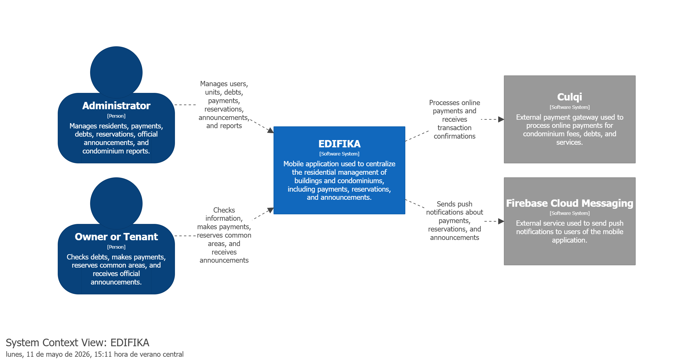
  
 *Figura 10. Context Diagram. Elaborado por el equipo utilizando Structurizr (Structurizr, s.f.).*

### 4.1.4. Approach driven ViewPoints Diagrams

En esta sección se presentan los diagramas que describen el comportamiento y la estructura del sistema desde distintas perspectivas. Se incluyen diagramas de actividad para representar los flujos principales de usuario, diagramas de estado para modelar los ciclos de vida de entidades clave como pagos y reservas, diagramas de clases para reflejar la estructura del dominio, y diagramas C4 complementarios que permiten visualizar la arquitectura del sistema en distintos niveles de detalle.

**Diagrama de contenedores**

 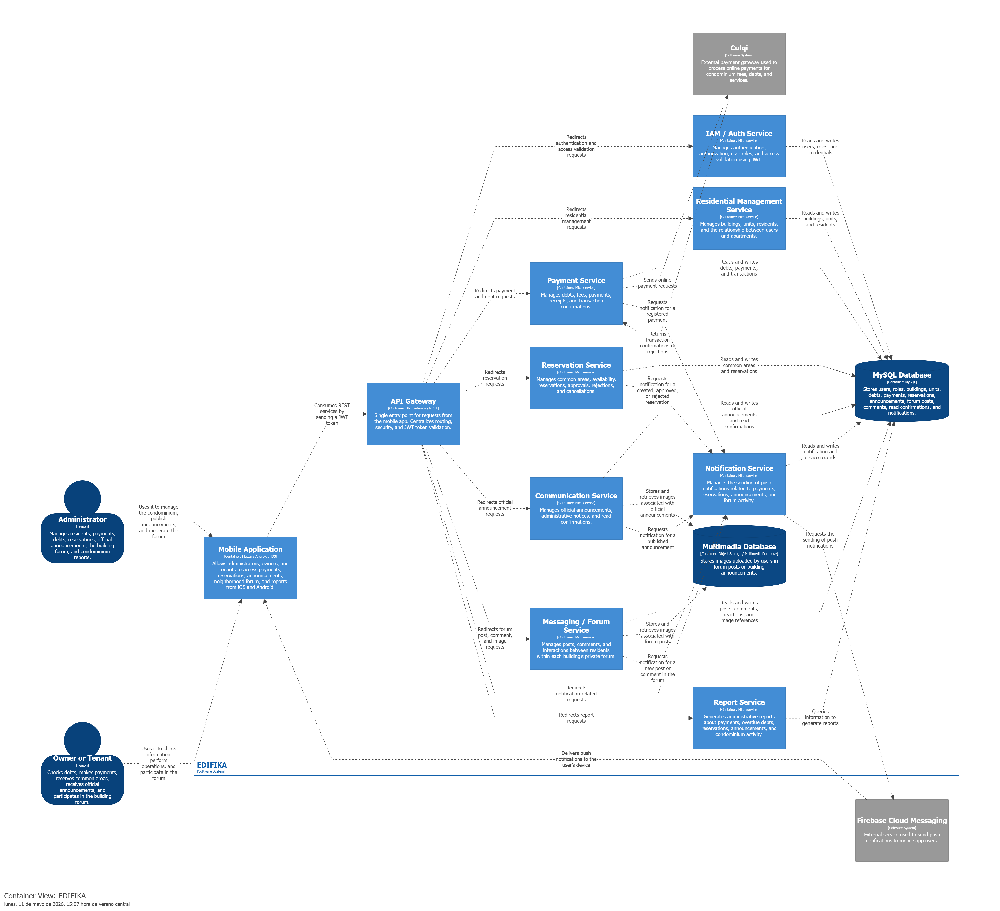
 
*Figura 11. Diagrama de Contenedores. Elaborado por el equipo utilizando Structurizr (Structurizr, s.f.).*

 **Diagramas de componentes**

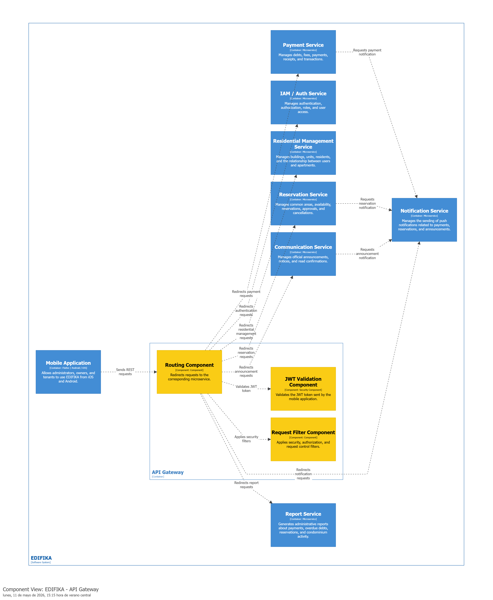

*Figura 12. Diagrama de Componentes - API Gateway. Elaborado por el equipo utilizando Structurizr (Structurizr, s.f.).*

*Figura 13. Diagrama de Componentes - Auth Service. Elaborado por el equipo utilizando Structurizr (Structurizr, s.f.).*

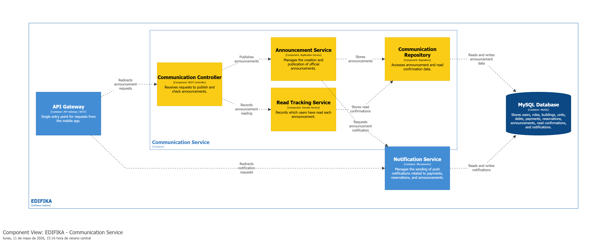

*Figura 14. Diagrama de Componentes - Communication Service. Elaborado por el equipo utilizando Structurizr (Structurizr, s.f.).*

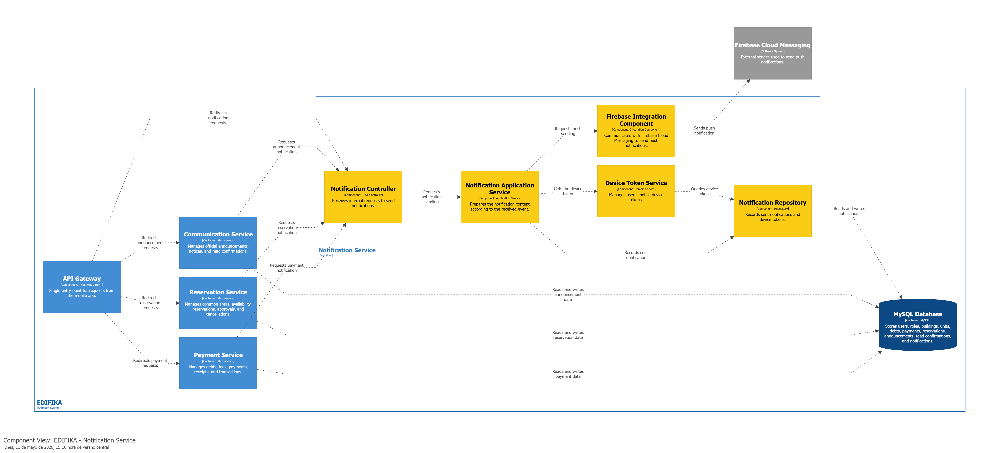

*Figura 15. Diagrama de Componentes - Notification Service. Elaborado por el equipo utilizando Structurizr (Structurizr, s.f.).*

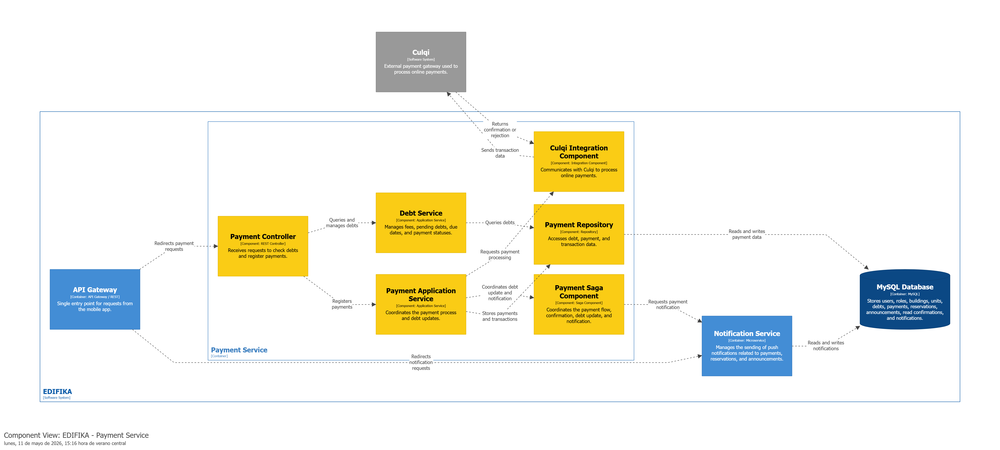

*Figura 16. Diagrama de Componentes - Payment Service. Elaborado por el equipo utilizando Structurizr (Structurizr, s.f.).*

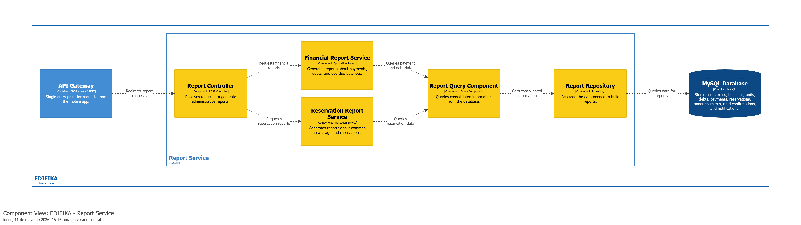

*Figura 17. Diagrama de Componentes - Report Service. Elaborado por el equipo utilizando Structurizr (Structurizr, s.f.).*

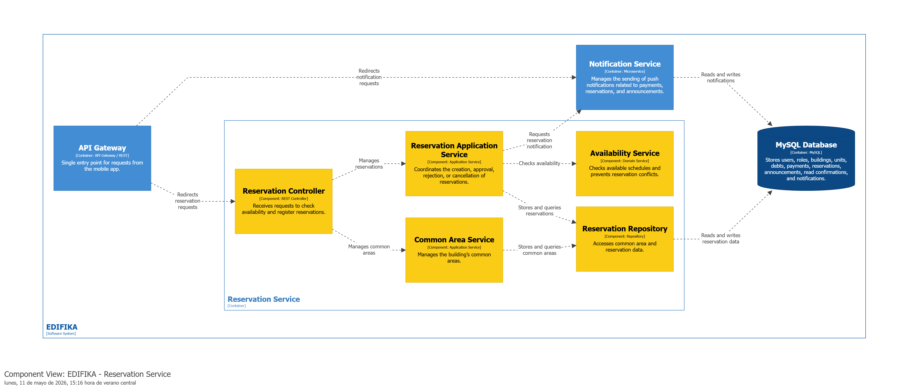

*Figura 18. Diagrama de Componentes - Reservation Service. Elaborado por el equipo utilizando Structurizr (Structurizr, s.f.).*

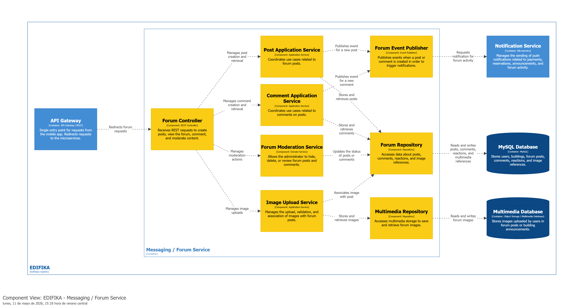

*Figura 19. Diagrama de Componentes - Forum Service. Elaborado por el equipo utilizando Structurizr (Structurizr, s.f.).*

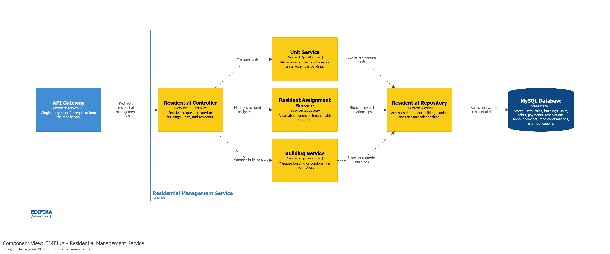

*Figura 20. Diagrama de Componentes - Residential Management Service. Elaborado por el equipo utilizando Structurizr (Structurizr, s.f.).*

 **Diagramas de Clases**

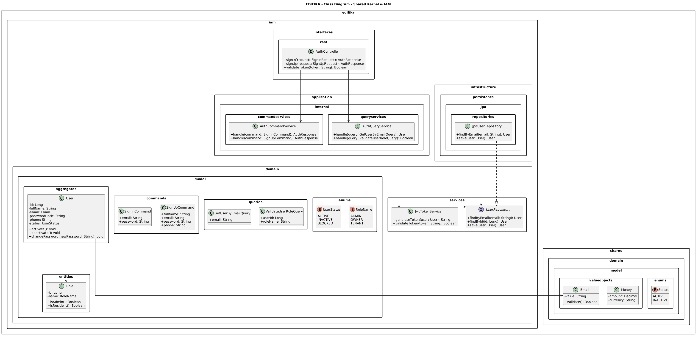

*Figura 21. Diagrama de Clases IAM. Elaborado por el equipo utilizando PlantUML Editor (PlantUML, s.f.).*

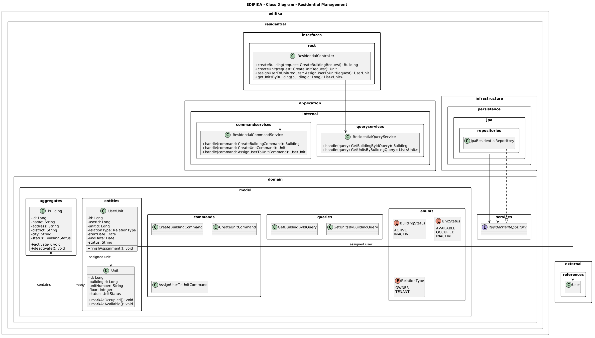

*Figura 22. Diagrama de Clases Residential management. Elaborado por el equipo utilizando PlantUML Editor (PlantUML, s.f.).*

*Figura 23. Diagrama de Clases Notifications. Elaborado por el equipo utilizando PlantUML Editor (PlantUML, s.f.).*

*Figura 24. Diagrama de Clases Reports. Elaborado por el equipo utilizando PlantUML Editor (PlantUML, s.f.).*

*Figura 25. Diagrama de Clases Communications. Elaborado por el equipo utilizando PlantUML Editor (PlantUML, s.f.).*

*Figura 26. Diagrama de Clases Payments. Elaborado por el equipo utilizando PlantUML Editor (PlantUML, s.f.).*

*Figura 27. Diagrama de Clases Forums. Elaborado por el equipo utilizando PlantUML Editor (PlantUML, s.f.).*

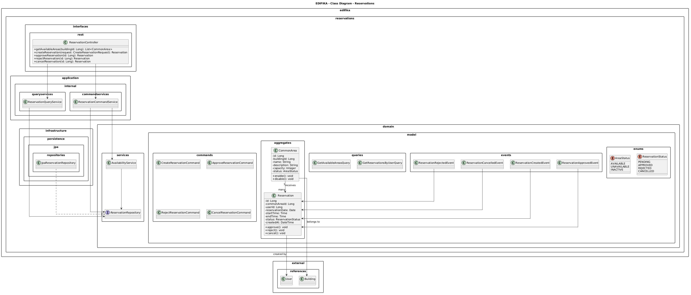

*Figura 28. Diagrama de Clases Reservations. Elaborado por el equipo utilizando PlantUML Editor (PlantUML, s.f.).*

**Diagramas de Secuencia**

**Registro e inicio de sesión del Administrador**

*Figura 29. Diagrama de Secuencia - Autenticación Administrador. Elaborado por el equipo utilizando PlantUML Editor (PlantUML, s.f.).*

Este diagrama muestra el flujo de registro e inicio de sesión del administrador en Edifika. El administrador ingresa sus datos a través de la App Mobile, que envía la solicitud al API Gateway, el cual la redirige al Auth Service para verificar y registrar las credenciales en la base de datos MySQL, retornando finalmente un token JWT para el acceso a la plataforma.

---

**Registro e inicio de sesión del Inquilino/Propietario**

*Figura 30. Diagrama de Secuencia - Autenticación Inquilino/Propietario. Elaborado por el equipo utilizando PlantUML Editor (PlantUML, s.f.).*

Este diagrama presenta el flujo de registro e inicio de sesión del propietario o inquilino. Al igual que el administrador, el residente crea su cuenta vinculada a su unidad residencial a través de la App Mobile, pasando por el API Gateway y el Auth Service para validar sus credenciales y obtener acceso a la plataforma mediante un token JWT.

---

**Publicación de comunicados**

*Figura 31. Diagrama de Secuencia - Comunicados Oficiales. Elaborado por el equipo utilizando PlantUML Editor (PlantUML, s.f.).*

Este diagrama ilustra el proceso de publicación de comunicados oficiales en Edifika. El administrador redacta y publica el comunicado desde la App Mobile, el cual es procesado por el API Gateway y el Announcement Service, que lo almacena en la base de datos y envía notificaciones push a todos los residentes mediante Firebase.

---

**Registro y aprobación de pagos**

*Figura 32. Diagrama de Secuencia - Gestión de Pagos. Elaborado por el equipo utilizando PlantUML Editor (PlantUML, s.f.).*

Este diagrama describe el flujo completo de gestión de pagos en Edifika. El residente consulta su deuda, registra su pago adjuntando el comprobante, y el administrador lo valida desde la plataforma. Una vez aprobado, el Payment Service genera automáticamente una constancia en PDF y notifica al residente mediante una notificación push.

---

**Reserva y aprobación de áreas comunes**

*Figura 33. Diagrama de Secuencia - Reserva de Áreas Comunes. Elaborado por el equipo utilizando PlantUML Editor (PlantUML, s.f.).*

Este diagrama muestra el flujo de reserva de áreas comunes en Edifika. El residente consulta la disponibilidad, selecciona un horario y envía su solicitud. El Reservation Service verifica que no existan duplicados y registra la reserva como pendiente. El administrador la revisa y aprueba, notificando automáticamente al residente sobre la confirmación.

**Generación y exportación de reportes**

*Figura 34. Diagrama de Secuencia - Reportes Financieros. Elaborado por el equipo utilizando PlantUML Editor (PlantUML, s.f.).*

Este diagrama describe el flujo de generación y exportación de reportes financieros en Edifika. El administrador selecciona el período y tipo de reporte, el Report Service consulta los datos de pagos y deudas en la base de datos, genera el resumen financiero y lo presenta en pantalla. Adicionalmente, permite exportar el reporte en formato PDF y consultar la lista de residentes morosos para tomar acciones administrativas.

### 4.1.5. Relational/Non Relational Database Diagram

En esta sección se presenta el diagrama de base de datos relacional de Edifika, el cual define las tablas, columnas, tipos de datos, restricciones y relaciones necesarias para garantizar la persistencia de la información del sistema. El diagrama refleja los principales dominios de la plataforma, incluyendo la gestión de usuarios, pagos, reservas de áreas comunes y comunicados oficiales, asegurando integridad referencial mediante el uso de claves primarias y foráneas.

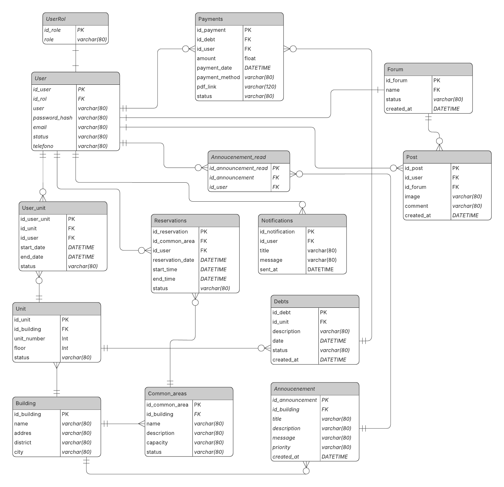

*Figura 35. Diagrama Entidad-Relación. Elaborado por el equipo utilizando LucidChart (LucidChart, s.f.).*

### 4.1.6. Design Patterns

En esta sección se describen los patrones de diseño aplicados en el desarrollo de Edifika. Estos patrones fueron seleccionados con base en las necesidades específicas de cada módulo del sistema, con el objetivo de promover un código más organizado, reutilizable y fácil de mantener, alineado con los principios y estilos arquitectónicos definidos para la plataforma.

### 4.1.7. Tactics

En esta sección se describen las tácticas arquitectónicas aplicadas en el diseño de Edifika. Estas tácticas representan decisiones técnicas concretas que permiten alcanzar los atributos de calidad definidos para la plataforma, considerando las restricciones del sistema, los escenarios de calidad identificados y las preocupaciones arquitectónicas que deben ser atendidas.

---

**1. Escalabilidad**

Escenario: Cuando la cantidad de condominios, unidades y usuarios registrados en Edifika crece de forma progresiva, el sistema debe mantenerse estable y responder en menos de 3 segundos sin necesidad de rediseñar su arquitectura base.

Tácticas:
- **Arquitectura basada en microservicios:** Cada módulo del sistema (pagos, reservas, comunicados, usuarios) opera de forma independiente, permitiendo escalar únicamente los componentes con mayor demanda sin afectar al resto.
- **API Gateway como punto de entrada único:** Centraliza el enrutamiento de solicitudes hacia los microservicios correspondientes, distribuyendo la carga de manera ordenada y permitiendo incorporar nuevos servicios sin modificar los existentes.
- **Base de datos relacional con modelo optimizado:** El uso de MySQL con relaciones bien definidas entre entidades permite manejar grandes volúmenes de registros sin comprometer la integridad ni el rendimiento de las consultas.

---

**2. Seguridad**

Escenario: Cuando un usuario intenta acceder a información o ejecutar operaciones que no corresponden a su rol, como un inquilino intentando aprobar pagos o acceder a datos de otros residentes, el sistema debe rechazar la solicitud de forma inmediata y registrar el intento.

Tácticas:
- **Autenticación mediante JWT:** Cada solicitud al sistema debe incluir un token válido que identifique al usuario y su rol antes de permitir cualquier operación.
- **Autorización por roles en cada endpoint:** El API Gateway y cada microservicio validan que el rol del usuario coincida con los permisos requeridos para ejecutar la operación solicitada.
- **Cifrado de contraseñas y datos sensibles:** Las contraseñas se almacenan cifradas y la información financiera se protege tanto en tránsito como en reposo.
- **Aislamiento del Payment Service:** La lógica de integración con Culqi se encapsula en un servicio dedicado que maneja errores, validaciones y confirmaciones de pago de forma controlada, evitando inconsistencias en el estado de las deudas.

---

**3. Disponibilidad**

Escenario: Cuando múltiples residentes y administradores acceden simultáneamente a la plataforma para consultar deudas, realizar reservas o revisar comunicados, el sistema debe mantenerse operativo y responder sin interrupciones, garantizando una disponibilidad igual o mayor al 99%.

Tácticas:
- **Separación de servicios independientes:** Al estar cada módulo desacoplado, un fallo en el servicio de notificaciones o en la integración con Firebase no afecta el funcionamiento de los módulos de pagos o reservas.
- **Manejo controlado de fallos externos:** Ante la indisponibilidad de Culqi o Firebase, el sistema responde con mensajes claros al usuario y permite que el resto de funcionalidades continúe operando con normalidad.
- **Despliegue en infraestructura cloud con contenedores:** Los servicios están preparados para ejecutarse en entornos cloud con variables de entorno y configuración externa, facilitando la recuperación ante fallos y el reinicio automático de instancias.

---

**4. Rendimiento**

Escenario: Cuando varios usuarios realizan consultas simultáneas sobre deudas, disponibilidad de áreas comunes o comunicados publicados, el sistema debe responder en menos de 2 segundos sin generar cuellos de botella en la base de datos.

Tácticas:
- **Paginación de resultados:** Las consultas de historial de pagos, comunicados y reservas se devuelven en páginas para reducir el volumen de datos transferidos en cada solicitud.
- **Distribución de carga mediante API Gateway:** Al centralizar el enrutamiento, el API Gateway permite distribuir las solicitudes entre los microservicios disponibles, evitando que un solo servicio concentre toda la carga.
- **Almacenamiento de imágenes en servicio externo:** Los comprobantes de pago e imágenes adjuntas se guardan en un servicio de almacenamiento separado, y la base de datos MySQL solo conserva la URL correspondiente, reduciendo el peso de las consultas.

---

**5. Usabilidad**

Escenario: Cuando un residente accede por primera vez a Edifika, debe poder consultar su deuda, reservar un área común o revisar un comunicado sin necesidad de capacitación previa, completando estas acciones de forma exitosa en su primer intento.

Tácticas:
- **Flujos simplificados por rol:** La interfaz presenta únicamente las opciones correspondientes al rol del usuario, evitando sobrecarga de información y reduciendo la curva de aprendizaje.
- **Notificaciones push como guía de acción:** Los recordatorios de pago, confirmaciones de reserva y alertas de comunicados orientan al usuario hacia las acciones más relevantes sin necesidad de que navegue activamente por la app.
- **Validación inmediata de formularios:** Los errores en el registro de pagos, reservas o datos del perfil se detectan y comunican al usuario antes de enviar la solicitud al servidor, evitando frustración y reprocesos.

---

**6. Integridad de transacciones**

Escenario: Cuando la pasarela de pagos Culqi procesa una transacción, el sistema debe reflejar de inmediata y correctamente el resultado en la cuenta del usuario, garantizando el 100% de consistencia entre el estado registrado en Culqi y el estado interno del sistema.

Tácticas:
- **Estados de pago definidos y trazables:** Cada pago registrado en el sistema pasa por estados claros (pendiente, validado, rechazado), con fecha, usuario responsable y referencia del comprobante, asegurando trazabilidad completa de cada operación.
- **Validación antes de confirmar deuda como pagada:** El Payment Service verifica la respuesta de Culqi antes de actualizar el estado de la deuda del residente, evitando registros incorrectos ante fallos en la comunicación con el servicio externo.
- **Restricciones en base de datos:** Se aplican constraints relacionales en MySQL para evitar inconsistencias entre pagos, deudas y usuarios, garantizando coherencia en la información financiera almacenada.

## 4.2. Architectural Drivers
Esta sección describe los principales conceptos de diseño arquitectónico del sistema Edifika, así como los puntos de vista utilizados para su modelado y análisis. Se abordan las decisiones clave que permiten estructurar la solución de manera eficiente, considerando tanto los requerimientos funcionales como los atributos de calidad.

A través de esta sección, se busca proporcionar una visión clara de cómo la arquitectura soporta las funcionalidades principales del sistema y responde a los desafíos identificados en el dominio del problema.

### 4.2.1. Design Purpose

El diseño arquitectónico de Edifika tiene como objetivo ofrecer una plataforma digital centralizada, segura y accesible para la gestión de condominios. Los principales drivers del negocio son la transparencia financiera, la optimización de procesos administrativos y la mejora de la comunicación entre residentes y administradores.

La arquitectura debe permitir el acceso eficiente a información crítica como pagos, deudas, reservas y comunicados, así como soportar múltiples usuarios con distintos niveles de permisos (Administrador y Residente). Además, el sistema debe operar de manera continua, ya que los usuarios requieren acceso permanente a sus funcionalidades.

Se priorizan atributos de calidad como la disponibilidad, necesaria para garantizar el acceso al sistema en todo momento; la seguridad, fundamental para proteger datos sensibles y transacciones financieras; el rendimiento, para asegurar tiempos de respuesta adecuados ante múltiples usuarios concurrentes; la usabilidad, que permite a usuarios no técnicos interactuar fácilmente con la plataforma; la escalabilidad, para soportar el crecimiento en número de condominios y usuarios; y la integridad de transacciones, especialmente importante para asegurar que los pagos se registren correctamente y sin inconsistencias.

Para cumplir con estos requerimientos, se adopta una arquitectura basada en microservicios, donde cada funcionalidad principal del sistema (gestión de usuarios, pagos, reservas y comunicación) se implementa como un servicio independiente. Este enfoque permite escalar componentes críticos como el módulo de pagos de manera independiente, mejorar la disponibilidad del sistema al aislar fallos y facilitar la evolución del sistema sin afectar el resto de funcionalidades. Además, favorece la integración con servicios externos como Culqi mediante servicios especializados.

### 4.2.2. Primary Functionality (Primary User Stories)
| User Story ID | Título | Descripción |
|--------------|--------|------------|
| US03 | Inicio de sesión | Como usuario, quiero iniciar sesión para acceder a mi información del condominio. |
| US13 | Publicar comunicados | Como administrador, quiero publicar comunicados para informar a los residentes. |
| US16 | Ver disponibilidad de áreas comunes | Como residente, quiero visualizar la disponibilidad para planificar su uso. |
| US17 | Reservar área común | Como residente, quiero reservar un área común para asegurar su uso. |
| US21 | Ver deuda actual | Como residente, quiero visualizar mi deuda pendiente. |
| US22 | Registrar pago | Como residente, quiero realizar pagos mediante Culqi para cumplir mis obligaciones. |
| US24 | Visualizar morosos | Como administrador, quiero identificar residentes con deudas pendientes. |
| US25 | Generar reportes | Como administrador, quiero generar reportes financieros del condominio. |
| US29 | Publicar mensaje en la comunidad | Como residente, quiero comunicarme con otros residentes mediante un canal comunitario. |
| US30 | Pagar deuda en línea | Como residente, quiero pagar mi deuda en línea para mantenerme al día sin realizar procesos manuales. |

### 4.2.3. Quality Attribute Scenarios

A continuación, se presentan los escenarios de atributos de calidad de Edifika, los cuales describen cómo el sistema responde ante distintos estímulos relacionados con escalabilidad, seguridad, disponibilidad, rendimiento, usabilidad e integridad de transacciones, tomando como referencia las principales funcionalidades del sistema.

#### QA-01 – Escalabilidad

| Atributo | Fuente | Estímulo | Artefacto | Entorno | Respuesta | Medida |
|----------|--------|----------|----------|---------|----------|--------|
| Escalabilidad | Administrador del sistema | Incremento en la cantidad de usuarios y condominios registrados | Arquitectura en capas y base de datos | Sistema en operación normal con crecimiento progresivo | El sistema permite soportar el aumento de usuarios sin afectar el desempeño general ni los tiempos de respuesta | El sistema mantiene tiempos de respuesta menores a 3 segundos bajo carga concurrente |

**Escenario:**  
Cuando se produce un crecimiento sostenido en la cantidad de usuarios y condominios que utilizan la plataforma, el sistema debe ser capaz de escalar sin necesidad de rediseñar su arquitectura base, permitiendo la incorporación de nuevos registros y operaciones sin degradar el rendimiento ni afectar la experiencia de los usuarios existentes. Esto implica que el sistema pueda manejar múltiples solicitudes concurrentes manteniendo estabilidad y consistencia en el acceso a la información.

**User Stories relacionadas:** US03, US25  

---

#### QA-02 – Seguridad

| Atributo | Fuente | Estímulo | Artefacto | Entorno | Respuesta | Medida |
|----------|--------|----------|----------|---------|----------|--------|
| Seguridad | Usuario malintencionado | Intento de acceso no autorizado o ejecución de operaciones restringidas | Módulo de autenticación y autorización | Sistema en operación normal con múltiples usuarios | El sistema valida credenciales, aplica control de acceso por roles y bloquea operaciones no autorizadas | 100% de accesos no autorizados rechazados; autenticación obligatoria en operaciones críticas |

**Escenario:**  
Cuando un usuario intenta acceder al sistema sin credenciales válidas o intenta ejecutar acciones que no corresponden a su rol, el sistema debe autenticar su identidad y verificar sus permisos antes de permitir cualquier operación. En caso de no cumplir con los requisitos de autorización, la solicitud debe ser rechazada de manera inmediata. Este comportamiento es especialmente crítico en funcionalidades relacionadas con pagos, donde se debe garantizar la protección de la información financiera y la integridad de las transacciones realizadas a través de Culqi.

**User Stories relacionadas:** US03, US22, US25  

---

#### QA-03 – Disponibilidad

| Atributo | Fuente | Estímulo | Artefacto | Entorno | Respuesta | Medida |
|----------|--------|----------|----------|---------|----------|--------|
| Disponibilidad | Usuario | Solicitud de acceso a funcionalidades del sistema | Aplicación móvil y backend | Sistema en operación con alta concurrencia de usuarios | El sistema permanece operativo y responde a las solicitudes sin interrupciones | Disponibilidad igual o mayor al 99% del tiempo; tiempo de respuesta menor a 3 segundos |

**Escenario:**  
Cuando múltiples usuarios acceden simultáneamente al sistema para consultar deudas, realizar reservas o visualizar comunicados, la plataforma debe mantenerse disponible y garantizar el acceso continuo a sus funcionalidades. Incluso ante escenarios de alta demanda, el sistema debe evitar interrupciones del servicio y asegurar una experiencia fluida, permitiendo que las operaciones críticas se ejecuten sin fallos.

**User Stories relacionadas:** US03, US21, US16  

---

#### QA-04 – Rendimiento

| Atributo | Fuente | Estímulo | Artefacto | Entorno | Respuesta | Medida |
|----------|--------|----------|----------|---------|----------|--------|
| Rendimiento | Usuarios concurrentes | Múltiples solicitudes simultáneas de consulta y operación | Backend y base de datos | Horarios de alta demanda | El sistema procesa solicitudes de manera eficiente sin generar retrasos significativos | Tiempo de respuesta menor a 2 segundos en operaciones de consulta |

**Escenario:**  
Cuando varios usuarios realizan consultas simultáneas sobre información crítica como deudas, reservas o comunicados, el sistema debe procesar dichas solicitudes de manera eficiente, evitando cuellos de botella y tiempos de espera prolongados. Esto implica optimizar el acceso a la base de datos y la gestión de solicitudes para garantizar una experiencia rápida y consistente.

**User Stories relacionadas:** US16, US21, US17  

---

#### QA-05 – Usabilidad

| Atributo | Fuente | Estímulo | Artefacto | Entorno | Respuesta | Medida |
|----------|--------|----------|----------|---------|----------|--------|
| Usabilidad | Usuario nuevo | Interacción inicial con la aplicación | Interfaz móvil | Uso normal del sistema | El usuario puede navegar y realizar acciones sin dificultad | Al menos 90% de usuarios completan tareas sin asistencia |

**Escenario:**  
Cuando un usuario accede por primera vez a la aplicación, debe ser capaz de comprender la interfaz y ejecutar acciones básicas como consultar su deuda, reservar áreas comunes o revisar comunicados sin necesidad de capacitación previa. Esto implica un diseño intuitivo, con flujos claros y una organización lógica de la información que facilite la interacción del usuario.

**User Stories relacionadas:** US16, US17, US21  

---

#### QA-06 – Integridad de transacciones

| Atributo | Fuente | Estímulo | Artefacto | Entorno | Respuesta | Medida |
|----------|--------|----------|----------|---------|----------|--------|
| Integridad de transacciones | Pasarela de pagos Culqi | Confirmación o rechazo de una transacción de pago | Módulo de pagos e integración externa | Transacción financiera en proceso | El sistema actualiza correctamente el estado del pago y la deuda del usuario | 100% de consistencia entre el estado de Culqi y el sistema interno |

**Escenario:**  
Cuando la pasarela de pagos Culqi procesa una transacción, ya sea aprobada o rechazada, el sistema debe reflejar de manera inmediata y correcta el resultado en la cuenta del usuario. Esto implica actualizar el estado de la deuda, registrar el pago correspondiente y evitar inconsistencias en la información financiera. En caso de fallos en la comunicación con el servicio externo, el sistema debe manejar la situación de forma controlada para garantizar la integridad de los datos.

**User Stories relacionadas:** US22  

### 4.2.4. Constraints
Las restricciones arquitectónicas definen los límites técnicos, tecnológicos y normativos bajo los cuales diseñaramos el sistema de EDIFIKA. Estas condiciones no pueden ser ignoradas, ya que influyen directamente en las decisiones de diseño, selección de tecnologías e implementación de la solución. Al considerar estas restricciones nos aseguramos la viabilidad del sistema, facilitar su integración con el entorno y reducir riesgos asociados al momento de desarrollar.
| Constraint                                              | Descripción                                                                                                                                                          | Impacto arquitectónico                                                                                                                                                |
| ------------------------------------------------------- | -------------------------------------------------------------------------------------------------------------------------------------------------------------------- | --------------------------------------------------------------------------------------------------------------------------------------------------------------------- |
| Uso de aplicación móvil                                 | EDIFIKA será consumida principalmente desde una aplicación móvil iOS/Android.                    | El backend debe exponer APIs REST seguras y optimizadas para dispositivos móviles.                                                                                    |
| Uso de API Gateway                                      | Todas las solicitudes deben pasar por el API Gateway.                                              | Centraliza validación JWT, filtros de seguridad y enrutamiento a microservicios.                                                                                      |
| Uso de JWT                                              | La autenticación se realizará mediante tokens JWT.                                               | Todos los servicios protegidos deben validar identidad y rol del usuario.                                                                                             |
| Uso de MySQL                                            | La información estructurada se almacenará en una base de datos MySQL.                                                                                                | Las entidades como usuarios, edificios, unidades, deudas, pagos, reservas y comunicados se modelarán relacionalmente.                                                 |
| Base o almacenamiento de imágenes                       | Las imágenes no deben guardarse directamente como binarios en MySQL.                                                                                                 | Se usará una base/servicio de almacenamiento de imágenes y en MySQL solo se guardará la URL o identificador.                                                          |
| Integración con Culqi                                   | Culqi solo puede usarse si se cumplen sus requisitos de cuenta, comercio, credenciales API y configuración de seguridad.                                             | Payment Service debe aislar la lógica de Culqi y manejar errores, validaciones y confirmaciones de pago.                                                              |
| Dependencia de Firebase Cloud Messaging                 | Las notificaciones push dependerán de Firebase Cloud Messaging.                                                                                                      | Notification Service debe integrarse con FCM y manejar tokens de dispositivos.                                                                                        |
| Límite del mini foro                                    | Cada usuario solo podrá realizar una publicación diaria.                                                                                                             | Communication Service debe validar fecha de última publicación antes de aceptar una nueva.                                                                            |
| Roles diferenciados                                     | Existen administradores, propietarios e inquilinos.                                                                                                                  | El sistema debe aplicar autorización por rol para limitar operaciones.                                                                                                |
| Seguridad de datos sensibles                            | Se gestionan pagos, deudas, usuarios y datos del condominio.                                                                                                         | Se deben cifrar contraseñas, proteger endpoints y evitar exposición de información privada.                                                                           |
| Disponibilidad de servicios externos                    | Culqi y Firebase son servicios externos fuera del control del sistema.                                                                                               | Se deben manejar fallos externos sin afectar todo el sistema.                                                                                                         |
| Arquitectura basada en microservicios                   | El sistema se divide en servicios independientes.                                                                                                                    | Cada servicio debe tener responsabilidades claras y comunicación mediante APIs.                                                                                       |
| Restricción de despliegue cloud                         | El sistema debe poder desplegarse en una infraestructura cloud.                                                                                                      | Los servicios deben estar preparados para contenedores, variables de entorno y configuración externa.                                                                 |
| Cumplimiento normativo para administración de edificios | EDIFIKA debe considerar la normativa peruana relacionada con la administración de edificios, bienes comunes, cuotas, acuerdos y responsabilidades del administrador. | Los módulos de pagos, deudas, comunicados, reservas y reportes deben registrar información trazable, ordenada y consultable para respaldar la gestión del condominio. |

### 4.2.5. Architectural Concerns
Las preocupaciones arquitectónicas representan los aspectos críticos del sistema que generan interés o riesgo para el negocio y los usuarios. Estas preocupaciones están relacionadas con atributos de calidad como seguridad, disponibilidad, escalabilidad y mantenibilidad, y deben ser abordadas mediante decisiones arquitectónicas adecuadas. Al identificarlas nos permite anticipar problemas potenciales y diseñar soluciones que garanticen el correcto funcionamiento del sistema.

| Concern                                 | Riesgo                                                                                                          | Decisión arquitectónica                                                                                                     |
| --------------------------------------- | --------------------------------------------------------------------------------------------------------------- | --------------------------------------------------------------------------------------------------------------------------- |
| Fallos durante el pago                  | Un pago podría quedar incompleto, duplicado o sin confirmación si Culqi no responde correctamente.              | El Payment Service debe manejar estados de pago, errores controlados y validación antes de confirmar una deuda como pagada. |
| Acceso indebido a información privada   | Un usuario podría ver deudas, pagos, reservas o datos que no le corresponden.                                   | Se validará el token JWT y el rol del usuario antes de permitir cada operación sensible.                                    |
| Falta de trazabilidad administrativa    | El administrador podría no contar con evidencia clara sobre pagos, acuerdos, comunicados o acciones realizadas. | El sistema debe registrar fecha, usuario responsable, tipo de operación e historial de cambios.                             |
| Pérdida o carga lenta de imágenes       | Las imágenes podrían afectar el rendimiento o perderse si no se almacenan correctamente.                        | Las imágenes se guardarán en un almacenamiento separado y la base principal solo guardará su URL o identificador.           |
| Notificaciones importantes no recibidas | Los usuarios podrían no enterarse de pagos pendientes, comunicados o reservas confirmadas.                      | El Notification Service gestionará tokens de dispositivos y manejará respuestas de Firebase.                                |
| Doble reserva de áreas comunes          | Dos usuarios podrían reservar el mismo espacio en el mismo horario.                                             | El Reservation Service validará disponibilidad antes de registrar la reserva.                                               |
| Abuso del mini foro                     | El foro podría llenarse de publicaciones repetitivas o poco relevantes.                                         | Se aplicará la regla de máximo una publicación diaria por usuario.                                                          |
| Bajo rendimiento en horas de mayor uso  | La app podría volverse lenta cuando muchos residentes consulten pagos, reservas o comunicados al mismo tiempo.  | Se usará API Gateway, paginación y servicios separados para distribuir mejor la carga.                                      |
| Cambios difíciles de mantener           | Modificar pagos, reservas o comunicados podría afectar otras partes del sistema.                                | Se separarán responsabilidades por microservicio y se mantendrán interfaces claras entre ellos.                             |
| Inconsistencia entre módulos            | Un pago, reserva o comunicado podría quedar registrado de forma diferente entre servicios.                      | Se aplicarán validaciones de negocio y restricciones en base de datos para mantener coherencia.                             |
| Uso incorrecto de roles                 | Un inquilino podría realizar acciones de administrador o un propietario acceder a información ajena.            | Se definirá autorización por roles en cada endpoint protegido.                                                              |
| Dependencia de servicios externos       | Si Culqi o Firebase fallan, algunas funciones críticas podrían verse afectadas.                                 | El sistema debe responder con mensajes claros y permitir que el resto de módulos siga funcionando.                          |

## 4.3 ADD Iterations

## 4.3.1 Iteration 1: Definición de la arquitectura base del sistema

### 4.3.1.1 Architectural Design Backlog

| ID | Driver | Tipo | Prioridad | Descripción |
|----|------|------|----------|------------|
| AD-01 | Disponibilidad | Atributo de calidad | Alta | El sistema debe mantenerse operativo incluso con múltiples usuarios concurrentes. |
| AD-02 | Rendimiento | Atributo de calidad | Alta | Las operaciones deben responder en menos de 2–3 segundos. |
| AD-03 | Seguridad | Atributo de calidad | Alta | El sistema debe proteger el acceso a datos sensibles mediante autenticación y autorización. |
| AD-04 | Uso de JWT | Restricción | Alta | La autenticación se implementará mediante tokens JWT. |
| AD-05 | Integridad de datos | Atributo de calidad | Alta | La información de pagos, deudas y reservas debe mantenerse consistente. |
| AD-06 | Uso de API Gateway | Restricción | Alta | Todas las solicitudes deben pasar por un punto centralizado. |
| AD-07 | Uso de MySQL | Restricción | Alta | Los datos estructurados se almacenan en una base relacional. |

### 4.3.1.2 Establish Iteration Goal by Selecting Drivers

El objetivo de esta iteración es definir una arquitectura base que permita soportar múltiples usuarios concurrentes garantizando **alta disponibilidad** y **buen rendimiento** en operaciones críticas como pagos y reservas.

### 4.3.1.3 Choose One or More Elements of the System to Refine

Se refinan los siguientes elementos del sistema:

- **API Gateway**
- **Microservicios principales:**
  - Payment Service
  - Reservation Service
  - IAM / Auth Service
- **Base de datos MySQL**

### 4.3.1.4 Choose One or More Design Concepts That Satisfy the Selected Drivers

Se adoptan los siguientes conceptos de diseño:

- **Arquitectura de microservicios**  
  Permite aislar fallos y mejorar la disponibilidad del sistema.

- **API Gateway**  
  Centraliza el acceso, validación de tokens y enrutamiento.

- **Separación por dominios**  
  Cada servicio maneja una responsabilidad específica, mejorando el rendimiento.

- **Base de datos relacional (MySQL)**  
  Permite mantener la integridad de las relaciones entre entidades.

### 4.3.1.5 Instantiate Architectural Elements, Allocate Responsibilities, and Define Interfaces

### 4.3.1.5 Instantiate Architectural Elements

| Elemento | Responsabilidad | Interfaces |
|----------|--------------|-----------|
| API Gateway | Validar JWT y enrutar solicitudes | `/api/v1/*` |
| IAM / Auth Service | Autenticación y roles | `/auth` |
| Payment Service | Gestión de pagos y deudas | `/payments` |
| Reservation Service | Gestión de reservas | `/reservations` |
| MySQL | Persistencia de datos | Conexión interna |

### 4.3.1.6 Sketch Views (C4 & UML) and Record Design Decisions

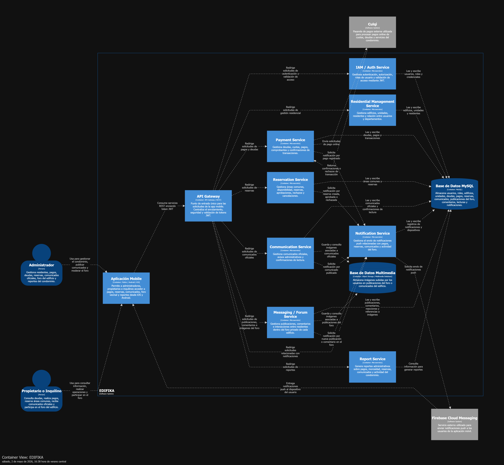
 
*Figura 36. Diagrama de Contenedores. Elaborado por el equipo utilizando Structurizr (Structurizr, s.f.).*

### 4.3.1.7 Analysis of Current Design and Review Iteration Goal (Kanban Board)

 
## 4.3.2 Iteration 2: Refinamiento de módulos críticos (Pagos y Reservas)

### 4.3.2.1 Architectural Design Backlog

| ID | Driver | Tipo | Prioridad | Descripción |
|----|------|------|----------|------------|
| AD-08 | Integridad de pagos | Atributo de calidad | Alta | Evitar inconsistencias entre pagos y deudas. |
| AD-09 | Disponibilidad | Atributo de calidad | Alta | El sistema debe seguir funcionando ante fallos de Culqi. |
| AD-10 | Rendimiento | Atributo de calidad | Alta | Consultas rápidas de disponibilidad y deudas. |
| AD-11 | Seguridad | Atributo de calidad | Alta | Solo usuarios autorizados pueden pagar o reservar. |

### 4.3.2.2 Establish Iteration Goal by Selecting Drivers

El objetivo de esta iteración es refinar los módulos de **Payment Service** y **Reservation Service**, ya que representan operaciones críticas del sistema.

Se busca garantizar la correcta ejecución de pagos, evitar inconsistencias en deudas y prevenir conflictos en reservas de áreas comunes, manteniendo tiempos de respuesta adecuados.

### 4.3.2.3 Choose One or More Elements of the System to Refine

Se refinan los siguientes elementos:

- **Payment Service**
- **Reservation Service**
- **Integración con Culqi**
- **Base de datos MySQL**

### 4.3.2.4 Choose One or More Design Concepts That Satisfy the Selected Drivers

Se adoptan los siguientes conceptos:

- **Saga Pattern (Payment Saga)**  
  Permite coordinar el proceso de pago y mantener consistencia entre pago y deuda.

- **Availability Service**  
  Permite validar disponibilidad antes de registrar una reserva.

- **Separación de responsabilidades**  
  Cada componente maneja una parte específica del flujo.

- **Control de errores en servicios externos**  
  Evita que fallos de Culqi afecten todo el sistema.

### 4.3.2.5 Instantiate Architectural Elements, Allocate Responsibilities, and Define Interfaces

Se definen los siguientes elementos:

- **Payment Controller**
  - Recibe solicitudes de pago

- **Payment Application Service**
  - Coordina el flujo de pago

- **Payment Saga**
  - Gestiona estados del pago (pendiente, confirmado, fallido)

- **Culqi Integration**
  - Procesa pagos externos

- **Reservation Controller**
  - Gestiona solicitudes de reserva

- **Availability Service**
  - Valida disponibilidad de áreas comunes

- **Reservation Service**
  - Registra reservas

### 4.3.2.6 Sketch Views (C4 & UML) and Record Design Decisions

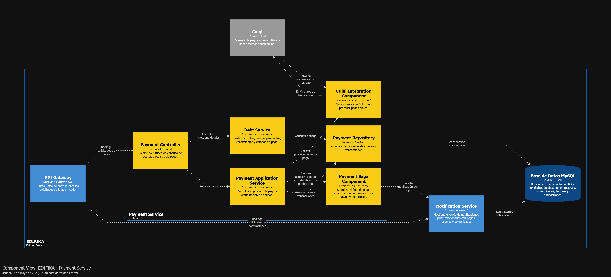

*Figura 37. Diagrama de Componentes - Payment Service. Elaborado por el equipo utilizando Structurizr (Structurizr, s.f.).*

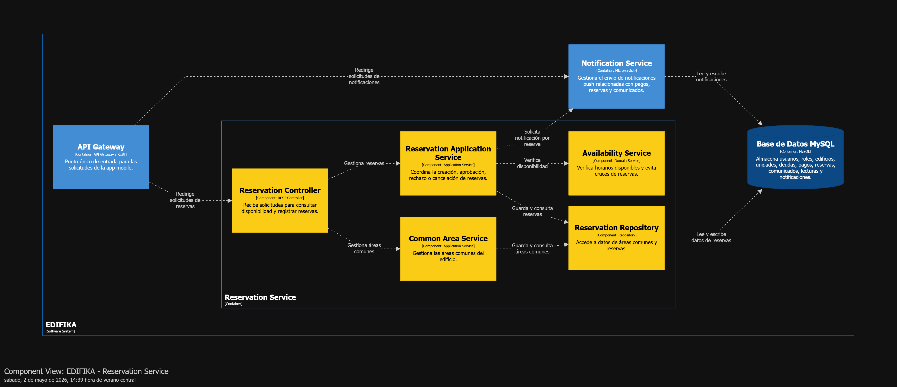

*Figura 38. Diagrama de Componentes - Reservation Service. Elaborado por el equipo utilizando Structurizr (Structurizr, s.f.).*

### 4.3.2.7 Analysis of Current Design and Review Iteration Goal (Kanban Board)

## 4.3.3 Iteration 3: Optimización de reportes, comunicados y notificaciones

### 4.3.3.1 Architectural Design Backlog

| ID | Driver | Tipo | Prioridad | Descripción |
|----|------|------|----------|------------|
| AD-12 | Rendimiento en reportes | Atributo de calidad | Alta | Los reportes no deben afectar operaciones críticas. |
| AD-13 | Disponibilidad de notificaciones | Atributo de calidad | Media | Fallos en notificaciones no deben afectar el sistema. |
| AD-14 | Escalabilidad | Atributo de calidad | Media | Soportar crecimiento de datos históricos. |
| AD-15 | Mantenibilidad | Atributo de calidad | Media | Permitir evolución de módulos sin afectar otros servicios. |

### 4.3.3.2 Establish Iteration Goal by Selecting Drivers

El objetivo de esta iteración es refinar los módulos de **Report Service**, **Communication Service** y **Notification Service**, ya que estos componentes apoyan la operación diaria del condominio mediante reportes, comunicados y alertas.

Se busca que las consultas administrativas y el envío de notificaciones funcionen de manera eficiente, sin sobrecargar los servicios principales como pagos y reservas.

### 4.3.3.3 Choose One or More Elements of the System to Refine

Se refinan los siguientes elementos:

- **Report Service**
- **Communication Service**
- **Notification Service**
- **Firebase Integration**
- **Base de datos MySQL**

### 4.3.3.4 Choose One or More Design Concepts That Satisfy the Selected Drivers

Se adoptan los siguientes conceptos de diseño:

- **Query Component**  
  Permite separar las consultas de reportes de las operaciones transaccionales, evitando afectar el rendimiento de pagos y reservas.

- **Event-Driven Communication**  
  Permite que eventos como pago registrado, reserva confirmada o comunicado publicado activen notificaciones sin acoplar directamente los servicios.

- **Read Tracking**  
  Permite registrar qué usuarios leyeron un comunicado, mejorando la trazabilidad de la comunicación interna.

- **Firebase Cloud Messaging**  
  Permite enviar notificaciones push a los usuarios de la aplicación móvil.

### 4.3.3.5 Instantiate Architectural Elements, Allocate Responsibilities, and Define Interfaces

### 4.3.3.5 Instantiate Architectural Elements

| Elemento | Responsabilidad | Interfaces |
|----------|--------------|-----------|
| Report Service | Generación de reportes | `/reports` |
| Communication Service | Gestión de comunicados | `/announcements` |
| Notification Service | Envío de notificaciones | `/notifications` |
| Firebase | Notificaciones push | API externa |

### 4.3.3.6 Sketch Views (C4 & UML) and Record Design Decisions

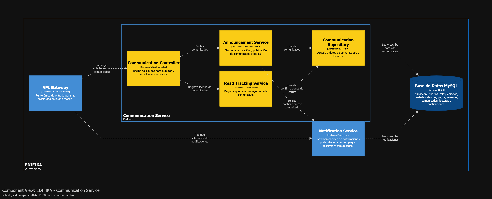

*Figura 39. Diagrama de Componentes - Communication Service. Elaborado por el equipo utilizando Structurizr (Structurizr, s.f.).*

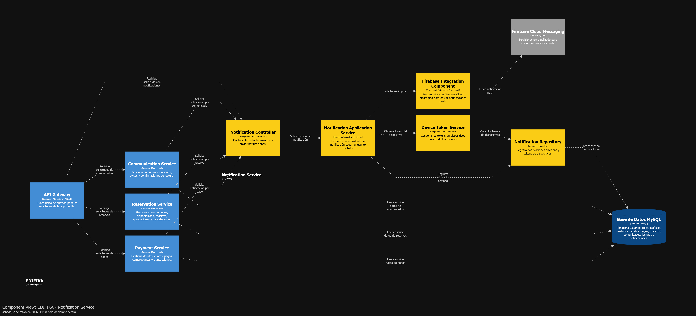

*Figura 40. Diagrama de Componentes - Notification Service. Elaborado por el equipo utilizando Structurizr (Structurizr, s.f.).*

### 4.3.3.7 Analysis of Current Design and Review Iteration Goal (Kanban Board)

# CAPÍTULO V: Product Implementation, Validation & Deployment
### 5.1. Testing Suites & General Patterns
##### 5.1.1. Backend Application Core Testing Suite
##### 5.1.2. Pattern Based Backend Application(s)
##### 5.1.3. Pattern Based Custom Software Library
##### 5.1.4. Framework Pattern Driven Refactoring Report

### 5.2. Software Configuration Management
##### 5.2.1. Software Development Environment Configuration
##### 5.2.2. Source Code Management
##### 5.2.3. Source Code Style Guide & Conventions
##### 5.2.4. Software Deployment Configuration

### 5.3. Microservices Implementation
#### 5.3.1. Sprint 1
##### 5.3.1.1. Sprint Backlog 1

El objetivo de este Sprint es implementar el microservicio de IAM (Identity and Access Management), desarrollar la Landing Page del producto y elaborar los mockups de los principales módulos de Edifika. Durante este ciclo, el equipo trabajará en completar las funcionalidades de registro, inicio de sesión, gestión de perfiles y autenticación con JWT, así como en la construcción de la página de presentación del producto. El éxito del Sprint se medirá con el avance de las tareas asignadas en el Sprint Backlog y la correcta implementación del microservicio IAM. Esta sección presenta el tablero de control en Trello, junto con la lista de User Stories y tareas desglosadas asignadas a cada miembro del equipo.

  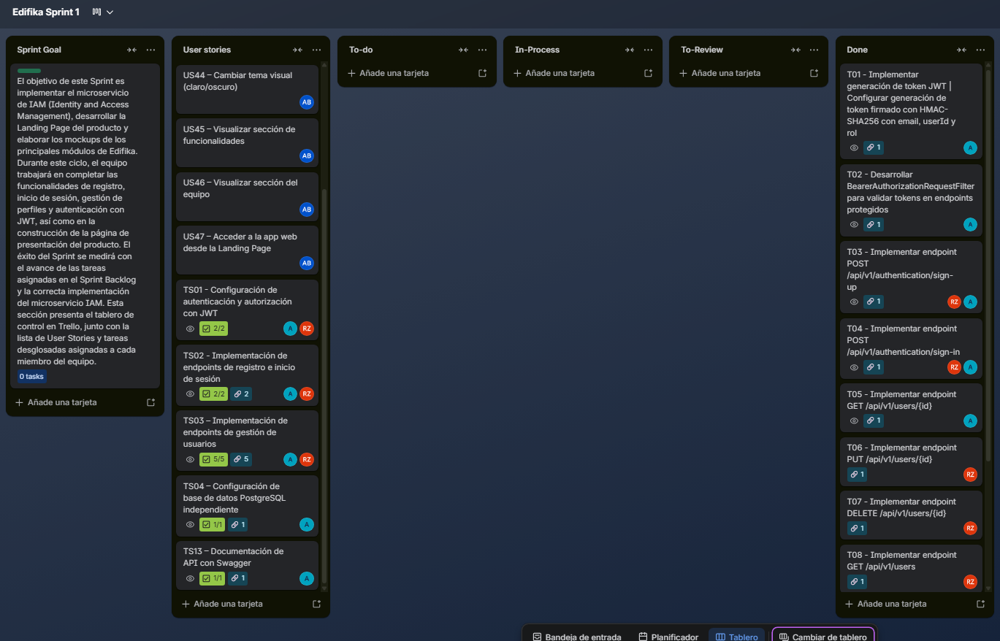

Enlace del Board: `https://trello.com/invite/b/6a0527cb585a58fe5f5375ba/ATTI112271af5d09099e7ea0df48ce05b74c6FCCB8A8/edifika-sprint-1`

| Sprint # | Sprint 1 | | | | | | |
|----------|----------|---|---|---|---|---|---|
| **User Story** | | **Work-Item / Task** | | | | | |
| **Id** | **Title** | **Id** | **Title** | **Description** | **Estimation (Hours)** | **Assigned To** | **Status** |
| TS01 | Configuración de autenticación y autorización con JWT | T01 | Implementar generación de token JWT | Configurar generación de token firmado con HMAC-SHA256 con email, userId y rol | 4 | | Done |
| TS01 | Configuración de autenticación y autorización con JWT | T02 | Implementar filtro de autorización Bearer | Desarrollar BearerAuthorizationRequestFilter para validar tokens en endpoints protegidos | 3 | | Done |
| TS02 | Implementación de endpoints de registro e inicio de sesión | T03 | Implementar endpoint POST /api/v1/authentication/sign-up | Desarrollar endpoint de registro con validaciones de email, contraseña, DNI y rol ADMIN | 4 | | Done |
| TS02 | Implementación de endpoints de registro e inicio de sesión | T04 | Implementar endpoint POST /api/v1/authentication/sign-in | Desarrollar endpoint de login con validación BCrypt y retorno de token JWT | 3 | | Done |
| TS02 | Implementación de endpoints de registro e inicio de sesión | T05 | Implementar endpoint GET /api/v1/users/{id} | Desarrollar endpoint para consultar información de un usuario por su id | 2 | | Done |
| TS02 | Implementación de endpoints de registro e inicio de sesión | T06 | Implementar endpoint PUT /api/v1/users/{id} | Desarrollar endpoint para actualizar datos del perfil de usuario | 3 | | Done |
| TS02 | Implementación de endpoints de registro e inicio de sesión | T07 | Implementar endpoint DELETE /api/v1/users/{id} | Desarrollar endpoint para eliminar un usuario del sistema | 2 | | Done |
| TS02 | Implementación de endpoints de registro e inicio de sesión | T08 | Implementar endpoint GET /api/v1/users | Desarrollar endpoint para listar todos los usuarios registrados | 2 | | Done |
| TS02 | Implementación de endpoints de registro e inicio de sesión | T09 | Implementar endpoint GET /api/v1/roles | Desarrollar endpoint para consultar los roles disponibles del sistema | 2 | | Done |
| TS04 | Configuración de base de datos PostgreSQL independiente | T10 | Configurar PostgreSQL para microservicio IAM | Configurar conexión, entidades JPA y creación automática de tablas users, roles y user_roles | 3 | | Done |
| TS13 | Documentación de API con Swagger | T11 | Integrar Swagger con autenticación JWT en IAM | Configurar Swagger UI con soporte Bearer token para documentar y probar endpoints | 2 | | Done |
|  |  |  | | | | | To-do |
|  | |  | | | | | To-do |
|  |  |  | | | | | To-do |
|  |  |  | | | | | To-do |
|  |  |  | | | | | To-do |
|  |  |  | | | | | To-do |

##### 5.3.1.2. Development Evidence for Sprint Review

A lo largo del Sprint 1, el historial de commits evidencia el avance incremental del proyecto Edifika en sus repositorios. En el repositorio del microservicio IAM se registran commits orientados a la implementación de funcionalidades clave como el registro de usuarios, inicio de sesión, autenticación mediante JWT y la gestión de perfiles. Cada commit refleja una iteración específica del desarrollo, permitiendo rastrear la evolución del backend desde su configuración inicial hasta la integración completa de los endpoints de autenticación. Asimismo, el repositorio de la Landing Page presenta commits enfocados en la construcción de la página de presentación del producto.

| Repository | Branch | Commit Id | Commit Message | Commit Message Body | Committed on (Date) |
|------------|--------|-----------|----------------|---------------------|---------------------|
| Edifika-Microservice-IAM | main | 4b20746 | feat(IAM): first commit | - | 12/05/2026 |
| Edifika-Microservice-IAM | develop | 9a187d4 | feat(IAM): Add IAM auth module and security | - | 12/05/2026 |
| Edifika-Microservice-IAM | develop | ebcde37 | fix(IAM): fixing error handling to controllers | - | 12/05/2026 |
| Edifika-Microservice-IAM | develop | c28c544 | feat: Add validations | - | 14/05/2026 |
| Edifika-Landing-Page | develop | | | - | |
| Edifika-Landing-Page | develop | | | - | |
| Edifika-Landing-Page | develop | | | - | |

##### 5.3.1.3. Testing Suite Evidence for Sprint Review

En esta sección se aplicó la metodología Behavior-Driven Development (BDD) para definir y verificar el comportamiento esperado del microservicio IAM desde la perspectiva técnica y funcional. Se elaboraron archivos de características (.feature) utilizando la sintaxis Gherkin de Cucumber, donde cada escenario describe una interacción específica del sistema mediante la estructura Given–When–Then.

Cada archivo .feature corresponde a una Technical Story del Sprint, cubriendo flujos como el registro de administradores, el inicio de sesión con generación de JWT, la validación de tokens en endpoints protegidos y la gestión de usuarios. Esto permite documentar de forma clara las reglas de negocio implementadas en el backend y facilitar la ejecución de pruebas automatizadas que garanticen el correcto funcionamiento del microservicio.

##### 5.3.1.4. Execution Evidence for Sprint Review

Esta sección resume la evidencia de ejecución del Sprint 1, donde se verificó el correcto funcionamiento de los endpoints del microservicio IAM de Edifika. Las pruebas se realizaron mediante Swagger UI, validando los flujos de autenticación, gestión de usuarios y asignación de roles. Se comprobó que el sistema genera tokens JWT al iniciar sesión y que los endpoints protegidos responden correctamente cuando se proporciona un Bearer Token válido. A continuación se detallan las pruebas realizadas por cada endpoint:

**Endpoint: POST /api/v1/authentication/sign-up**

Se verificó el registro de un nuevo administrador enviando los campos requeridos: fullName, email, password, phone, documentType, documentNumber y roles. El sistema validó los datos correctamente y retornó un código 201 confirmando la creación del usuario en la base de datos PostgreSQL.

  

  

**Endpoint: GET /api/v1/users/{id}**

Se verificó la consulta de un usuario específico por su id, enviando el Bearer Token en el header Authorization. El sistema retornó un código 200 con los datos completos del usuario incluyendo fullName, email, phone, status, documentType, documentNumber y roles asignados.

  

**Endpoint: PUT /api/v1/users/{id}**

Se comprobó la actualización de datos de un usuario existente enviando el id como parámetro y los campos editables en el body: fullName, email, password, phone, documentType y documentNumber. El sistema procesó la solicitud con el Bearer Token válido y retornó la confirmación de actualización.

  

**Endpoint: DELETE /api/v1/users/{id}**

Se verificó la eliminación de un usuario del sistema enviando el id como parámetro con el Bearer Token en el header. El sistema procesó la solicitud y confirmó la eliminación del registro.

  

**Endpoint: GET /api/v1/users**

Se comprobó la consulta de todos los usuarios registrados en el sistema. Con el Bearer Token válido, el sistema retornó un código 200 con la lista completa de usuarios incluyendo sus datos y roles asignados.

  

**Endpoint: GET /api/v1/roles**

Se verificó la consulta de roles disponibles en el sistema. El endpoint retornó la lista de roles configurados permitiendo identificar los permisos asignables a cada usuario.

  

##### 5.3.1.5. Microservices Documentation Evidence for Sprint Review

##### 5.3.1.6. Software Deployment Evidence for Sprint Review

##### 5.3.1.7. Team Collaboration Insights during Sprint

##### 5.3.1.8. Kanban Board

# Conclusiones
# Conclusiones y Recomendaciones

TB1:

- La investigación realizada confirmó que la gestión de condominios en el Perú presenta problemas estructurales de desorganización, falta de transparencia y comunicación deficiente, validando la necesidad real que Edifika busca resolver mediante la digitalización.
- Ambos segmentos objetivo mostraron disposición para adoptar una solución digital, lo que reduce la fricción de entrada al mercado y respalda la viabilidad del producto, siempre que ofrezca una experiencia simple y accesible.
- El análisis competitivo reveló que las soluciones existentes no están adaptadas al contexto local, lo que representa una oportunidad de diferenciación para Edifika al enfocarse en la simplicidad y las necesidades reales del usuario peruano.
- Se recomienda priorizar las funcionalidades de mayor impacto como pagos, reservas y comunicados, validarlas con usuarios reales antes del lanzamiento e incorporar métodos de pago locales para facilitar la adopción.
- Para escalar el producto de forma sostenible, se recomienda explorar alianzas con empresas administradoras de condominios como canal principal de distribución, permitiendo llegar a múltiples comunidades a través de un solo punto de entrada.
- El desarrollo del product backlog, los user stories y los escenarios To-Be demostró que el equipo logró comprender en profundidad los problemas de ambos segmentos y traducirlos en soluciones concretas, lo que garantiza que el producto esté orientado a generar valor real desde sus primeras versiones.

TB2:

- La definición de principios y enfoques arquitectónicos para Edifika permitió establecer una base sólida y coherente para el diseño del sistema, asegurando que cada decisión técnica esté alineada con los objetivos del negocio y las necesidades reales de los usuarios.
- La adopción de una arquitectura basada en microservicios, junto con patrones como API Gateway, Repository y Saga, demostró ser la decisión más adecuada para garantizar la escalabilidad, disponibilidad e independencia de los módulos críticos de Edifika como pagos, reservas y comunicados.
- La elaboración de los diagramas C4, de secuencia y de base de datos permitió visualizar con claridad cómo interactúan los componentes del sistema, facilitando la identificación de dependencias, riesgos y oportunidades de mejora en etapas tempranas del diseño.
- Los escenarios de atributos de calidad definidos en el ADD confirmaron que la arquitectura propuesta responde adecuadamente a los requisitos de seguridad, rendimiento, usabilidad e integridad de transacciones que exige una plataforma de gestión residencial.
- La identificación de restricciones y preocupaciones arquitectónicas permitió al equipo anticipar riesgos como fallos en servicios externos, doble reserva o inconsistencias en pagos, diseñando tácticas concretas para mitigarlos desde el diseño inicial.

# Referencias Bibliografía
  - Aguilar, K. L. B. (2026). Vacíos regulatorios en la Ley de Propiedad en Condominio, análisis de conflictos recurrentes en su modalidad vertical ubicados en el Distrito Central (Tesis doctoral). Centro Universitario Tecnológico CEUTEC. `https://repositorio.unitec.edu/server/api/core/bitstreams/cd97bbd4-204c-49c8-9901-3d0a5a85d7f3/content`
  - Condominos. (2024, 4 de noviembre). Manejo de chats de WhatsApp de vecinos en condominios. `https://www.condominos.app/sitio/detalle/OA/manejo-de-chats-de-whatsapp-de-vecinos-en-condominios`
  - Deloitte. (2022). Digital transformation and operational efficiency.
`https://www2.deloitte.com/us/en/insights/topics/digital-transformation.html`
  - El Comercio. (2026, 3 de abril). Fallas en la gestión de edificios corporativos pueden generar sobrecostos de hasta 30%. `https://elcomercio.pe/economia/fallas-en-la-gestion-de-edificios-corporativos-pueden-generar-sobrecostos-de-hasta-30-noticia/`
  - Gestión. (2023, 12 de septiembre). Advierten que deudas por gastos en condominios llevan a inquilinos a Infocorp. `https://gestion.pe/tu-dinero/inmobiliarias/advierten-que-deudas-por-gastos-en-condominios-llevan-a-inquilinos-a-infocorp-condominios-deudas-por-pagos-de-mantenimiento-noticia/`
  - Instituto Nacional de Estadística e Informática (INEI). (2023). Perú: Características de las viviendas particulares y hogares. `https://www.gob.pe/institucion/inei/informes-publicaciones/4377979-las-tecnologias-de-informacion-y-comunicacion-en-los-hogares-ene-feb-mar-2023`
  - Lucidchart. (s.f.). `https://www.lucidchart.com`
  - Miro. (s.f.). `https://miro.com/`
  - PlantUML. (s.f.). `https://plantuml.com`
  - ProTool. (2026, 11 de marzo). Administrar un condominio por WhatsApp no es gestión, es un riesgo para la comunidad. `https://www.protool.cl/noticia_detalle.php?slug=administrar-condominios-por-whatsapp-no-es-gestion-es-riesgo`
  - Sociedad Peruana de Bienes Raíces. (2024). Digitalización de edificios y condominios en Perú. `https://bienesraicess.com/blogs/digitalizacion-de-edificios-y-condominios-en-peru`
  - UXPressia. (s.f.). `https://uxpressia.com/`
  - Verastegui Leon, P. A., Mendoza Castañeda, J. L. D. C., Zapata Becerra, M. L., Capristan Leon, K. E., & Ravines Garcia, M. A. (2025). Propuesta de un plan estratégico para mejora de la Gestión en Edificios Multifamiliares en Lima Moderna: Caso De Estudio: MONARCH MANAGERS EIRL. Universidad Peruana de Ciencias Aplicadas. `https://repositorioacademico.upc.edu.pe/handle/10757/686137`
  

# Anexos
- Lean Ux Canvas: `https://miro.com/welcomeonboard/SXAwU0llbzVXekRWcG4zWHhBSjBBMjJkUEdXTXlncGEzOHlPWDM1dkRvMVlPU3I5QzE1UWhrMEg2USsyTFYvU002eVpyS2JvdVlYRzFsODZLV0xpcEYwblhkNkx1RHZZM3VjeDlHbmV5MXU0dmpsMFZ4K050NVVxMlRUTVNzRFZhWWluRVAxeXRuUUgwWDl3Mk1qRGVRPT0hdjE=?share_link_id=35010524832`
- Cuadros as-is y to-be: `https://miro.com/app/board/uXjVGhe7HqQ=/?share_link_id=293203178495`
- Impact map: `https://drive.google.com/file/d/1vSoBPwzNnKNbPt-nrmsQtPQPS1uqYmOt/view?usp=sharing`
- User Persona 1: `https://drive.google.com/file/d/1CZasihoytHlc5yitISw_9r6zasZjfTG0/view?usp=sharing`
- User Persona 2: `https://drive.google.com/file/d/1Iy0-x1W3vIBjgpKlcGfhzkv9yUg4askm/view?usp=sharing`
# Links
- Enlace del repositorio: `https://github.com/Condomia/Edifika-report.git`
